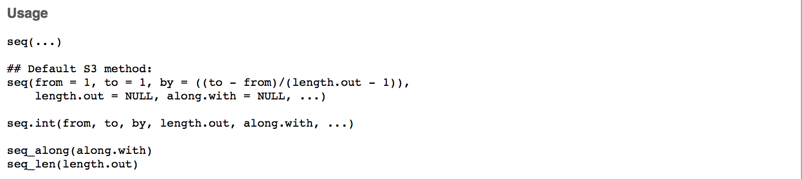
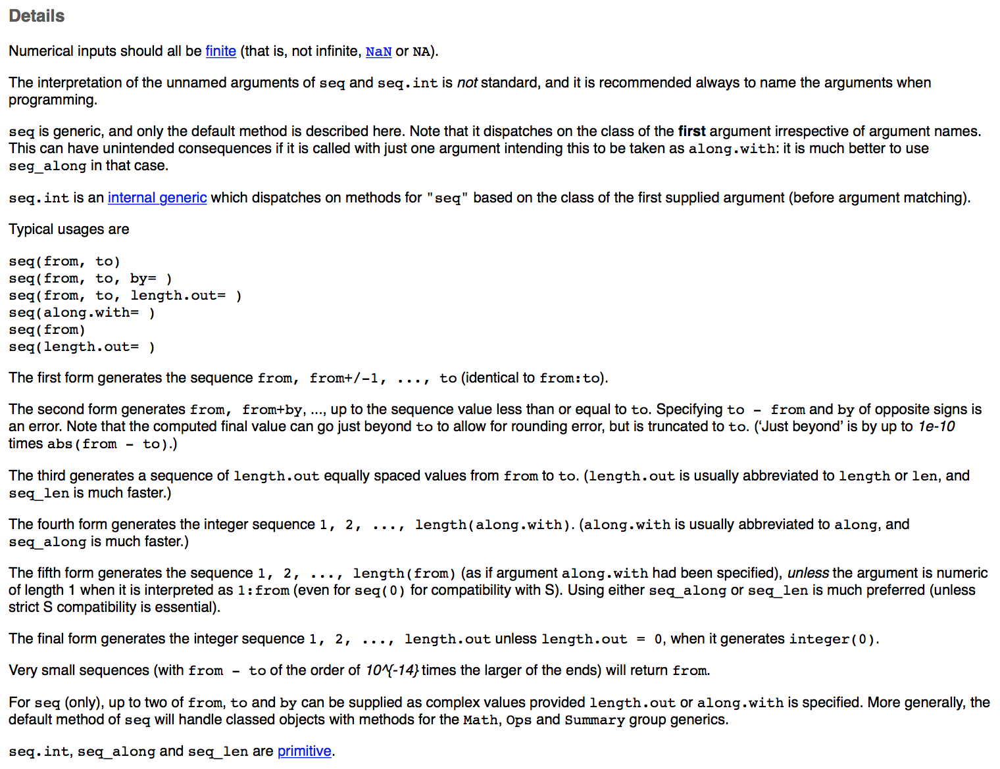
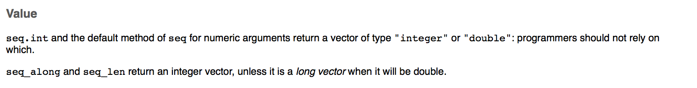
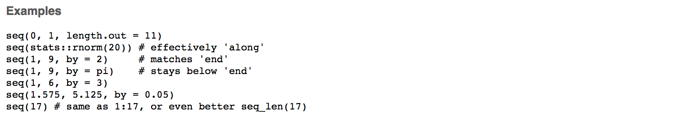
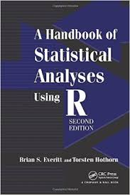

```{r setup, echo = F}
knitr::opts_chunk$set(
  comment = "#",
  collapse = TRUE,
  warning = FALSE,
  message = FALSE, 
  fig.width=6, fig.height=6,
  fig.align = 'center'
)
```

```{r, echo =F}
options(repos=structure(c(CRAN="http://cran.r-project.org")))
```

```{r, include = FALSE}
if (!require(DiagrammeR)) install.packages("DiagrammeR")
library(DiagrammeR)
if (!require(widgetframe)) install.packages("widgetframe")
library(widgetframe)
```


## Workshop 1: Introduction to R

<br>

.center[

]


Website: http://qcbs.ca/wiki/r/workshop1


---
class: inverse, center, middle

# Introduction

---
## What is R?

.pull-left[
R is an open source programming language designed for statistical analysis, data mining, and data visualization.
]

.pull.right[

]

---
## Why use R?

**It's open source**

 Improved **by** the public, **for** the public!

 **Free!**

.right[

]


---
## Why use R?

.center[

]


**It's compatible**

R works on most existing operating systems

---
## Why use R?

What people have traditionally done to analyze their data:

```{r, echo = FALSE}
  grViz("
      digraph {

      node [shape = oval, fillcolor = PaleTuruoise]
      Data; Graphs; Tables; Statistics

      node [shape = box]
      Sigmaplot; Excel; SAS

      ##add arrows
      edge [arrowhead = none]
      Data -> Sigmaplot; Data -> Excel; Data -> SAS;

      edge [arrowhead = normal]
      Sigmaplot -> Graphs; Excel -> Tables; SAS -> Statistics;

      }")

```

---
## Why use R?

R allows you to do everything with one program, which is nice!
```{r, echo = FALSE}
grViz("
      digraph {

      node [shape = oval, fillcolor = PaleTuruoise]
      Data; Graphs; Tables; Statistics

      node [shape = box]
      R

      ##add arrows
      edge [arrowhead = none]
      Data -> R;

      edge [arrowhead = normal]
      R -> Graphs; R -> Tables; R -> Statistics;

      }")

```


---
## Why use R?

- More and more scientists use it every year!
- Increasing capacities

.center[]


---
## Challenge

.pull-left2[
- Throughout these workshops you will be presented with a series of challenges that will be indicated by these rubik's cubes
- During challenges, collaborate with your neighbours!
]


.pull-right2[

]


---
## Challenge 1  

.center[Open Rstudio]

<br>

.center[

]


---
## The Rstudio console


---

## Note for Windows user

If the restriction `unable to write on disk` appears when you try to open R-Studio, .alert[don't worry!]

We have the solution! 

Right-click on your R-Studio icon and chose:
"Execute as administrator" to open the program.

---
## Note for Windows user

**Common problem**

installation process of some packages

.comment[(especially a problem for permission when installing libraries)]

---
## Note for Mac user

Please install the developer package

https://developer.apple.com/downloads/index.action#

---
## How to read the console

Text in the console typically looks like this:

.comment[You always have to push "enter" for the input to run in the console.]

```{r, include = FALSE}
output <- "This is the output"
```

```{r}
output
```

---
## How to read the console

```{r}
output
```

What does this bracket `[]` in the output means?

---
## How to read the console

```{r}
output
```

The bracket help you to locate *where* you are in the output

```{r, echo = FALSE}
c(1:40)
```

---
## Error and Warning

- .alarm[Warning message] happens with unexpected behavior in your process. You can continue to proceed your process.

- .alarm[Error message] will stop the current execution. It indicates a problem in your code

.center[
**To solve *error*, google is your bestfriend!**
]


---
class: inverse, center, middle

# Using R as a calculator

---
## Addition, substraction, etc.

- Additions and Substractions

```{r}
1+1

10-1
```

---
## Additions, substractions, etc.

- Multiplications and Divisions

```{r}
2*2

8/2
```

---
## Additions, substractions, etc.

- Exponents

```{r}
2^3
```

---
## Challenge 2 


Use R to calculate the following skill testing question:

$$
2+16*24-56
$$

<br>

**Hints**: The `*` symbol is used to multiply

---
## Challenge 2: Solution 


$$
2+16*24-56
$$


```{r}
2+16*24-56
```

---
## Challenge 3 

Use R to calculate the following skill testing question:

$$
2+16*24-56 / (2+1)-457
$$

**Hints**: Think about the order of the operation.

---
## Challenge 3: Solution 

Use R to calculate the following skill testing question:

$$
2+16*24-56 / (2+1)-457
$$


```{r}
2+16*24-56/(2+1)-457
```

.comment[Note that R follows the order of the operations]

---
## R command line tip


Use the **Up** and **Down** arrow keys to reproduce previous commands.

Give it a try!


.center[

]


---
## Challenge 4 

What is the area of this circle, with a radius of $5\ cm$?

```{r echo = F}
radius <- 1
theta <- seq(0, 2*pi, length = 200)
plot(c(-1, 1), c(-1, 1), type = "n", ann = F, axes = F, asp = 1)
lines(x = radius * cos(theta), y = radius * sin(theta))
arrows(0, 0, x1 = 1, length = 0)
text(.5, .1, "radius = 5 cm", cex = 1)
```

---
## Challenge 4: Solution 


What is the area of a circle, with a radius of $5\ cm$?


```{r}
3.1416*5^2
```

.comment[**Tip**: Note that `R` has some built-in constant such as $\pi$, so you can write:]

```{r}
pi*5^2
```

---
class: inverse, center, middle

# Objects

---
## Objects

- One of the most useful concept in `R`!
- You can store values as named objects using the assignement operator `<-`

```{r, eval = F}
object name <- assigned value
```

The value on the **right** is assigned to the name on the **left** with the assignement operator `<-`

.comment[It is also possible to use the `=` sign, but it is better to **avoid it** as it is also used for other purposes.]

---
## Objects names

- Objects names can only include:

|  Type      |  Symbol |
|------------|:-------:|
| Letters    | a-z A-Z |
| Numbers    |     0-9 |
| Period     |       . |
| Underscore |       _ |

- Objects names should **always** begin with a letter.
- `R` is **case sensitive**, the names `Data1` and `data1` are not the same.
- You can **not** use special characters! (@, /, etc.)

---
## Object names: good practices

- Try having short and explicit names for your variables. Naming a variable `var`  is not very informative.
- Adding spaces after and before the `<-` is recommended because it adds clarity.
- When typing the object's name, `R` return its value.

```{r}
mean.x <- (2+6)/2

mean.x
```

---
## Challenge 5 

<br>

Create an object with a value of 1+1.718282 (Euler's number) and name it `euler.value`.

---
## Challenge 5: Solution 


<br>

Create an object with a value of 1+1.718282 (Euler's number) and name it `euler.value`.


```{r}
euler.value <- 1+1.718282

euler.value
```

---
## Challenge 6 

Create a second object (you decide the name) with a name that starts with a number. What happens?

---
## Challenge 6: Solution 


Create a second object (you decide the name) with a name that starts with a number. What happens?


Creating an object name that starts with a number returns the following error:

```{r, eval = F}
Error: unexpected symbol in "[your object name]"
```

---
## R command line tip

- Use the tab key to autocomplete scripts
- This helps avoid spelling errors and speeds up command entering

Let's try it!

---
## R command line tip

- Enter `eu`
- Push tab
- Use the arrow keys and push enter to select the correct autocomplete

---
class: inverse, center, middle

# Types of data structures in R

---
## Types of data structures in R

- Vectors
- Data frames
- Matrices, arrays and lists

---
## Vectors

- An entity consisting of a list of related values
- A single value is called an *atomic value*
- All values of a vector must have the **same mode** (or class).
      * Numeric: only numbers
      * Logical: True/False entries
      * Character: Text, or a mix of text and other modes

---
## Vectors

- Creating vectors usually require the `c` function

.comment[`c` stands for *combine* or *concatenate*.]

- The syntax is:

```{r, eval = F}
vector <- c(value1, value2, ...)
```

---
## Vectors

- Numeric vectors

```{r}
num.vector <- c(1, 4, 3, 98, 32, -76, -4)

num.vector
```

- Character vectors

```{r}
char.vector <- c("blue", "red", "green")

char.vector
```

---
## Vectors

- Logical vectors

```{r}
bool.vector<- c(TRUE, TRUE, FALSE)

bool.vector
```

You can just write T for TRUE and F for FALSE, it's exactly the same
```{r}
bool.vector2 <- c(T, T, F)

bool.vector2
```

---
## Challenge 7 

Create a vector containing the first 5 odd numbers, starting from 1, and name it `odd.n`

---
## Challenge 7: Solution 


Create a vector containing the first 5 odd numbers, starting from 1, and name it `odd.n`


```{r}
 odd.n <- c(1,3,5,7)
```

---
## Vectors

We can use vectors for calculations

```{r}
  x <- c(1:5)
  y <- 6
```

.comment[The semicolon symbol `:` is use to combine all values between the first and the second provided numbers. `c(1:5)` returns `1, 2, 3, 4, 5`]

```{r}
x+y

x*y
```

---
## Data Frames

- Used to store data tables
- A list of vectors of the same length
- Columns = variables
- Rows = observations, sites, cases, replicates, ...
- Differents columns can have different modes

---
## Data Frames

Let's say you want to store this table in `R`:

|ID of the site|soil pH|# of species|treatment|
|---|---|---|---|
|A1.01|5.6|17|Fert|
|A1.02|7.3|23|Fert|
|B1.01|4.1|15|No Fert|
|B1.02|6.0|7|No Fert|

---
## Data Frames

One way of doing it is:
- Start by creating vectors

```{r}
siteID <- c("A1.01", "A1.02", "B1.01", "B1.02")
soil_pH <- c(5.6, 7.3, 4.1, 6.0)
num.sp <- c(17, 23, 15, 7)
treatment <- c("Fert", "Fert", "No_fert", "No_fert")
```

- We then combine them using the function `data.frame`

```{r}
my.first.df <- data.frame(siteID, soil_pH, num.sp, treatment)
```

.comment[We will come back to the `data.frame` function later.]

---
## Data Frames

```{r} 
my.first.df
```

---
## Matrices, Arrays and Lists

.center[

]


---
## Indexing objects

Sometimes, we only want to look at or extract part of our data. This is done using **brackets:** `[]`

We indicate the **position** of the values we want to see between the brackets. It's called *indexing*.

---
## Indexing vectors


You  can use indexing to chose a particular position, let's say we want to see the second value of our `odd.n` vector


```{r}
odd.n[2]
```

It also work with multiple position:


```{r}
odd.n[c(2,4)]
```

It can be used to remove some values at particular positions


```{r}
odd.n[-c(1,2)]
```

---
## Indexing vectors


If you select a position that is not in the vector it will return:

```{r}
odd.n[c(1,5)]
```

You can also use conditions to select values:


```{r}
odd.n[odd.n > 4]
```


```{r}
char.vector[char.vector == "blue"]
```


.comment[Logical statements such as `>` will be described in more details later.]


---
## Challenge 8 

Using the vector `num.vector`

- Extract the 4th value
- Extract the 1st and 3rd values
- Extract all values except for the 2nd and the 4th

---
## Challenge 8: Solution 

- Extract the 4th value

```{r}
num.vector[4]
```

- Extract the 1st and 3rd values

```{r}
num.vector[c(1,3)]
```

- Extract all values except for the 2nd and the 4th

```{r}
num.vector[c(-2,-4)]
```

---
## Challenge 9 

Explore the difference between these 2 lines of code:

```{r, eval = F}
char.vector == "blue"

char.vector[char.vector == "blue"]
```

---
## Challenge 9: Solution 

```{r}
char.vector == "blue"
```

In this line of code, you **test a logical statement**. For each entry in the `char.vector`,  `R` checks whether the entry is equal to `"blue"` or not.

```{r}
char.vector[char.vector == "blue"]
```

In this line of code, you ask `R` to extract all values within the `col.vector` vector that are exactly equal to `"blue"`.

---
## A quick note on logical statements

`R` allows testing of logical statements, *i.e.* testing whether a statement is true or false.
You need to use logical operators for that.

|Operator|Description|Example|
|-------------|-------------------------|-------------------------------|
|`<` and `>`  |less than or greater than|`odd.n > 3`                    |
|`<=` and `>=`|less/greater or equal to |`odd.n >= 3`                   |
|`==`         |exactly equal to         |`odd.n == 3`                   |
|`!=`         |not equal to             |`odd.n != 3`                   |
|`x`&#124;`y` |x OR y                   |`odd.n[odd.n >= 5` &#124; `odd.n < 3]`|
|`x & y`      |x AND y                  |`odd.n[odd.n >=3 & odd.n < 7]` |

---
## Indexing data frames

To index a data frame you must specify two dimensions: row and column number, using the following syntax:

```r
data.frame.name[row, column]
```

---
## Indexing data frames: examples

`my.first.df[1,]`  Extracts the first line


.comment[Note that an empty index select **all** the values.]

`my.first.df[,3]`  Extracts the third column


`my.first.df[2,4]`  Extracts the second element of the fourth column


---
## Indexing data frames: examples

`my.first.df[c(2,4),]`  Extracts lines 2 to 4

.comment[The examples given so far are also valid for indexing matrices, this is not the case for the following examples.]


`my.first.df$siteID`  Extracts the variable `siteID` from the data frame

`my.first.df$siteID[2]`  Extracts the second value of the variable `siteID` from the data frame


`my.first.df[c("siteID", "soil_pH")]`  Extracts the `siteID` and `soil_pH` variables from the data frame.


---
## Challenge 10 

1. Extract the `num.sp` column from `my.first.df` and multiply its value by  the first four values of `num.vec`.

2. After that, write a statement that checks if the values you obtained are greater than 25.

---
## Challenge 10: Solution 

1. Extract the `num.sp` column from `my.first.df` and multiply its value by  the first four values of `num.vec`.

```{r}
my.first.df$num.sp * num.vector[c(1:4)]
# or
my.first.df[,3] * num.vector[c(1:4)] 
```

2. After that, write a statement that checks if the values you obtained are greater than 25.


```{r}
(my.first.df$num.sp * num.vector[c(1:4)]) > 25
```

---
class: inverse, center, middle

# Functions

---
## Functions

.pull-left2[
A function is a tool to simplify your life.

It allows you to quickly execute operations on objects without having to write every mathematical step.

A function needs entry values called **arguments** (or parameters). It then performs hidden operations using these arguments and gives a **return value**.
]

.pull.right2[

]

---
## Functions

To use (call) a function, the command must be structured properly, following the "grammar rules" of the `R` language: the syntax.

```{r, eval = F}
function_name(argument 1, argument 2)
```

---
## Arguments

Arguments are **values** and **instructions** the function needs to run.

Objects storing these values and instructions can be used in functions:

```{r}
a <- 3
b <- 5
sum(a,b)
```

---
## Challenge 11 

- Create a vector `a` that contains all the numbers from 1 to 5
- Create an object `b` with a value of 2
- Add `a` and `b` together using the basic `+` operator and save the result in an object called `result_add`
- Add `a` and `b` together using the `sum` function and save the result in an object called `result_sum`
- Compare `result_add` and `result_sum`. Are they different?
- Add 5 to `result_sum` function using the `sum` function

---
## Challenge 11: Solution  

```{r}
a <- c(1:5)
b <- 2

result_add <- a + b

result_sum <- sum(a,b)
```

```{r}
result_add

result_sum

sum(result_sum, 5)
```

---
## Challenge 11: Solution  

The operation `+` on the vector `a` adds 2 to each element. The result is a vector.

The function `sum` concatenates all the values provided and then sum them. It is the same as doing 1+2+3+4+5+2.

---
## Arguments

Arguments each have a **name** that can be provided during a function call.

If the name is not present, the order of the arguments does matter.

If the name is present, the order does not matter.

---
## Challenge 12 

`plot` is a function that draws a graph of y as a function of x. It requires two arguments names *x* and *y*. What are the differences between the following lines?

```{r, eval = F}
a <- 1:100
b <- a^2
plot(a,b)
plot(b,a)
plot(x = a, y = b)
plot(y = b, x = a)
```

---
## Challenge 12: Solution

```{r, echo = F}
a <- 1:100
b <- a^2
par(mfrow = c(2,2),mar=c(4,4,1,1))
plot(a,b)
plot(b,a)
plot(x = a, y = b)
plot(y = b, x = a)
```

---
## Challenge 12: Solution 

.pull-left[
```{r,eval=F}
plot(a,b)
```

```{r, echo = FALSE, fig.width=3.6, fig.height=3.6}
par(mar=c(4,4,1,1))
plot(a,b)
```
]

.pull-right[
```{r,eval=F}
plot(b,a)
```

```{r, echo = FALSE, fig.width=3.6, fig.height=3.6}
par(mar=c(4,4,1,1))
plot(b,a)
```
]

The shape of the plot changes, as we did not provided the arguments names, the order is important.

---
## Challenge 12: Solution 

.pull-left[
```{r,eval=F}
plot(x = a, y = b)
```

```{r, echo = FALSE, fig.width=3.6, fig.height=3.6}
par(mar=c(4,4,1,1))
plot(x = a, y = b)
```
]

.pull-right[
```{r,eval=F}
plot(y = b, x = a)
```

```{r, echo = FALSE, fig.width=3.6, fig.height=3.6}
par(mar=c(4,4,1,1))
plot(y = b, x = a)
```
]

Same as `plot(a,b)`. The argument names are provided, the order is not important.

---
## Packages

Packages are a **grouping of functions** and/or **datasets** that share a similar **theme**, e.g. statistics, spatial analysis, plotting, etc.

**Everyone** can develop packages and make them available to others.

They are usually available through the *Comprehensive R Archive Network* or CRAN: http://cran.r-project.org/web/packages/

Currently, more than 5877 packages are publicly availables.

---
## Packages

To install packages on your computer, use the function `install.packages`.

```r
install.packages("package name")
```

Installing a package is not enough to use it. You need to load it into your workspace before using it using the `library` function.

```r
library(package name)
```

---
## Package: an example

```{r, eval = F}
install.packages("ggplot2")
```

```{r, eval = F}
Installing package into '/home/labo/R/x86_64-redhat-linux-gnu-library/3.3'
(as 'lib' is unspecified)
```

```{r, eval = F}
qplot(1:10, 1:10)
```

```{r, eval = F}
## Error: could not find function "qplot"
```

---
## Package name: an example

```{r, fig.width=4, fig.height=4}
library(ggplot2)
qplot(1:10, 1:10)
```

---
class: inverse, center, middle

# Getting help

---
## Searching for functions

WOW! `R` is so great! So many functions to do what I want!

But... how do I find them?

---
## Searching for functions

To find a function that does something specific in your installed packages, you can use `??` followed by a search term.

Let's say we want to create a *sequence* of odd numers between 0 and 10 as we did earlier. We can search in our packages all the functions with the word "sequence" in them:

```{r, eval = F}
??sequence
```

---
## Search results


---
## Search results


---
## Search results


---
## Getting help with functions

OK! SO let's use the `seq` function!!

But wait... how does it work? What arguments does it need?

To find information about a function in particular, use `?`

```{r, eval = F}
  ?seq
```

---
## Help pages


---
## Description

- `function_name {package_name}`
- Description: a short description of what the function does.


---
## Usage

- How to call the function
- If `name = value` is present, a default value is provided if the argument is missing. The argument becomes optional.
- Other related functions described in this help page




---
## Arguments

- Description of all the arguments and what they are used for


---
## Details

- A detailed description of how the functions work and their characteristics



---
## Value

- A description of the return value



---
## See Also

- Other related functions that can be useful


---
## Examples

- Reproducibles examples



---
## Challenge 13 

1. Create a sequence of even numbers from 0 to 10 using the `seq` function.

2. Create a unsorted vector of your favourite numbers, then sort your vector in reverse order.

---
## Challenge 13: Solutions 

1. Create a sequence of even numbers from 0 to 10 using the `seq` function.

.pull-left[
```{r class="fragment"}
seq(from=0, to=10, by=2)
```
]

.pull-right[
```{r class="fragment"}
seq(0,10,2)
```
]


2. Create a unsorted vector of your favourite numbers, then sort your vector in reverse order.

```{r class="fragment"}
numbers <- c(2,4,22,6,26)
sort(numbers, decreasing = T)
```

---
## Other ways to get help

Usually, your best source of information will be your favorite search engine!

Here are some tips on how to use them efficiently:
- Search in English
- Use the keyword "R" at the beginning of your search
- Define precisely what you are looking for
- Learn to read discussion forums. Chances are other people already had your problem and asked about it.
- Don't hesitate to search again using different keywords!

---
## Challenge 14 

Find the appropriate functions to perform the following operations:

- Square root
- Calculate the mean of numbers
- Combine two data frames by columns
- List availables objects in your workspace

---
## Challenge 14: Solutions 
- `sqrt`
- `mean`
- `cbind`
- `ls`

---
class: inverse, center, middle

# Additional resources

---
## Cheat 4ever

Lot of cheatsheets are available:

https://www.rstudio.com/resources/cheatsheets/

Open it directly from **Rstudio**

---
## Cheat 4ever


---
## Some useful R books





---
## Some useful R websites

- http://stats.stackexchange.com
- https://www.zoology.ubc.ca/~schulter/R/
- http://statmethods.net/
- http://rseek.org/
- http://cookbook-r.com/
- http://cran.r-project.org/doc/contrib/Baggott-refcard-v2.pdf

---
class: inverse, center, bottom

# Thank you for attending!


