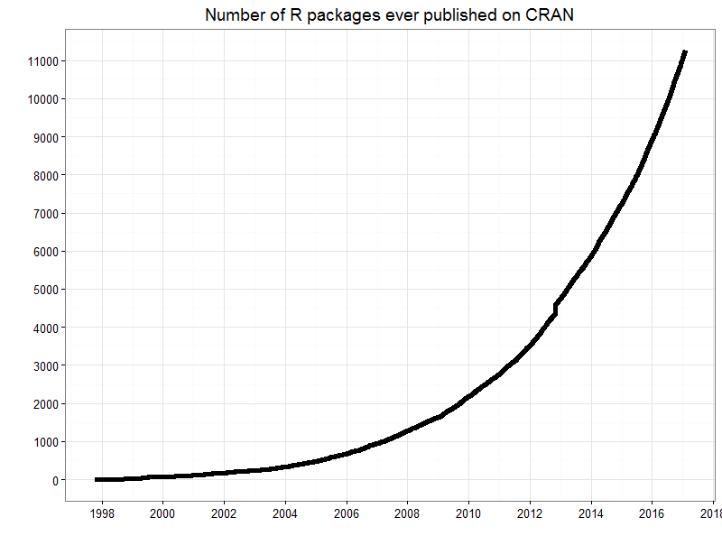
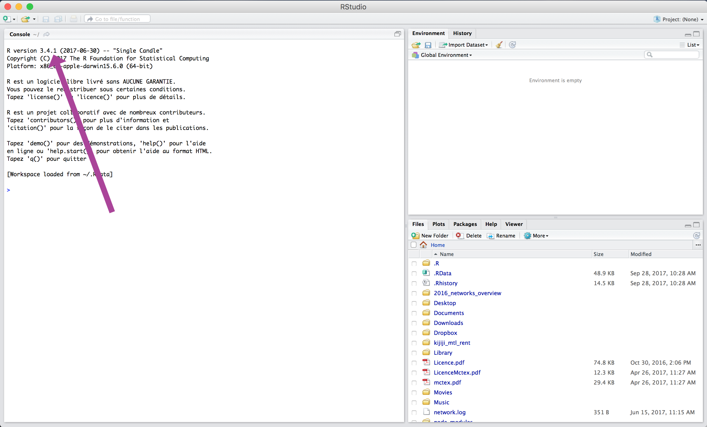
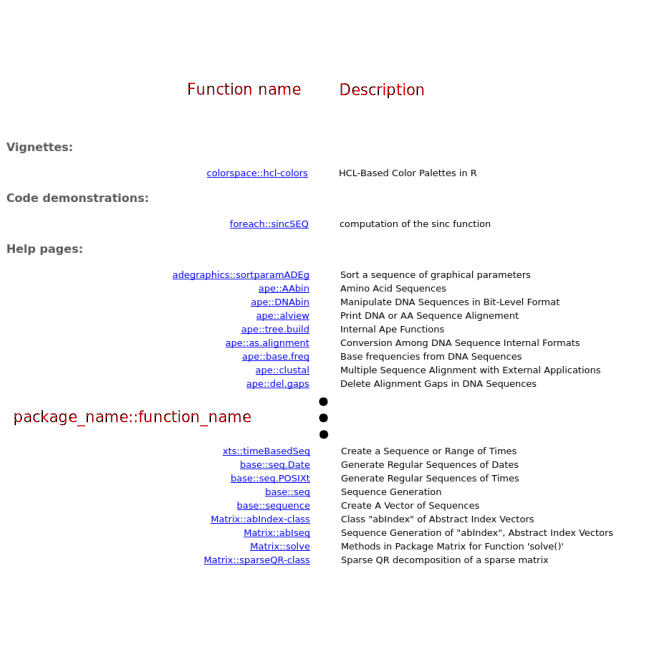
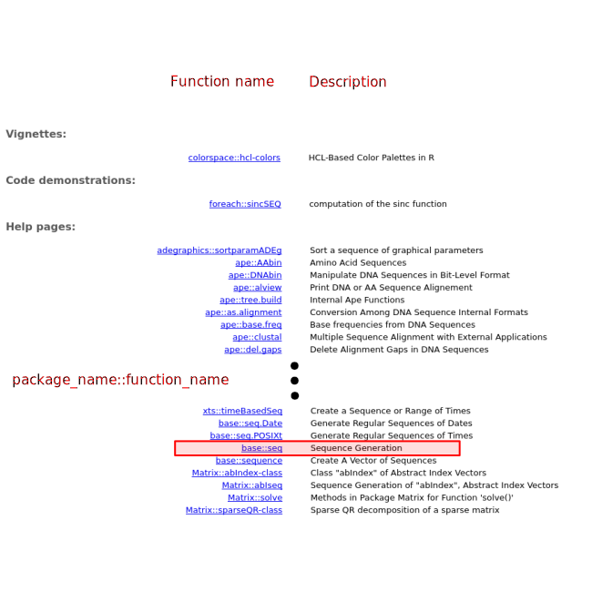
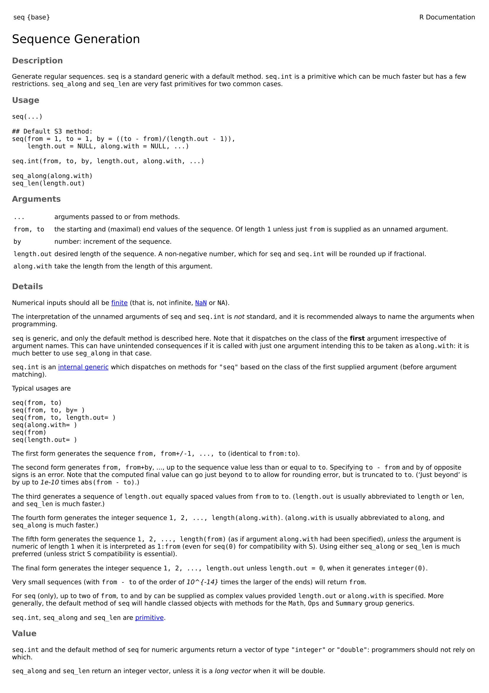
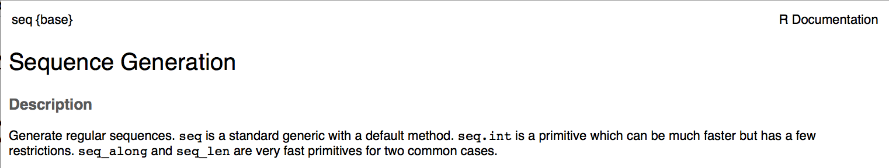
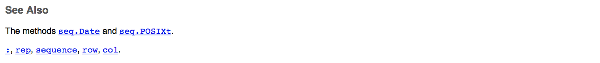
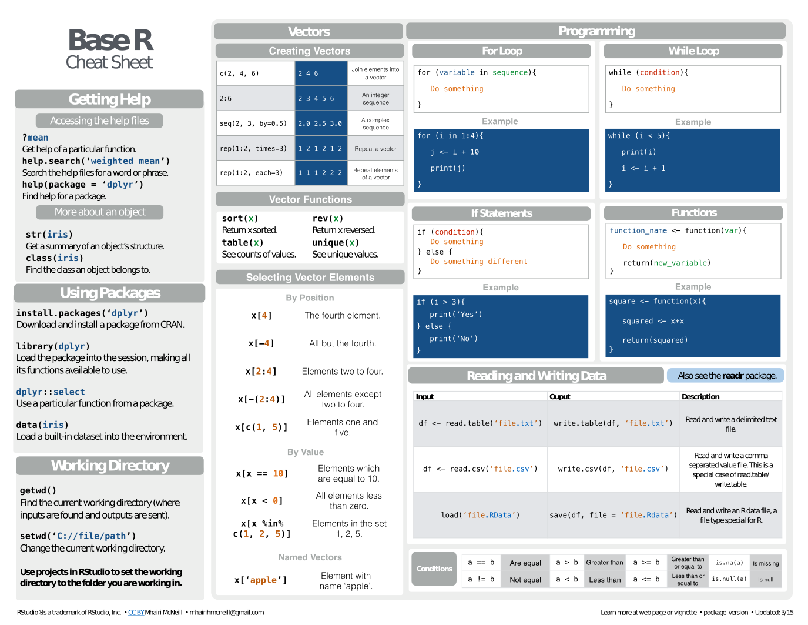
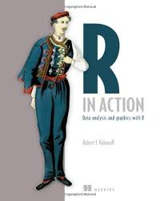
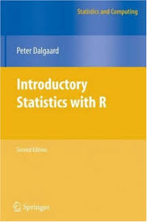

```{r, include = FALSE}
install.packages("DiagrammeR")
library(DiagrammeR)

```

## Workshop 1: Introduction to R

<center></center>

<center>Website: http://qcbs.ca/wiki/r/workshop1</center>

# Introduction

## What is R?

<div id = left>

R is an open source programming language designed for statistical analysis, data mining, and data visualization.

</div>


## Why use R?

<p class="flotte">
 
</p>
<p style="line-height:65px;">
**It's open source**
</p>

**Free** & Improved **by** the public, **for** the public!

## Why use R?

<center></center>

**It's compatible**

R works on most existing operating systems

## Why use R?

What people have traditionally done to analyze their data:

```{r, echo = FALSE}
  grViz("
      digraph {

      node [shape = oval, fillcolor = PaleTuruoise]
      Data; Graphs; Tables; Statistics

      node [shape = box]
      Sigmaplot; Excel; SAS

      ##add arrows
      edge [arrowhead = none]
      Data -> Sigmaplot; Data -> Excel; Data -> SAS;

      edge [arrowhead = normal]
      Sigmaplot -> Graphs; Excel -> Tables; SAS -> Statistics;

      }")

```

## Why use R?

```{r, echo = FALSE}
  grViz("
      digraph {

      node [shape = oval, fillcolor = PaleTuruoise]
      Data; Graphs; Tables; Statistics

      node [shape = box]
      R

      ##add arrows
      edge [arrowhead = none]
      Data -> R;

      edge [arrowhead = normal]
      R -> Graphs; R -> Tables; R -> Statistics;

      }")

```

R allows you to do everything with one program, which is nice!

## Why use R?



<div id = "right">

 - More and more scientists use it every year!
 - Increasing capacities

 </div>

## Challenge

<div id = "left">

 - Throughout these workshops you will be presented with a series of challenges that will be indicated by these rubiks cubes
 - During challenges, collaborate with your   neighbours!

</div>


## Challenge 1 

<center>Open Rstudio</center>

<center></center>

## The Rstudio console



## Note for Windows user

If the restriction:
"unable to write on disk"
appears when you try to open R-Studio,

**Don't worry!**
We have the solution
right-click on your R-Studio icon and chose:
"Execute as administrator" to open the program.

## Note for Windows user

**Common problem**

installation process of some packages

<small>(especially a problem for permission when installing libraries)</small>

## Note for Mac user

Please install the developer package

https://developer.apple.com/downloads/index.action#


## How to read the console

Text in the console typically looks like this:
<small>You always have to push "enter" for the input to run in the console.</small>

```{r, include = FALSE}
  output <- "This is the output"
```

```{r}
  output
```

## How to read the console

```{r}
  output
```

<put an arrow here>

What does this bracket in the output means?

## How to read the console

```{r}
  output
```
<put an arrow here>
This bracket help you to locate "where" you are in the output

```{r, echo = FALSE}
	c(1:40)
```

## Error and Warning

Error message will not allow to enter values/furthur
process.

warning message you can proceed your process

# Using R as a calculator

## Addition, substraction, etc.

- Additions and Substractions

```{r}
	1+1
  10-1
```

## Additions, substractions, etc.

- Multiplications and Divisions

```{r}
	2*2
  8/2
```

## Additions, substractions, etc.

- Exponents

```{r}
	2^3
```

## Challenge 2 


Use R to calculate the following skill testing question:

$$
2+16*24-56
$$

<small>Hints: The `*` symbol is used to multiply</small>

## Challenge 2: Solution 

- Question

$$
2+16*24-56
$$

- Solution

```{r}
	2+16*24-56
```

## Challenge 3 

Use R to calculate the following skill testing question:

$$
2+16*24-56 / (2+1)-457
$$

<small>Hints: Think about the order of the operation.</small>

## Challenge 3: Solution 

- Question

$$
2+16*24-56 / (2+1)-457
$$

- Solution

```{r}
	2+16*24-56/(2+1)-457
```

Note that R follows the order of the operations

## R command line tip

<div id = "left">

Use the "Up" and "Down" arrow keys to reproduce previous commands.

Give it a try!

</div>


## Challenge 4 

What is the area of this circle, with a radius of $5\ cm$?

```{r echo = F, fig.width=4.5, fig.height=4.5}
  radius <- 1
  theta <- seq(0, 2*pi, length = 200)
	plot(c(-1, 1), c(-1, 1), type = "n", ann = F, axes = F, asp = 1)
	lines(x = radius * cos(theta), y = radius * sin(theta))
	arrows(0, 0, x1 = 1, length = 0)
	text(.5, .1, "radius = 5 cm", cex = .8)
```

## Challenge 4: Solution 

- Question

What is the area of a circle, with a radius of $5\ cm$?

- Solution

```{r}
  3.1416*5^2
```

Tip: Note that `R` has some built-in constant such as $\pi$, so you can write:

```{r}
  pi*5^2
```

# Objects

## Objects

- One of the most useful concept in `R`!
- You can store values as named objects using the assignement operator `<-`

```{r, eval = F}
  object name <- assigned value
```

The value on the **right** is assigned to the name on the **left** with the assignement operator `<-`

 <small>It is also possible to use the `=` sign, but it is better to **avoid it** as it is also used for other purposes.</small>

## Objects names

- Objects names can only include:

|  Type      |  Symbol |
|------------|--------:|
| Letters    | a-z A-Z |
| Numbers    |     0-9 |
| Period     |       . |
| Underscore |       _ |

- Objects names should **always** begin with a letter.
- `R` is **case sensitive**, the names `Data1` and `data1` are not the same.

## Object names: good practices

- Try having short and explicit names for your variables. Naming a variable `var`  is not very informative.
- Adding spaces after and before the `<-` is recommended because it adds clarity.
- When typing the object's name, `R` return its value.

```{r}
  mean.x <- (2+6)/2
  mean.x
```

## Challenge 5 

Create an object with a value of 1+1.718282 (Euler's number) and name it `euler.value`.

## Challenge 5: Solution 

- Question

Create an object with a value of 1+1.718282 (Euler's number) and name it `euler.value`.

- Solution

```{r}
  euler.value <- 1+1.718282
  euler.value
```

## Challenge 6 

Create a second object (you decide the name) with a name that starts with a number. What happens?

## Challenge 6: Solution 

- Question

Create a second object (you decide the name) with a name that starts with a number. What happens?

- Solution

Creating an object name that starts with a number returns the following error:

```{r, eval = F}
 Error: unexpected symbol in "[your object name]"
```

## R command line tip

- Use the tab key to autocomplete scripts
- This helps avoid spelling errors and speeds up command entering

Let's try it!

## R command line tip

- Enter `eu`
- Push tab
- Use the arrow keys and push enter to select the correct autocomplete

# Types of data structures in R

## Types of data structures in R

- Vectors
- Data frames
- Matrices, arrays and lists

## Vectors

- An entity consisting of a list of related values
- A single value is called an *atomic value*
- All values of a vector must have the **same mode** (or class).
      * Numeric: only numbers
      * Logical: True/False entries
      * Character: Text, or a mix of text and other modes

## Vectors

- Creating vectors usually require the `c` function

<small>`c` stands for *combine* or *concatenate*.</small>

- The syntax is:

```{r, eval = F}
  vector <- c(value1, value2, ...)
```

## Vectors

- Numeric vectors

```{r}
  num.vector <- c(1, 4, 3, 98, 32, -76, -4)
  num.vector
```

- Character vectors

```{r}
  char.vector <- c("blue", "red", "green")
  char.vector
```

## Vectors

- Logical vectors

```{r}
 bool.vector<- c(TRUE, TRUE, FALSE)
 bool.vector
 # You can just write T for TRUE and F for FALSE, it's exactly the same
 bool.vector2 <- c(T, T, F)
 bool.vector2
```

## Challenge 7 

Create a vector containing the first 5 odd numbers, starting from 1, and name it `odd.n`

## Challenge 7: Solution 

- Question

Create a vector containing the first 5 odd numbers, starting from 1, and name it `odd.n`

- Solution

```{r}
 odd.n <- c(1,3,5,7)
```

## Vectors

We can use vectors for calculations

```{r}
  x <- c(1:5)
  y <- 6
```

<small>The semicolon symbol `:` is use to combine all values between the first and the second provided numbers. `c(1:5)` returns `1, 2, 3, 4, 5`</small>

```{r}
  x+y
  x*y
```

## Data Frames

- Used to store data tables
- A list of vectors of the same length
- Columns = variables
- Rows = observations, sites, cases, replicates, ...
- Differents columns can have different modes

## Data Frames

Let's say you want to store this table in `R`:

|ID of the site|soil pH|# of species|treatment|
|---|---|---|---|
|A1.01|5.6|17|Fert|
|A1.02|7.3|23|Fert|
|B1.01|4.1|15|No Fert|
|B1.02|6.0|7|No Fert|

## Data Frames

One way of doing it is:
- Start by creating vectors

```{r}
  siteID <- c("A1.01", "A1.02", "B1.01", "B1.02")
  soil_pH <- c(5.6, 7.3, 4.1, 6.0)
  num.sp <- c(17, 23, 15, 7)
  treatment <- c("Fert", "Fert", "No_fert", "No_fert")
```

- We then combine them using the function `data.frame`

```{r}
  my.first.df <- data.frame(siteID, soil_pH, num.sp, treatment)
```

<small>We will come back to the `data.frame` function later.</small>

## Data Frames

```{r}
  my.first.df
```

## Matrices, Arrays and Lists

<center></center>

## Indexing objects

Sometimes, we only want to look at or extract part of our data. This is done using **brackets:** `[]`

We indicate the **position** of the values we want to see between the brackets. It's called *indexing*.

## Indexing vectors

```{r cache=F,echo=F}
s0 <- knitr::knit_hooks$get('source')
o0 <- knitr::knit_hooks$get('output')

knitr::knit_hooks$set(
  list(
    source=function(x,options){
      if (is.null(options$class)) s0(x, options)
      else
        paste0(
          paste0("<div class='", options$class, "'><pre><code>")
          ,x
          ,'</code></pre>\n'
        )
    }
    ,output = function(x,options){
      if (is.null(options$class)) o0(x, options)
      else
        paste0(
          "<pre><code>"
          ,x
          ,'</code></pre></div>\n'
        )
    }
  )
)
```

<div class="fragment">
  You  can use indexing to chose a particular position, let's say we want to see the second value of our `odd.n` vector
</div>


```{r class="fragment"}
 odd.n[2]
```

<div class="fragment">
  It also work with multiple position:
</div>


```{r class="fragment"}
 odd.n[c(2,4)]
```

<div class="fragment">
  It can be used to remove some values at particular positions
</div>

```{r class="fragment"}
 odd.n[-c(1,2)]
```

## Indexing vectors

<div class="fragment">
  If you select a position that is not in the vector it will return:
</div>

```{r class="fragment"}
 odd.n[c(1,5)]
```

<div class="fragment">
  You can also use conditions to select values:
</div>


```{r class="fragment"}
 odd.n[odd.n > 4]
```

```{r class="fragment"}
 char.vector[char.vector == "blue"]
```

<div class="fragment">
<small>Logical statements such as `>` will be described in more details later.</small>
</div>

## Challenge 8 

Using the vector `num.vector`

- Extract the 4th value
- Extract the 1st and 3rd values
- Extract all values except for the 2nd and the 4th

## Challenge 8: Solution 

- Extract the forth value

```{r}
  num.vector[4]
```

- Extract the 1st and 3rd values

```{r}
  num.vector[c(1,3)]
```

- Extract all values except for the 2nd and the 4th

```{r}
  num.vector[c(-2,-4)]
```

## Challenge 9 

Explore the difference between these 2 lines of code:

```{r, eval = F}
  char.vector == "blue"
  char.vector[char.vector == "blue"]
```

## Challenge 9: Solution 

```{r}
  char.vector == "blue"
```

In this line of code, you **test a logical statement**. For each entry in the `char.vector`, `R` checks whether the entry is equal to `"blue"` or not.

```{r}
  char.vector[char.vector == "blue"]
```

In this line of code, you ask `R` to extract all values within the `col.vector` vector that are exactly equal to `"blue"`.

## A quick note on logical statements

- `R` allows testing of logical statements, *i.e.* testing whether a statement is true or false.

- You need to use logical operators for that.

|Operator|Description|Example|
|---|---|---|
|`<` and `>`|less than or greater than|`odd.n > 3`|
|`<=` and `>=`|less/greater or equal to|`odd.n >= 3`|
|`==`|exactly equal to|`odd.n == 3`|
|`!=`|not equal to|`odd.n != 3`|
|`x | y`|x OR y|`odd.n[odd.n >= 5 | odd.n < 3]`|
|`x & y`|x and y|`odd.n[odd.n >=3 & odd.n < 7]`|

## Indexing data frames

To index a data frame you must specify two dimensions: row and column number, using the following syntax:

`data.frame.name[row,column]`

## Indexing data frames: examples

```{r class="fragment", eval = F}
 my.first.df[1,]
```

<div class="fragment">
  Extracts the first line

  <small>Note that an empty index select **all** the values.</small>
</div>

```{r class="fragment", eval = F}
 my.first.df[,3]
```

<div class="fragment">
  Extracts the third column
</div>

```{r class="fragment", eval = F}
 my.first.df[2,4]
```

<div class="fragment">
  Extracts the second element of the fourth column
</div>

## Indexing data frames: examples

```{r class="fragment", eval = F}
 my.first.df[c(2,4),]
```

<div class="fragment">
  Extracts lines 2 to 4

  <small>The examples given so far are also valid for indexing matrices, this is not the case for the following examples.</small>
</div>

```{r class="fragment", eval = F}
 my.first.df$siteID
```

<div class="fragment">
  Extracts the variable `siteID` from the data frame
</div>

```{r class="fragment", eval = F}
 my.first.df$siteID[2]
```

<div class="fragment">
  Extracts the second value of the variable `siteID` from the data frame
</div>

```{r class="fragment", eval = F}
 my.first.df$[c("siteID", "soil_pH")]
```

<div class="fragment">
  Extracts the `siteID` and `soil_pH` variables from the data frame.
</div>

## Challenge 10 

- a) Extract the `num.sp` column from `my.first.df` and multiply its value by  the first four values of `num.vec`.
- b) After that, write a statement that checks if the values you obtained are greater than 25.

## Challenge 10: Solution 

<div class="fragment">
  Part a):
</div>

```{r class="fragment"}
 my.first.df$num.sp * num.vector[c(1:4)]
 # or
 my.first.df[,3] * num.vector[c(1:4)]
```

<div class="fragment">
  Part b):
</div>

```{r class="fragment"}
 (my.first.df$num.sp * num.vector[c(1:4)]) > 25
```

# Functions

## Functions

A function is a tool to simplify your life.

It allows you to quickly execute operations on objects without having to write every mathematical step.

A function needs entry values called **arguments** (or parameters). It then performs hidden operations using these arguments and gives a **return value**.

## Functions

To use (call) a function, the command must be structured properly, following the "grammar rules" of the `R` language: the syntax.

```{r, eval = F}
  function_name(argument 1, argument 2)
```

## Arguments

Arguments are **values** and **instructions** the function needs to run.

Objects storing these values and instructions can be used in functions:

```{r}
  a <- 3
  b <- 5
  sum(a,b)
```

## Challenge 11 

- Create a vector `a` that contains all the numbers from 1 to 5
- Create an object `b` with a value of 2
- Add `a` and `b` together using the basic `+` operator and save the result in an object called `result_add`
- Add `a` and `b` together using the `sum` function and save the result in an object called `result_sum`
- Compare `result_add` and `result_sum`. Are they different?
- Add 5 to `result_sum` function using the `sum` function

## Challenge 11: Solution 

```{r}
  a <- c(1:5)
  b <- 2
  result_add <- a + b
  result_sum <- sum(a,b)
```

```{r}
  result_add
  result_sum
  sum(result_sum, 5)
```

## Challenge 11: Solution 

The operation `+` on the vector `a` adds 2 to each element. The result is a vector.

The function `sum` concatenates all the values provided and then sum them. It is the same as doing 1+2+3+4+5+2.

## Arguments

Arguments each have a **name** that can be provided during a function call.

If the name is not present, the order os the arguments does matter.

If the name is present, the order does not matter.

## Challenge 12 

`plot` is a function that draws a graph of y as a fucntion of x. It requires two arguments names *x* and *y*. What are the differences between the following lines?

```{r, eval = F}
  a <- 1:100
  b <- a^2
  plot(a,b)
  plot(b,a)
  plot(x = a, y = b)
  plot(y = b, x = a)
```

## Challenge 12: Solutions 

```{r, echo = F, fig.width=5, fig.height=5}
  a <- 1:100
  b <- a^2
  par(mfrow = c(2,2))
  plot(a,b)
  plot(b,a)
  plot(x = a, y = b)
  plot(y = b, x = a)
```

## Challenge 12: Solution 

```{r,fig.width=4.5, fig.height=4.5}
  plot(a,b)
```

## Challenge 12: Solution 

```{r,fig.width=4.5, fig.height=4.5}
  plot(b,a)
```

The shape of the plot has changed, as we did not provided the arguments names, the order is important.

## Challenge 12: Solution 

```{r,fig.width=4.5, fig.height=4.5}
  plot(x = a, y = b)
```

Same as `plot(a,b)`

## Challenge 12: Solution 

```{r,fig.width=4.5, fig.height=4.5}
  plot(y = b, x = a)
```

Same as `plot(a,b)`. The argument names are provided, the order is not important.

## Packages

Packages are a **grouping of functions** and/or **datasets** that share a similar **theme**, e.g. statistics, spatial analysis, plotting, etc.

**Everyone** can develop packages and make them available to others.

They are usually available through the *Comprehensive R Archive Network* or CRAN: http://cran.r-project.org/web/packages/

Currently, more than 5877 packages are publicly availables.

## Packages

To install packages on your computer, use the function `install.packages`.

```{r, eval = F}
  install.packages("package name")
```

Installing a package is not enough to use it. You need to load it into your workspace before using it using the `library` function.

```{r, eval = F}
 library(package name)
```

## Package: an example

```{r, eval = F}
  install.packages("ggplot2")
```

```{r, eval = F}
## Installing package into '/home/labo/R/x86_64-redhat-linux-gnu-library/3.3'
## (as 'lib' is unspecified)
```

```{r, eval = F}
 qplot(1:10, 1:10)
```

```{r, eval = F}
  ## Error: could not find function "qplot"
```

## Package name: an example

```{r, fig.width=5, fig.height=5}
  library(ggplot2)
  qplot(1:10, 1:10)
```

# Getting help

## Searching for functions

WOW! `R` is so great! So many functions to do what I want!

But... how do I find them?

## Searching for functions

To find a function that does something specific in your installed packages, you can use `??` followed by a search term.

Let's say we want to create a *sequence* of odd numers between 0 and 10 as we did earlier. We can search in our packages all the functions with the word "sequence" in them:

```{r, eval = F}
  ??sequence
```

## Search results


## Search results



## Search results



## Getting help with functions

OK! SO let's use the `seq` function!!

But wait... how does it work? What arguments does it need?

To find information about a function in particular, use `?`

```{r, eval = F}
  ?seq
```

## Help pages



## Description

- `function_name {package_name}`
- Description: a short description of what the function does.



## Usage

- How to call the function
- If `name = value` is present, a default value is provided if the argument is missing. The argument becomes optional.
- Other related functions described in this help page


## Arguments

- Description of all the arguments and what they are used for


## Details

- A detailed description of how the functions work and their characteristics


## Value

- A description of the return value


## See Also

- Other related functions that can be useful



## Examples

- Reproducibles examples


## Challenge 13 

a) Create a sequence of even numbers from 0 to 10 using the `seq` function.

b) Create a unsorted vector of your favourite numbers, then:
- find out how to *sort* it
- sort your vector in reverse order

## Challenge 13: Solutions 

<div class="fragment">
  Part a)
</div>

```{r class="fragment"}
 seq(from=0, to=10, by=2)
```

<div class="fragment">
  or
</div>

```{r class="fragment"}
 seq(0,10,2)
```

<div class="fragment">
  Part b)
</div>

```{r class="fragment"}
 numbers <- c(2,4,22,6,26)
 sort(numbers, decreasing = T)
```

## Other ways to get help

Usually, your best source of information will be your favorite search engine!

Here are some tips on how to use them efficiently:
- Search in English
- Use the keyword "R" at the beginning of your search
- Define precisely what you are looking for
- Learn to read discussion forums. Chances are other people already had your problem and asked about it.
- Don't hesitate to search again using different keywords!

## Challenge 14 

Find the appropriate functions to perform the following operations:

- Square root
- Calculate the mean of numbers
- Combine two data frames by columns
- List availables objects in your workspace

## Challenge 14: Solutions 

- `sqrt`
- `mean`
- `cbind`
- `ls`

# Additional resources

## Cheat 4ever

Lot of cheatsheets are available:

https://www.rstudio.com/resources/cheatsheets/

Open it directly from **Rstudio**

## Cheat 4ever

<center></center>

## Some useful R books








## Some useful R websites

- http://stats.stackexchange.com
- https://www.zoology.ubc.ca/~schulter/R/
- http://statmethods.net/
- http://rseek.org/
- http://cookbook-r.com/
- http://cran.r-project.org/doc/contrib/Baggott-refcard-v2.pdf

## Thank you for attending!


We want your feed back!
https://docs.googlgithube.com/spreadsheets/d/1BUZ24UZEMvsF16gxWOm8yAvM_A9DdIeSaOk6b61bzxQ/edit#gid=0
