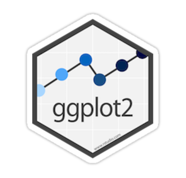
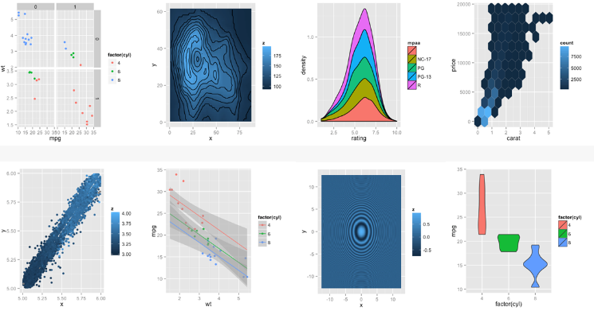

```{r, include = FALSE}
library(ggplot2)
```

## ggplot2

 

## Introduction

Why use R for plotting? 


## Introduction

Why use R for plotting? 


## Introduction

Why use R for plotting?

Beautiful and flexible graphics!


## Introduction

- Have you created plots?
      * What kind of plot?
      * Which software?

- Have you plotted in R?
      * base R, lattice?
      * ggplot2?

## Introduction

- To follow along:

Code and HTML available at http://qcbs.ca/wiki/r/workshop3 

- Recommendation:
      * create your own new script
      * refer to provided code only if needed
      * avoid copy pasting or running the code directly from script

- ggplot2 is also hosted on github: https://github.com/hadley/ggplot2

## Introduction

Required packages
```{r, eval = FALSE}
install.packages("ggplot2")
library(ggplot2)
```

## Outline
1. Your first R plot
    * Basic scatter plot
    * Challenge 1
2. Grammar of graphics
    * More advanced plots
    * Available plot elements and when to use them
    * Challenge 2
3. Saving a plot
4. Fine tuning your plot
    * Colours
    * Themes
5. Miscellaneous

## Basic scatter plot
```{r, eval = FALSE}
?qplot
```
arguments:

- data

- x

- y

- ...

## Basic scatter plot
Look at pre-loaded "iris" dataset:
```{r, eval = FALSE}
> ?iris
> head(iris)
> str(iris)
> names(iris)
```

## Basic scatter plot

```{r}
qplot(data = iris,
        x = Sepal.Length,
        y = Sepal.Width)
```

## Basic scatter plot

```{r}
qplot(data = iris,
        x = Species,
        y = Sepal.Width)
```

## Less basic options

arguments:

- xlab

- ylab

- main

## Less basic options

```{r}
qplot(data = iris,
        x = Sepal.Length,
        xlab = "Sepal Length (mm)",
        y = Sepal.Width,
        ylab = "Sepal Width (mm)",
        main = "Sepal dimensions")
```

## Challenge #1
Produce a basic plot with built in data (5 minutes)

```{r, eval = FALSE}
?CO2
data(CO2)
?BOD
data(BOD)
```

## Solution #1
Produce a basic plot with the CO2 dataset 

```{r}
qplot(data = CO2,
        x = conc,
        xlab = "CO2 Concentration (mL/L)",
        y = uptake,
        ylab = "CO2 Uptake (umol/m^2 sec)",
        main = "CO2 uptake in grass plants")
```


## tidyr


## dplyr

## How to use rmd

> - Bullet 1
> - Bullet 2
> - Bullet 3

### Begins a new header within a slide

## Vertical Slide with Incremental Bullets
> - Level 1 item
>      * Level 2 item
>      * Level 2 item
> - Level 1 item

## Vertical Slide with Normal Text and Small Text

This is a normal text.

<small>This sentence will appear smaller.</small>

## Vertical Slide with Text Aligned to the Right

<div id="right">

- You can place two graphs on a slide
- Or two columns of text
- These are all created with div elements

</div>

## Vertical Slide with Text Aligned to the Left

<div id="left">

- You can place two graphs on a slide
- Or two columns of text
- These are all created with div elements

</div>

## Vertical Slide with Quote Text

> R Markdown is amazing!

## Vertical Slide with Images

[Caption for the picture.](/images/logo_text.png)

# Code Section

## Slide with R Code and Output

```{r}
summary(cars)
```

## Slide with Plot

```{r, echo=FALSE}
plot(cars)
```

## Slide with R Code and No Output

```{r, eval = FALSE}
summary(cars)
```

## Slide with a ggplot2 plot


```{r, echo = TRUE}
library(ggplot2)
data(diamonds)
diamonds <- diamonds[sample(1:nrow(diamonds),2000),]

ggplot(diamonds, 
       aes(carat, price)) +
  geom_point(color="firebrick")
```

## Use a zoom transition, ggplot and plotly! {data-transition="zoom"}

_It is interactive!!!_


```{r plotly, message = FALSE, echo = FALSE}
library(ggplot2)
library(plotly)
g <- ggplot(mpg, 
            aes(x = -cty, 
                y = hwy, 
                colour = as.factor(cyl))) +
  geom_point()
ggplotly(g)
```

## Use a faster speed {data-transition-speed="fast"}

This slide has a figure caption.

```{r,echo = FALSE, warning = FALSE,message=FALSE, fig.cap= "Cars"}

library(ggplot2)
data(mtcars)
g <- ggplot(mpg, aes(class))
g <- g + geom_bar()

print(g)

```

## Incrementaly reveal code

```{r cache=F,echo=F}
s0 <- knitr::knit_hooks$get('source')
o0 <- knitr::knit_hooks$get('output')

knitr::knit_hooks$set(
  list(
    source=function(x,options){
      if (is.null(options$class)) s0(x, options)
      else
        paste0(
          paste0("<div class='", options$class, "'><pre><code>")
          ,x
          ,'</code></pre>\n'
        )
    }
    ,output = function(x,options){
      if (is.null(options$class)) o0(x, options)
      else 
        paste0(
          "<pre><code>"
          ,x
          ,'</code></pre></div>\n'
        )
    }
  )
)
```

What is the `mean(1:3)`?

```{r class="fragment"}
mean(1:3)
```

<div class="fragment">
  This works fine! The `div` does not appear until you click forward in the deck. But you cannot put the `div` tags around a code fragment!
</div>

<div class="fragment">
What do we type to get the mean from a vector that goes from 1 to 5?
</div>

```{r class="fragment"}
mean(1:5)
```

## Incrementaly reveal plots

```{r cache=F,echo=F}
c0 <- knitr::knit_hooks$get('chunk')

knitr::knit_hooks$set(
  list(
    chunk=function(x,options){
      if(is.null(options$class) & is.null(options$fragIndex)){
        c0(x, options)
      } else if(is.null(options$fragIndex)) {
        classidx <- which(names(options)=="class")
        paste0(
          paste0("<span class='", options$class, "'>"),
          c0(x, options[-classidx]),
          '</span>\n'
        )
      }
      else if(length(options$fragIndex)==1) {
        classidx <- which(names(options)%in%c("class", "fragIndex"))
        str_replace(
          paste0(
            paste0("<span class='", options$class, "' data-fragment-index=", options$fragIndex,">"),
            c0(x, options[-classidx]),
            '</span>\n'
          ),
          "<div class=\"chunk\" id=\"(.*?)\">\\s*<div class=\"rimage default\">(.*)</div>\\s*</div>",
          "\\2"
        )
      } else {
        classidx <- which(names(options)%in%c("class", "fragIndex"))
        str_replace(
          paste0(
            paste0("<span class='", options$class, " fade-in' data-fragment-index=", options$fragIndex[1],">"),
            paste0(
              paste0("<span class='", options$class, " fade-out' data-fragment-index=", options$fragIndex[2],">"),
              c0(x, options[-classidx]),
              '</span>\n'
              ),
            '</span>\n'
            ),
          "<div class=\"chunk\" id=\"(.*?)\">\\s*<div class=\"rimage default\">(.*)</div>\\s*</div>",
          "\\2"
        )
        
      }
        
    }
  )
)
```

## Slides with Equations

With *equations*:

$$\sum_{i=0}^n i^2 = \frac{(n^2+n)(2n+1)}{6}$$

## More equations

Inline equation, just like this $equation$, and...

Display equation:

$$ equation $$

# Special Transitions and Color Effects

## Fade in, Slide out {data-transition="slide-in fade-out"}

## Horizontal Rule / Page Break

Three or more asterisks or dashes:

******

Result in this

------

## Tables

First Header  | Second Header
------------- | -------------
Content Cell  | Content Cell
Content Cell  | Content Cell

## Reference Style Links and Images

### Links

A [linked phrase][id].
At the bottom of the document:

[id]: http://example.com/ "Title"

### Images
![QCBSLOGO][logo-qcbs]

At the bottom of the document:

[logo-qcbs]: /images/logo_text.png "QCBS Logo"

## Slide in, Fade out {data-transition="fade-in slide-out"}

## CSS color background {data-background=#ff0000}

## CSS color background {data-background=#D3D3D3}

## CSS color background {data-background=#EBF5FB}

Refer to HEX codes in [HTML Color Codes](http://htmlcolorcodes.com/) for other colors.

## Full size image background {data-background="https://qcbs.ca/wp-content/uploads/2010/05/QCBS_widescreen_background_white-01.png"}

## Video embeded

<iframe width="560" height="315" src="https://www.youtube.com/embed/wA9OJkCFtLU" frameborder="0" allowfullscreen></iframe>

## {data-background-iframe="http://qcbs.ca/wiki/r"}

# Extra information

## Next Steps {#nextsteps .emphasized}

<span class="emphasized">Pay attention to this!</span>


