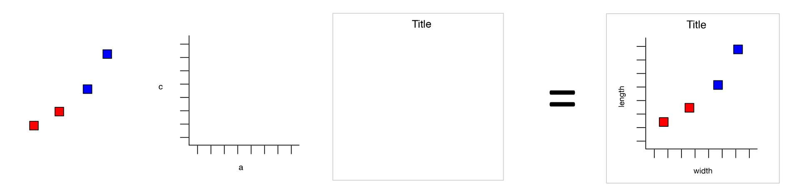

```{r, include = FALSE}
library(ggplot2)
library(knitr)
library(tidyr)
library(dplyr)
library(magrittr)
require(grid)
require(gridExtra)
require(RColorBrewer)
library(wesanderson)
require(kableExtra)
```


## Introduction

Why use R for plotting? 

<div style="text-align:center"> 

</div>


## Introduction

Why use R for plotting? 

<div style="text-align:center"> 

</div>


## Introduction

Why use R for plotting?

Beautiful and flexible graphics!

<div style="text-align:center"> 

</div>


## Introduction

- Have you created plots?
      * What kind of plot?
      * Which software?

- Have you plotted in R?
      * base R, lattice?
      * ggplot2?

## Introduction

- To follow along:

Code and HTML available at http://qcbs.ca/wiki/r/workshop3 

- Recommendation:
      * create your own new script
      * refer to provided code only if needed
      * avoid copy pasting or running the code directly from script

- ggplot2 is also hosted on github: https://github.com/hadley/ggplot2

## ggplot2

The ggplot2 package lets you make beautiful and customizable plots of your data. It implements the grammar of graphics, an easy to use system for building plots. 

<div style="text-align:center"> 

</div>


## Introduction

Required packages
```{r, eval = FALSE}
install.packages("ggplot2")
library(ggplot2)
```

## Outline
1. Your first R plot
    * Basic scatter plot
    * Challenge 1
2. Grammar of graphics
    * More advanced plots
    * Available plot elements and when to use them
    * Challenge 2
3. Saving a plot
4. Fine tuning your plot
    * Colours
    * Themes
5. Miscellaneous

## Basic scatter plot
```{r, eval = FALSE}
?qplot
```
arguments:

- data

- x

- y

- ...

## Basic scatter plot
Look at pre-loaded "iris" dataset:
```{r, eval = FALSE}
?iris
head(iris)
str(iris)
names(iris)
```

```{r, echo = FALSE}
head(iris)
```

## Basic scatter plot

```{r, fig.align="center", fig.width=4, fig.height=4}
qplot(data = iris,
        x = Sepal.Length,
        y = Sepal.Width)
```

## Basic scatter plot

```{r, fig.align="center", fig.width=4, fig.height=4}
qplot(data = iris,
        x = Species,
        y = Sepal.Width)
```

## Less basic options

arguments:

- xlab

- ylab

- main

## Less basic options

```{r, fig.align="center", fig.width=4, fig.height=4}
qplot(data = iris,
        x = Sepal.Length, xlab = "Sepal Length (mm)",
        y = Sepal.Width, ylab = "Sepal Width (mm)",
        main = "Sepal dimensions")
```

## Challenge #1

Produce a basic plot with built in data (5 minutes)

```{r, eval = FALSE}
?CO2
data(CO2)
?BOD
data(BOD)
```

## Solution to challenge #1

```{r, fig.align="center", fig.width=4, fig.height=4}
qplot(data = CO2,
        x = conc, xlab = "CO2 Concentration (mL/L)",
        y = uptake, ylab = "CO2 Uptake (umol/m^2 sec)",
        main = "CO2 uptake in grass plants")
```

## Tips for expressions

```{r, fig.align="center", fig.width=4, fig.height=4}
qplot(data = CO2, x = conc, y = uptake, 
      xlab = expression(paste(CO[2]," Concentration (ml/L)")),
      ylab = expression(paste(CO[2]," Uptake (", mu, "mol/", m^2," sec)")),
      main = expression(paste(CO[2]," uptake in grass plants")))
```

## Grammar of graphics (gg)
A graphic is made of elements (layers)

- Data
    * aesthetics (aes)
    * transformation
    * geoms (geometric objects)
    * axis (coordinate system)
    * scales



## Grammar of graphics (gg)
A graphic is made of elements (layers)

- Data
- Aesthetics (aes), to make data visible
    * x,y : position along the x and y axis
    * colour: the colour of the point
    * group: what group a point belongs to 
    * shape: the figure used to plot a point
    * linetype: the type of line used (solid, dashed, etc)
    * size: the size of the point or line
    * alpha: the transparency of the point 

## Grammar of graphics (gg)
A graphic is made of elements (layers)

- Data
- Aesthetics (aes)
- Geometric objects (geoms)
    * `geom_point()`: scatterplot
    * `geom_line()`: lines connecting points by increasing value of x
    * `geom_path()`: lines connecting points in sequence of appearance
    * `geom_boxplot()`: box and whiskers plot for categorical variables
    * `geom_bar()`: bar charts for categorical x axis
    * `geom_histogram()`: histogram for continuous x axis
    
## Grammar of graphics (gg)
Edit any single element to produce a new graph
e.g., by changing the coordinate system


  
```{r, echo=FALSE, message=FALSE, warning=FALSE, fig.width=8.5, fig.align='center', fig.height=5}
plot1 <- ggplot(data = diamonds) + 
  geom_bar(mapping = aes(x = cut, fill = cut)) 

plot2 <- ggplot(data = diamonds) + 
  geom_bar(mapping = aes(x = cut, fill = cut)) + 
  coord_polar()
grid.arrange(plot1, plot2, ncol=2)
```


## How it works

Create a simple plot object: 

  * `plot.object <- ggplot()` OR `qplot()`

Add graphical layers: 

  * `plot.object <- plot.object + layer()`

Repeat step 2 until statisfied, then print: 

  * `print(plot.object)`

## `qplot()` vs `ggplot()`

```{r, eval = FALSE, message=FALSE, warning=FALSE}
qplot(data = iris,
      x = Sepal.Length,
      xlab = "Sepal Length (mm)",
      y = Sepal.Width,
      ylab = "Sepal Width (mm)",
      main = "Sepal dimensions")

ggplot(data = iris, aes(x = Sepal.Length, y = Sepal.Width)) +
  geom_point() +
  xlab("Sepal Length (mm)") +
  ylab("Sepal Width (mm)") +
  ggtitle("Sepal dimensions")
```

## Assign plot to an R object

```{r, fig.height=3.8, fig.width=3.8, fig.align='center'}
basic.plot <- ggplot(data=iris, aes(x=Sepal.Length, y=Sepal.Width)) +
    geom_point()+
    xlab("Sepal Length (mm)") + ylab("Sepal Width (mm)")+
    ggtitle("Sepal dimensions")
basic.plot
```

## Adding colours and shapes

Add aesthetics using `aes()`

```{r, fig.height=4, fig.width=6, fig.align='center'}
basic.plot <- basic.plot + aes(colour = Species, shape = Species)
basic.plot
```

## Adding geometric objects

Add linear regressions with geom_smooth()

```{r, fig.height=4, fig.width=6, fig.align='center'}
linear.smooth.plot <- basic.plot + geom_smooth(method = "lm", se = F)
linear.smooth.plot
```

## Challenge #2

Produce a colourful plot with linear regression (or other smoother) from built in data such as the CO2 dataset or the msleep dataset

```{r, eval=FALSE}
?CO2
data(CO2)
?msleep
data(msleep)
```

## Solution to challenge #2

Example using loess smoothing

```{r, eval=F}
data(CO2)
CO2.plot <- ggplot(data = CO2, aes(x = conc, y = uptake, colour = Treatment)) +
    geom_point() +
    xlab("CO2 Concentration (mL/L)") +
    ylab("CO2 Uptake (umol/m^2 sec)") +    
    ggtitle("CO2 uptake in grass plants") +
    geom_smooth(method = "loess")
CO2.plot
```

## Solution to challenge #2

Example using loess smoothing

```{r, echo=F, fig.height=4, fig.width=6, fig.align='center'}
data(CO2)
CO2.plot <- ggplot(data = CO2, aes(x = conc, y = uptake, colour = Treatment)) +
    geom_point() +
    xlab("CO2 Concentration (mL/L)") +
    ylab("CO2 Uptake (umol/m^2 sec)") +    
    ggtitle("CO2 uptake in grass plants") +
    geom_smooth(method = "loess")
CO2.plot
```


## Adding multiple facets and groups

Data becomes difficult to visualize when there are multiple factors, e.g., the CO2 data set contains data on CO2 uptake for chilled vs non-chilled treatments from two different regions. Let's build a basic plot using this data set:

```{r, eval=F}
CO2.plot <- ggplot(data = CO2, aes(x = conc, y = uptake, colour = Treatment)) +
    geom_point() +
    xlab("CO2 Concentration (mL/L)") +
    ylab("CO2 Uptake (umol/m^2 sec)") +    
    ggtitle("CO2 uptake in grass plants")
CO2.plot
```

## Adding multiple facets and groups

```{r, echo=F, fig.align="center", fig.width=6, fig.height=4}
CO2.plot <- ggplot(data = CO2, aes(x = conc, y = uptake, colour = Treatment)) +
    geom_point() +
    xlab("CO2 Concentration (mL/L)") +
    ylab("CO2 Uptake (umol/m^2 sec)") +    
    ggtitle("CO2 uptake in grass plants")
CO2.plot
```

## Adding multiple facets and groups

If we want to compare regions, it is useful to make two panels.
Synthax: `plot.object + facet_grid(rows ~ columns)`

```{r, fig.align="center", fig.width=5.5, fig.height=3.5}
CO2.plot <- CO2.plot + facet_grid(. ~ Type)
CO2.plot
```

## Adding multiple facets and groups

Now that we have 2 facets, let's observe how the CO2 uptake evolves as CO2 concentrations rise, by adding connecting lines to the points using `geom_line()`:

```{r, fig.align="center", fig.width=5.5, fig.height=3.5}
CO2.plot + geom_line()
```
Wrong! Because each treatment in each region has 3 replicates

## Adding multiple facets and groups

Specify groups

```{r, fig.align="center", fig.width=5.5, fig.height=3.5}
CO2.plot <- CO2.plot + geom_line(aes(group = Plant))
CO2.plot
```

## Available elements

[Data Visualization with ggplot2 Cheat Sheet](https://www.rstudio.com/wp-content/uploads/2015/03/ggplot2-cheatsheet.pdf)

<div style="text-align:center"> 

</div>

## Additional resources

`help(package = ggplot)`

http://ggplot2.tidyverse.org/reference/

<div>
  
  
</div>


## Challenge #3

Explore a new geom and other plot elements with your own data or built in data. 

```{r, eval = FALSE}
data(msleep)
data(OrchardSprays)
```

## Solution to challenge #3

```{r, fig.align='center', fig.width=4, fig.height=4}
data(OrchardSprays)
box.plot <- ggplot(data = OrchardSprays, aes(x=treatment, y=decrease)) +
  geom_boxplot()
box.plot
```

## Saving plots in RStudio

<div style="text-align:center"> 

</div>


## Saving plots in code

ggsave() will write directly to your working directory all in one line of code and you can specify the name of the file and the dimensions of the plot:

```{r, eval=FALSE}
ggsave("CO2_plot.pdf",
       CO2.plot,
       height = 8.5,
       width = 11,
       units = "in")
```
Note that vector format (e.g., pdf, svg) are often preferable choice compared to raster format (jpeg, png, ...)

Other methods to save image
`?pdf`
`?jpeg`

## Fine tuning - colours

```{r, fig.align="center", fig.width=6, fig.height=4}
CO2.plot + 
  scale_colour_manual(values = c("nonchilled" = "red", "chilled" = "blue"))
```

## Fine tuning - colours

```{r, eval=FALSE}
install.packages("RColorBrewer")
require(RColorBrewer)
```

```{r, fig.align="center", fig.width=6, fig.height=6}
display.brewer.all()
```

## Fine tuning - colours
```{r, fig.align="center"}
CO2.plot + scale_color_brewer(palette = "Dark2")
```

## Fine tuning - colours

Wes Anderson colour palette

```{r, eval=F}
install.packages("wesanderson")
library(wesanderson)
```
  
## Fine tuning - colours

Wes Anderson colour palette


## Fine tuning - colours

Wes Anderson colour palette
  


## Fine tuning - colours

Wes Anderson colour palette
  


## Fine tuning - colours

Wes Anderson colour palette

```{r, fig.align="center", fig.width=5, fig.height=3.5}
ggplot(data = iris, aes(Sepal.Length, Sepal.Width, color = Species)) + 
  geom_point(size = 3) + 
  scale_color_manual(values = wes_palette("GrandBudapest2")) 
```

## Using `tidyr` to reshape data frames

<div style="text-align:center"> 

</div>


## Data formats

**Wide format**
```{r, echo=FALSE}
wide <- data.frame(Species = c("Oak", "Elm", "Ash"),
                   DBH = c(12, 20, 13),
                   Height = c(56, 85, 55))
kable(wide, format = "html", align=rep('c', 3)) %>%
  kable_styling(bootstrap_options = c("striped", "bordered"),full_width=F, font_size = 18) %>%
  column_spec(1:3, width = "5em") 
```

<br>

**Long format**
```{r, echo=FALSE}
long = gather(wide, Measurement, Value, DBH, Height)
kable(long, format = "html", align=rep('c', 3))  %>%
  kable_styling(bootstrap_options = c("striped", "bordered"), full_width=F, font_size = 18) %>%
  column_spec(1:3, width = "5em")
```

## long vs wide format

**Long** data format has a column for possible variables and a column for the values of those variables

**Wide** data format has a separate column for each variable or each factor in your study

Wide data frame can be used for some basic plotting in `ggplot2`, but more complex plots require long format (example to come)

`dplyr`, `lm()`, `glm()`, `gam()` all require long data format

## Tidying your data

Tidying allows you to manipulate the structure of your data while preserving all original information

`gather()` - convert from wide to long format

`spread()` - convert from long to wide format

<div style="text-align:center"> 

</div>

## `tidyr` installation

```{r, eval=FALSE}
install.packages("tidyr")
library(tidyr)
```


## `gather` columns into rows

```{r}
(wide <- data.frame(Species = c("Oak", "Elm", "Ash"),
                   DBH = c(12, 20, 13), Height = c(56, 85, 55)))
```

`gather(data, key, value, ...)`

<span style="font-size: 21px;">
  - `data` A data frame (e.g. `wide`)   
  - `key` name of the new column containing variable names (e.g. `Measurement`)  
  - `value` name of the new column containing variable values (e.g. `Value`)   
  - `...` name or numeric index of the columns we wish to gather (e.g. `DBH`, `Height`)
</span>


## `gather` columns into rows

```{r}
wide
long = gather(wide, Measurement, Value, DBH, Height)
long
```

## `spread` rows into columns

```{r}
long
```

`spread(data, key, value)`

<span style="font-size: 21px;">
  - `data` A data frame (e.g. `long`)   
  - `key` Name of the column containing variable names (e.g. `Measurement`)  
  - `value` Name of the column containing variable values (e.g. `Value`)   
</span>


## `spread` rows into columns

```{r}
long
wide2 = spread(long, Measurement, Value)
wide2
```


## Challenge #4

1. Using the airquality dataset, `gather` all the columns (except Month and Day) into rows.

2. Then `spread` the resulting data frame to return to the original data format.

```{r}
?airquality
data(airquality)
```


## Solution #4

1. Using the airquality dataset, `gather` all the columns (except Month and Day) into rows.
```{r}
air.long <- gather(airquality, variable, value, -Month, -Day)
head(air.long)
```
<span style="font-size: 18px;">
Note that the syntax used here indicates that we wish to gather ALL the columns exept *Month* and *Day*. It is equivalent to: `gather(airquality, value, Ozone, Solar.R, Temp, Wind)`
</span>


## Solution #4

2. Then `spread` the resulting data frame to return to the original data format.
```{r}
air.wide <- spread(air.long, variable, value)
head(air.wide)
```


## `separate` columns

`separate()` splits a columns by a character string separator

<div style="text-align:center"> 

</div>

`separate(data, col, into, sep)`

  - `data` A data frame (e.g. `long`)   
  - `col` Name of the column you wish to separate
  - `into` Names of new variables to create
  - `sep` Character which indicates where to separate  


## Using `separate()` example 

Create a fictional dataset about fish and plankton
```{r}
set.seed(8)
messy <- data.frame(id = 1:4,
                    trt = sample(rep(c('control', 'farm'), each = 2)),
                    zooplankton.T1 = runif(4),
                    fish.T1 = runif(4),
                    zooplankton.T2 = runif(4),
                    fish.T2 = runif(4))
messy
```


## Using `separate()` example 

First convert the messy data frame from wide to long format

```{r}
messy.long <- gather(messy, taxa, count, -id, -trt)
head(messy.long)
```


## Using `separate()` example 

Then we want to split the 2 sampling time (T1 and T2). 

```{r}
messy.long.sep <- separate(messy.long, taxa, 
                           into = c("species", "time"), sep = "\\.") 
head(messy.long.sep)
```

<span style="font-size: 18px;">
The argument `sep = "\\."` tells R to splits the character string around the period (.). We cannot type directly `"."` because it is a regular expression that matches any single character.
</span>


## Recap of `tidyr`

A package that reshapes the layout of data sets.

Converting from wide to long format using `gather()`

Converting from long format to wide format using `spread()`

Split and merge columns with `unite()` and `separate()`

[Data Wrangling with dplyr and tidyr Cheat Sheet](https://www.rstudio.com/wp-content/uploads/2015/02/data-wrangling-cheatsheet.pdf)

## Exercices with `ggplot` and `tidyr`

```{r}
head(airquality)
```

The dataset is in wide format, where measured variables (Ozone, Solar.R, Wind and Temp) are each in their own columns.

## Exercices with `ggplot` and `tidyr`

Let's use ggplot to visualize each individual variable and the range it displays for each month in the time series

```{r}
fMonth <- factor(airquality$Month) 
# Convert the Month variable to a factor. 
 
ozone.box <- ggplot(airquality, aes(x = fMonth, y = Ozone)) + 
  geom_boxplot()

solar.box <- ggplot(airquality, aes(x = fMonth, y = Solar.R)) + 
  geom_boxplot()

temp.box  <- ggplot(airquality, aes(x = fMonth, y = Temp)) + 
  geom_boxplot()

wind.box  <- ggplot(airquality, aes(x = fMonth, y = Wind)) + 
  geom_boxplot()
```

## Exercices with `ggplot` and `tidyr`

You can use `grid.arrange()` in the package `gridExtra` to arrange the 4 separate plots into one panel for viewing. 
```{r, eval=F, warning=F}
combo.box <- grid.arrange(ozone.box, solar.box, temp.box, wind.box, 
                          nrow = 2) 
# nrow = number of rows you would like the plots displayed on
```

## Exercices with `ggplot` and `tidyr`

```{r, echo=F, warning=F}
combo.box <- grid.arrange(ozone.box, solar.box, temp.box, wind.box, nrow = 2) 
```


## Exercices with `ggplot` and `tidyr`

Convert airquality to long format to use `facet_wrap()` for the different variables as opposed to by month
```{r, results="hide"}
air.long <- gather(airquality, variable, value, -Month, -Day)

fMonth.long <- factor(air.long$Month)

weather <- ggplot(air.long, aes(x = fMonth.long, y = value)) +
  geom_boxplot() +
  facet_wrap(~ variable, nrow = 2)
```

## Exercices with `ggplot` and `tidyr`

```{r, echo=F, warning=F}
weather
```

## Exercices with `ggplot` and `tidyr`

`facet_wrap` puts all the individual variables on the same scale, which can be useful in many cases. However, here, we can't see the variability in the `Wind` and `Temp` variables.
We can free the y axis in each panel using `scales=free`

```{r,  warning=F, results="hide"}
weather <- weather + 
  facet_wrap(~ variable, nrow = 2, scales = "free")
```

## Exercices with `ggplot` and `tidyr`

```{r,  warning=F, echo=F}
weather
```

## Exercices with `ggplot` and `tidyr`

We can also use the long data format to create a plot with all the variables included on a single plot

```{r,  warning=F, results="hide"}
w2 <- ggplot(air.long, aes(x = Day, y = value, colour = variable)) +
  geom_point() + # put all day measurements on one plot
  facet_wrap(~ Month, nrow = 1) #split observations by month
```

## Exercices with `ggplot` and `tidyr`

```{r,  warning=F, echo=F}
w2
```

## Data manipulation with `dplyr`

<div style="text-align:center"> 

</div>


## Intro to `dplyr`

- Package that contains a set of functions (or “verbs”) for data manipulation such as filtering rows, selecting specific columns, re-ordering rows, adding new columns and summarizing data;
- Easy and intuitive functions
- Fast and efficient
- Can interface with external databases and translate your R code into SQL queries

Some corresponding R base functions: 
`split()`, `subset()`, `apply()`, `sapply()`, `lapply()`, `tapply()` and `aggregate()`

## Intro to `dplyr`


```{r, eval=F}
install.packages("dplyr")
library(dplyr)
```

## Basic functions in `dplyr`

These 4 core functions tackle the most common manipulations when working with data frames

  * `select()`: select columns from a data frame
  * `filter()`: filter rows according to defined criteria
  * `arrange()`: re-order data based on criteria (e.g. ascending, descending)
  * `mutate()`: create or transform values in a column 

## `select` columns

<div style="text-align:center"> 
</img>
</div>

`select(data, ...)`

  * `...`  Can be column names or positions or complex expressions separated by commas
  
  `select(data, column1, column2)` select columns 1 and 2
  `select(data, c(2:4,6))` select columns 2 to 4 and 6
  `select(data, -column1)` select all columns except column 1
  `select(data, start_with(x.))` select all columns that start with "x."

## `select` columns

<div style="text-align:center"> 

</div>

## `select` columns

Example: suppose we are only interested in the variation of Ozone over time within the airquality dataset

```{r}
ozone <- select(airquality, Ozone, Month, Day)
head(ozone)
```

## `filter` rows

Extract a subset of rows that meet one or more specific conditions

`filter(dataframe, logical statement 1, logical statement 2, ...)`

<div style="text-align:center"> 


</div>

## `filter` rows

Example: we are interested in analyses that focus on the month of August during high temperature events

```{r}
august <- filter(airquality, Month == 8, Temp >= 90)
# same as: filter(airquality, Month == 8 & Temp >= 90)
head(august)
```

## Sort rows with `arrange`

Re-order rows by a particular column, by default in ascending order

Use `desc()` for descending order.

`arrange(data, variable1, desc(variable2), ...)`


## Sort rows with `arrange`

Example:
1. Let's use the following code to create a scrambled version of the airquality dataset

```{r}
air_mess <- sample_frac(airquality, 1)
head(air_mess)
```

## Sort rows with `arrange`

Example:
2. Now let's arrange the data frame back into chronological order, sorting by Month then Day

```{r}
air_chron <- arrange(air_mess, Month, Day)
head(air_chron)
```

Try :  `arrange(air_mess, Day, Month)` and see the difference


## Create new columns using `mutate`

Compute and add new columns

`mutate(data, newVar1 = expression1, newVar2 = expression2, ...)`

<div style="text-align:center"> 

</div>

## Create new columns using `mutate`

Example: we want to convert the temperature variable form degrees Fahrenheit to degrees Celsius

```{r}
airquality_C <- mutate(airquality, Temp_C = (Temp-32)*(5/9))
head(airquality_C)
```

## `magrittr`

<div style="text-align:center"> 

</div>

Usually data manipulation require multiple steps, the magrittr package offers a pipe operator `%>%` which allows us to link multiple operations

## `magrittr`

```{r, eval=F}
install.packages("magrittr")
require(magrittr)
```

## `magrittr`

Suppose we want to analyse only the month of June, then convert the temperature variable to degrees Celsius. We can create the required data frame by combining 2 dplyr verbs we learned

```{r}
june_C <- mutate(filter(airquality, Month == 6), 
                 Temp_C = (Temp-32)*(5/9))
```

As we add more operations, wrapping functions one inside the other becomes increasingly illegible. But, step by step would be redundant and write a lot of objects to the workspace.

## `magrittr`

Alternatively, we can use maggritr's pipe operator to link these successive operations

```{r}
june_C <- airquality %>% 
    filter(Month == 6) %>%
    mutate(Temp_C = (Temp-32)*(5/9))
```

Advantages :

  * less redundant code

  * easy to read and write because functions are executed in order

## `dplyr::group_by` and `summarise`

The `dplyr` verbs become especially powerful when they are are combined using the pipe operator `%>%`. 
The following `dplyr` functions allow us to split our data frame into groups on which we can perform operations individually

`group_by()` : group data frame by a factor for downstream operations (usually summarise)

`summarise()` : summarise values in a data frame or in groups within the data frame with aggregation functions (e.g. `min()`, `max()`, `mean()`, etc…)

## `dplyr` - Split-Apply-Combine

The `group_by` function is key to the Split-Apply-Combine strategy 

<div style="text-align:center"> 

</div>

## `dplyr` - Split-Apply-Combine

<div style="text-align:center"> 

</div>

## `dplyr` - Split-Apply-Combine

Example: we are interested in the mean temperature and standard deviation within each month if the airquality dataset

```{r}
month_sum <- airquality %>% 
      group_by(Month) %>% 
      summarise(mean_temp = mean(Temp),
                sd_temp = sd(Temp))
month_sum
```

## Chalenge #5

Using the `ChickWeight` dataset, create a summary table which displays the difference in weight between the maximum and minimum weight of each chick in the study. 

Employ `dplyr` verbs and the `%>%` operator.

## Solution #5

1. Use group_by() to divide the dataset by "Chick"
2. Use summarise() to calculate the weight gain within each group

```{r}
weight_diff <- ChickWeight %>% 
      group_by(Chick) %>% 
      summarise(weight_diff = max(weight) - min(weight))
head(weight_diff)
```


## Ninja challenge

Using the ChickWeight dataset, create a summary table which displays, for each diet, the average individual difference in weight between the end and the beginning of the study. 

Employ `dplyr` verbs and the `%>%` operator. 

(Hint: `first()` and `last()` may be useful here.)

## Ninja solution

```{r}
diet_summ <- ChickWeight %>% 
      group_by(Diet, Chick) %>% 
      summarise(weight_gain = last(weight) - first(weight)) %>% 
      group_by(Diet) %>% 
      summarise(mean_gain = mean(weight_gain))
diet_summ
```

## More on data manipulation

[Learn more on dplyr](http://r4ds.had.co.nz/transform.html)

[dplyr and tidyr cheatsheet](https://www.rstudio.com/wp-content/uploads/2015/02/data-wrangling-cheatsheet.pdf)