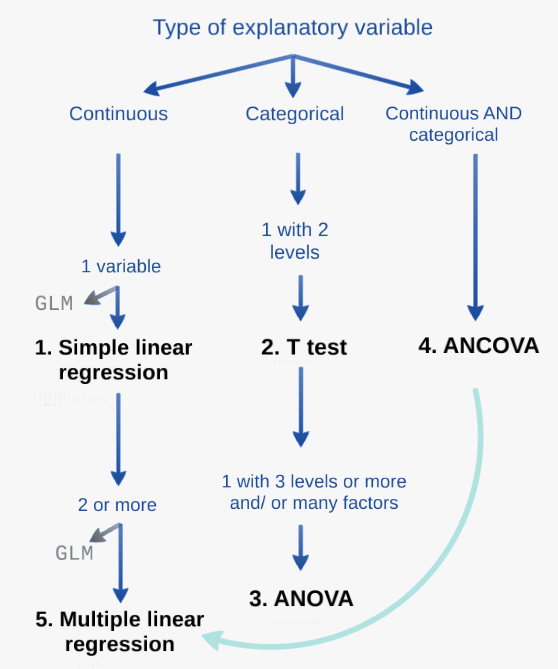
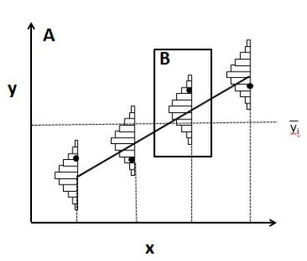
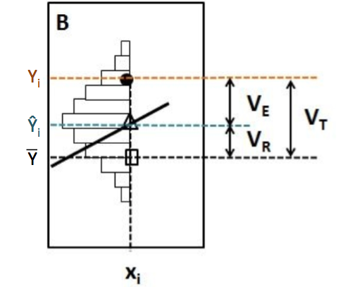

<!-- devtools::install_github('yihui/xaringan') -->

## Workshop 4: Linear models


Website: http://qcbs.ca/wiki/r/workshop4

---
## Learning objectives

.center[

]

```{r eval=TRUE, echo=FALSE}
library(e1071)
library(MASS)
```

---
## Review: Simple linear regression

Linear relationship between response (Y) and explanatory (X) variable

$Y_i = α + βX_i  + ε_i$


###Assumptions
- Continuous explanatory variable
- Homogeneous and normally distributed error
- Independent residuals
- No outlier

---
## Review: Simple linear regression

- **Least squares**: most used method and corresponds to the default function in R



### Assumptions

- $Y_i$ : Observed value (measured) at $X_i$
- $\widehat{Y}_i$ : Predicted value at $X_i$
- $\bar{Y}$ : Mean value of all $Y_i$
- $V_E$ : Residual variance (error)
- $V_R$ : Variance explained by the regression
- $V_T$ : Total variance
- $R^2 = \frac{V_R}{V_T}$
  

---
## Running a regression in R

###Step 1: Run your linear model

###Step 2: Verify assumptions

Assumptions are met

###Step 3: Estimate parameters (regression coefficients), test significance, plot your model

Assumptions are not met

Can you transform your variables (and does it make sense to do so)?

Yes: Go back to Step 1 with transformed variables
No: Try GLM that might better suit your data

---
## Running a regression in R

### **Step 1:** Run your linear model

In R, the function `lm()` is used to fit a linear model

```{r, eval = FALSE}
lm1 <- lm(Y~X)
```

- `lm1` : New object containing the linear model we created
- `Y` : Response variable
- `X` : Explanatory variable

---
## Running a regression in R

Download the <span style="color:blue"> *birdsdiet* </span> dataset:

```{r, eval=TRUE, echo=FALSE}
bird = read.csv("Scripts_and_data/birdsdiet.csv")
```

```{r, eval = FALSE}
setwd()
bird <- read.csv("birdsdiet.csv")
```

Visualize the data using the structure `str()` command: 

```{r, eval = FALSE}
str(bird)
```

```
'data.frame':	54 obs. of  7 variables:
 $ Family   : Factor w/ 53 levels "Anhingas"... 
 $ MaxAbund : num  2.99 37.8 241.4 4.4 4.53 ...
 $ AvgAbund : num  0.674 4.04 23.105 0.595 2.963 ...
 $ Mass     : num  716 5.3 35.8 119.4 315.5 ...
 $ Diet     : Factor w/ 5 levels "Insect","InsectVert"
 $ Passerine: int  0 1 1 0 0 0 0 0 0 0 ...
 $ Aquatic  : int  0 0 0 0 1 1 1 0 1 1 ...
```

---
## Running a regression in R

Response variable: **Bird abundance**    num: continuous

Explanatory variable: **Bird mass**      num: continuous

```
'data.frame':	54 obs. of  7 variables:
 $ Family   : Factor w/ 53 levels "Anhingas"... 
 $ MaxAbund : num  2.99 37.8 241.4 4.4 4.53 ...
 $ AvgAbund : num  0.674 4.04 23.105 0.595 2.963 ...
 $ Mass     : num  716 5.3 35.8 119.4 315.5 ...
 $ Diet     : Factor w/ 5 levels "Insect","InsectVert"
 $ Passerine: int  0 1 1 0 0 0 0 0 0 0 ...
 $ Aquatic  : int  0 0 0 0 1 1 1 0 1 1 ...
```

We first want to test if bird maximum abundance is a function of bird mass 

```{r eval=TRUE}
lm1 <- lm(MaxAbund ~ Mass, data = bird)
```

---
## Running a regression in R

Step 2: Verify assumptions using diagnostic plots

```{r, eval=FALSE}
opar <- par(mfrow=c(2,2)) 
plot(lm1)
```

- par(): sets the graphical parameters, for example, the mfrow argument sets the number of rows in the frame 
- plot(): is a generic function to plot graphics in R

The output will provide the four built-in diagnostic plots of the `lm()` function

---
## Diagnostic plot # 1 - Residuals vs Fitted

Example of independence (what we want!)

- Should show a scatter across and no pattern 

```{r echo=FALSE, fig.height=4}
set.seed(1234564)
x = rnorm(100,10,10)
y = 2*x+0 + rnorm(100)
lm=lm(y~x)
plot(lm,which = 1)
```

---
## Diagnostic plot # 1 - Residuals vs Fitted


```{r echo=FALSE, fig.height=4, warning=FALSE}
par(mfrow=c(1,2))
set.seed(1234564)
x = rnorm(100,10,10)
y = (x)^2+0 + rnorm(length(x),0,30)
lm=lm(y~scale(x))
plot(lm,which = 1, main = "Nonlinear", col.main="red")

x = rnorm(100,10,10)
y = (x)+0 + rnorm(length(x),0,x) 
lm=lm(y~scale(x))
plot(lm,which = 1, main = "Heteroscedastic", col.main="red")
```

- Solution: Transform your data or try another distribution than linear (Gaussian) (i.e., a generalized linear model (GLM): Poisson, binomial, negative binomial, etc.)

---
## Diagnostic plot # 2 - Scale Location

- Should show a scatter across and no pattern 

No pattern in the residuals 

Strong pattern in the residuals 

---
## Diagnostic plot # 3 - Normal QQ 

- Compares the distribution (quantiles) of the residuals of the current model to those of a normal distribution 
- If points lie linearly on the 1:1 line, data follow a normal distribution 

---
## Diagnostic plot # 4 - Residuals vs Leverage 
- Looks for influential values
- **Leverage points**: observations at extreme/ outlying values of the explanatory variable. Because they lack neighboring observations, the regression model passes close to leverage points. **They may OR may not have a high influence on the regression.**
- High leverage points with high influence can be identified with a **Cook's distance greater than 0.5**

---
## Leverage vs influence


- No leverage
- Low influence

- High leverage
- No influence

- High leverage
- High influence

---

No influential values
  
High leverage point and reasonable influence
- Here, point 32 has high leverage but its influence is acceptable (inside the 0.5 Cook's distance limits)

---

High leverage point and high influence
- Points are outside the 0.5 limit of Cook's distance
- These points have too much influence on the regression

** Note: you should never remove outliers if you don't have good reasons to do so (ex: error of measurement)

---

**Step 2**: Verify assumptions of `lm1`
```{r, eval=TRUE}
plot(lm1)
```


---
## Assumptions not met - where did we go wrong?

- Plot Y ~ X with corresponding best-fit regression line, and a histogram of Y and X to explore their distributions

```{r}
par(mfrow=c(1,3))
```

```{r}
plot(bird$MaxAbund ~ bird$Mass)
abline(lm1)
hist(bird$MaxAbund)
hist(bird$Mass)
```

- The function `abline()` adds the best-fit line
- The function `hist()` produces a histogram of the variable

---
## Assumptions not met - where did we go wrong?

Can also use the `Shapiro-Wilk` and the `Skewness` tests to see if variables follow a normal distribuon:

```{r}
shapiro.test(bird$MaxAbund)
shapiro.test(bird$Mass)
```
In both cases, distributions are significantly different from normal

```{r}
skewness(bird$MaxAbund)
skewness(bird$Mass)
```
The positive skewness values also indicate that the distributions are left skewed

---
## Transform the data

- Lets try normalizing data with a `log10()` transformation
- Add the log-transformed variables to our dataframe

```{r}
bird$logMaxAbund <- log10(bird$MaxAbund)
bird$logMass <- log10(bird$Mass)
```

**Step 1**: Re-run the analysis with log-transformed variables

```{r}
lm2 <- lm(logMaxAbund ~ logMass, data = bird) 
```

---
**Step 2**: Verify assumptions of model `lm2`

```{r}
plot(lm2)
```

- Much improved! 

---
**Step 2**: Verify assumptions of model `lm2`

```{r}
plot(logMaxAbund ~ logMass, data=bird)
abline(lm2) 
hist(log10(bird$MaxAbund))
hist(log10(bird$Mass))
```

---

**Step 3**: Estimate parameters and test significance

The function `summary()` is used to obtain parameter estimates, significance, etc.

```{r}
summary(lm2)
```

- We can also call out specific parameters of the model, for example:

```{r eval=FALSE}
lm2$coef
str(summary(lm2))
summary(lm2)$coefficients 
summary(lm2)$r.squared 
```

---
## Group discussion 

- Can you write down the equation of the regression line for your model `lm2`? 
- Are the parameters significant? 
- What proportion of variance is explained by model `lm2`?

```
Coefficients:
            Estimate Std. Error t value Pr(>|t|)    
(Intercept)   1.6724     0.2472   6.767 1.17e-08 ***
logMass      -0.2361     0.1170  -2.019   0.0487 *  
---
Signif. codes:  0 ‘***’ 0.001 ‘**’ 0.01 ‘*’ 0.05 ‘.’ 0.1 ‘ ’ 1

Residual standard error: 0.6959 on 52 degrees of freedom
Multiple R-squared:  0.07267,	Adjusted R-squared:  0.05484 
F-statistic: 4.075 on 1 and 52 DF,  p-value: 0.04869
```

---
## Group discussion 

Can we improve the model if we only use terrestrial birds?
**You could exclude objects using "=!" 

```{r}
lm3 <- lm(logMaxAbund~logMass, data=bird, subset=!bird$Aquatic) 
# removes aquatic birds (= TRUE) 
# or equivalently
lm3 <- lm(logMaxAbund~logMass, data=bird, subset=bird$Aquatic == 0)
```

```{r eval=FALSE}
# Examine the diagnostic plots
par(mfrow=c(2,2))
plot(lm3)
summary(lm3)

# Compare both models
par(mfrow=c(1,2))
plot(logMaxAbund~logMass, data=bird)
plot(logMaxAbund~logMass, data=bird, subset=!bird$Aquatic)
```


---
## Plot

- R2-adj changed from 0.05 to 0.25 when we dropped aquatic birds: 

---
## Challenge 1


- Examine the relationship between log(MaxAbund) and log(Mass) for passerine birds
- Save the model object as lm4

HINT: Passerine is also coded 0 and 1 (look at str(bird))

- Compare the variance explained by lm2, lm3 and lm4

---
## Challenge 1 - Solution

The best model among the three models is lm3 *(only terrestrial birds)*

```{r}
# Run the model
lm4 <- lm(logMaxAbund ~ logMass, data=bird, subset=bird$Passerine == 1)

# Examine the diagnostic plots
par(mfrow=c(2,2))
plot(lm4)
summary(lm4)

# Compare variance explained by lm2, lm3 and lm4
str(summary(lm4)) 

# Recall: we want adj.r.squared
summary(lm4)$adj.r.squared # R2-adj = -0.02
summary(lm2)$adj.r.squared # R2-adj = 0.05
summary(lm3)$adj.r.squared # R2-adj = 0.25
```


---
## Learning objectives

.center[

]

---
## T-test 

- **Response variable**: Continuous 
- **Explanatory variable**: Categorical with **2 levels**

Hypothesis (for a bilateral t-test)

- H0: The mean of group 1 is equal to the mean of group 2 
- H1: The mean of group 1 is not equal to the mean of group 2
If assumptions cannot be respected,

Hypothesis (for a unilateral t-test)
- H0: The mean of group 1 is not larger than the mean of group 2
- H1: The mean of group 1 is smaller than the mean of group 2

Assumptions
- Data follow a normal distribution
- Equality of variance between groups

* robustness of this test increases with sample size and is higher when groups have equal sizes

---
## Running a T-test in R

- Use the function `t.test()`

```t.test(Y~X2, data= data, alternative = "two.sided")```
response variable
factor (2 levels)
name of dataframe
Alternative hypothesis: "two.sided" (default), "less", or "greater"

- The t-test is still a linear model and a specific case of ANOVA with one factor with 2 levels 

Thus the function `lm()` can also be used

```lm.t <-lm(Y~X2, data = data)```
```anova(lm.t)```

---
## Running a T-test in R 

Are aquatic birds heavier than non-aquatic birds?

Response variable: **Bird mass** / num: Continuous
Explanatory variable: **Aquatic** / 2 levels: 1 or 0 (yes or no)

---
## Running a T-test in R 

First, lets visualize the data using the function `boxplot()`
```{r eval=TRUE}
boxplot(logMass ~ Aquatic, 
        data = bird, 
        names = c("Non-Aquatic",
                  "Aquatic"))
```

---
## Running a t-test in R 

- Next, test the assumption of equality of variance using `var.test()`

```{r}
var.test(logMass ~ Aquatic, data = bird)
```

- The ratio of variances is not statistically different from 1, therefore variances are equal 
- We may now proceed with the t-test!

---
## Running a T-test in R 

```{r}
ttest1 <- t.test(logMass ~ Aquatic, var.equal = TRUE, data = bird)

# Or use lm()
ttest.lm1 <- lm(logMass ~ Aquatic, data=bird)
```

Indicates that homogeneity of variance was respected (as we just tested)

You can verify that `t.test()` and `lm()` provide the same model:

```{r}
ttest1$statistic^2
anova(ttest.lm1)$F 
# answer: F=60.3845 in both cases
```

When the assumption of equal variance is met $t^2$ follows an F distribution 
--- 
## Running a t-test in R

If p<0.01 (or 0.05), the null hypothesis of no difference between the two groups (H0) can be rejected, with a risk of 0.01 (or 0.05) that we made a mistake in this conclusion.

There exists a difference in mass between the aquatic and terrestrial birds

mean of the two groups 

```
Two Sample t-test

data:  logMass by Aquatic
t = -7.7707, df = 52, p-value = 2.936e-10
alternative hypothesis: true difference in means is not equal to 0
95 percent confidence interval:
 -1.6669697 -0.9827343
sample estimates:
mean in group 0 mean in group 1 
       1.583437        2.908289 
```

---
## Violation of Assumptions

- If variances between groups are not equal, can use corrections like the Welch correction (DEFAULT in R!)
- If assumptions cannot be respected, the **non-parametric** equivalent of t-test is the Mann-Whitney test
- If two groups **are not independent** (e.g. measurements on the same individual at 2 different years), you should use a paired t-test

---
## Thank you for attending!


We want your feed back!
https://docs.googlgithube.com/spreadsheets/d/1BUZ24UZEMvsF16gxWOm8yAvM_A9DdIeSaOk6b61bzxQ/edit#gid=0