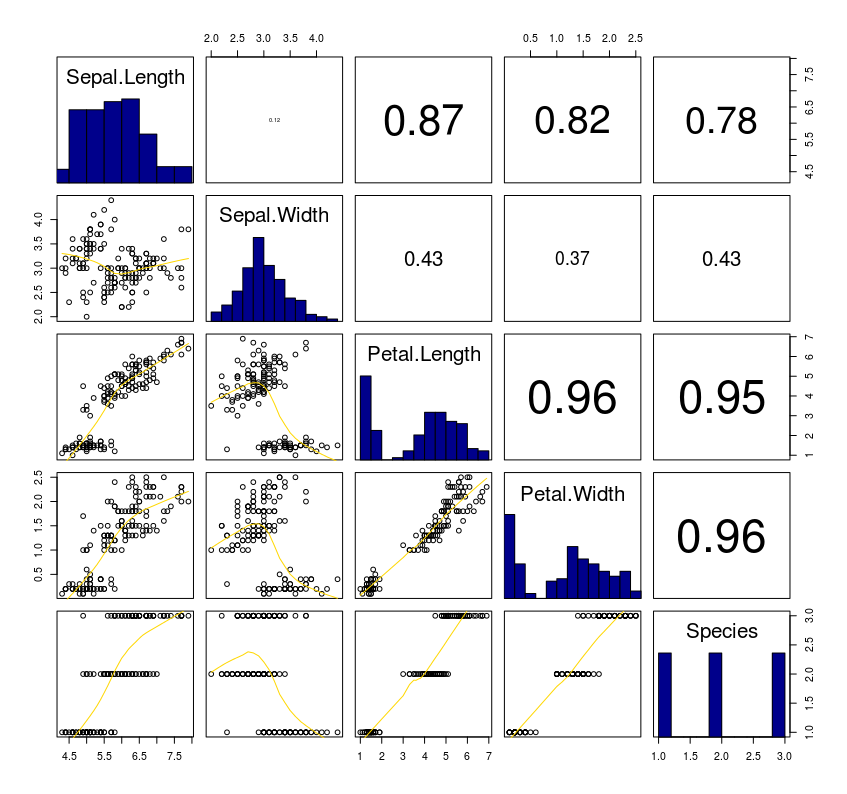
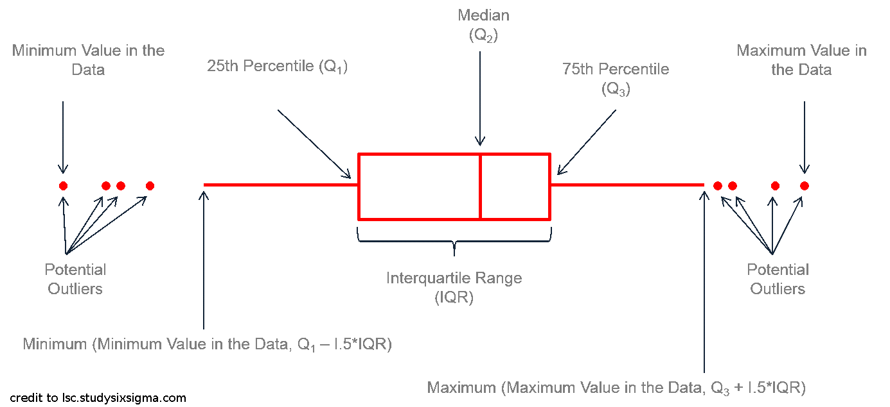

```{r setup, echo = F}
knitr::opts_chunk$set(
  comment = "#",
  collapse = TRUE,
  warning = FALSE,
  message = FALSE,
  fig.width=5, fig.height=5,
  fig.align = 'center'
)
```

```{r, echo = F}
options(repos=structure(c(CRAN="http://cran.r-project.org")))
```

```{r, include = FALSE}
if(!require(ggplot2)) install.packages("ggplot2")
if(!require(ggplot2)) library(ggplot2)

if(!require(knitr)) install.packages("knitr")
if(!require(knitr)) library(knitr)

if(!require(tidyr)) install.packages("tidyr")
if(!require(tidyr)) library(tidyr)

if(!require(dplyr)) install.packages("dplyr")
if(!require(dplyr)) library(dplyr)

if(!require(magrittr)) install.packages("magrittr")
if(!require(magrittr)) library(magrittr)

if(!require(grid)) install.packages("grid")
if(!require(grid)) library(grid)

if(!require(gridExtra)) install.packages("gridExtra")
if(!require(gridExtra)) require(gridExtra)

if(!require(RColorBrewer)) install.packages("RColorBrewer")
if(!require(RColorBrewer)) library(RColorBrewer)

if(!require(kableExtra)) install.packages("kableExtra")
if(!require(kableExtra)) library(kableExtra)

if(!require(gridBase)) install.packages("gridBase")
if(!require(gridBase))library(gridBase)

if(!require(vegan)) install.packages("vegan")
if(!require(vegan)) library(vegan)

if(!require(vioplot)) install.packages("vioplot")
if(!require(vioplot)) library(vioplot)

if(!require(ggpubr)) install.packages("ggpubr")
if(!require(ggpubr)) library(ggpubr)

if(!require(ggsignif)) library(ggsignif)

if(!require(ggvegan)) library(ggvegan)
                              
if(!require(ggdendro)) library(ggdendro)

if(!require(rworldmap)) library(rworldmap)

if(!require(maps)) library(maps)

if(!require(mapproj)) library(mapproj)

source(file="./scripts/multiplot.R")
```

# Introduction

- To follow along:

Code and .HTML available at http://qcbs.ca/wiki/r/workshop3

- Recommendation:
      * create your own new script
      * refer to provided code only if needed
      * avoid copy pasting or running the code directly from script

- ggplot2 is also hosted on Github: https://github.com/hadley/ggplot2
---
# Outline
1. Introduction
2. ggplot mechanics
4. Basic plot
5. Aesthetic
6. Fine tunning
  * Color
  * Theme
7. Geom
  * point, line, Histogram, box plot
  * Error bar, sgnificant value & linear regression
8. Miscellaneous

---
# Introduction : Why use R for plotting?
<div style="text-align:center">

</div>
---
# Introduction : Why use R for plotting?
<div style="text-align:center">

</div>

---
# Introduction : Why use R for plotting?
Beautiful and flexible graphics!

```{r, echo=FALSE, fig.width=10, fig.height=7}
source(file="./scripts/multiExamplePlot.R")
```
---
# Introduction

- Have you created plots?
      * What kind of plot?
      * Which software?

- Have you plotted in R?
      * `base` R, `lattice`?
      * `ggplot2`?

---

# ggplot2

The `ggplot2` package lets you make beautiful and customizable plots of your data. It implements the grammar of graphics, an easy to use system for building plots.

<div style="text-align:center">

</div>

---

# Introduction

Required packages
```{r, eval = FALSE}
install.packages("ggplot2")
library(ggplot2)
```

---
# Grammar of Graphics (GG)

A graphic is made of different layers:
  * aesthetics (`aes`)
  * transformation
  * geometries (`geoms`)
  * axis (coordinate system)
  * scales


---
# A simple example with Iris database
```{r, eval = FALSE}
ggplot(data = iris,             # Data
       aes(x = Sepal.Length,    # Your X-value
           y = Sepal.Width,     # Your Y-value
           col = Species)) +    # Aesthetics
  geom_point() +                # Geometry
  geom_smooth(method = "lm") +  # Linear regression
  ggtitle("My fabulous graph")+ # Title
  theme(plot.title= element_text(color="red",         #|
                                 size=14,             #| Theme
                                 face="bold.italic")) #| 
```
```{r, echo = FALSE, fig.height=4, fig.width=5, fig.align='center'}
ggplot(data = iris,             # Data
       aes(x = Sepal.Length,    # Your X-value
           y = Sepal.Width,     # Your Y-value
           col = Species)) +    # Aesthtics
  geom_point() +                # Geometry
  geom_smooth(method = "lm") +  # Linear regression
  ggtitle("My fabulous graph")+  # Title
  theme(plot.title=
    element_text(color="red",
                 size=14,
                 face="bold.italic")) # Theme
```

---

# Importance in data structure

```{r, echo=FALSE}
head(iris[,c("Sepal.Length","Sepal.Width","Species")], n = 5)
```
`ggplot(data = iris, aes(`**x = Sepal.Length**`,` **y = Sepal.Width**`, `**col = Species**`))`

```{r, echo = FALSE, fig.height=4, fig.width=5, fig.align='center'}
ggplot(data = iris,             # Data
       aes(x = Sepal.Length,    # Your X-value
           y = Sepal.Width,     # Your Y-value
           col = Species)) +    # Aesthtics
  geom_point() +                # Geometry
  ggtitle("My fabulous graph")+  # Title
  theme(plot.title=
    element_text(color="red",
                 size=14,
                 face="bold.italic")) # Theme
```

---

# Exploring your data
```{r, eval=FALSE}
betterPairs(iris)
```
<div style="text-align:center">

</div>

```{r, echo=FALSE, eval=FALSE}
panel.hist <- function(x, ...)
{
  usr <- par("usr"); on.exit(par(usr))
  par(usr = c(usr[1:2], 0, 1.5) )
  h <- hist(x, plot = FALSE)
  breaks <- h$breaks; nB <- length(breaks)
  y <- h$counts; y <- y/max(y)
  rect(breaks[-nB], 0, breaks[-1], y, col="blue4", ...)
}

panel.cor <- function(x, y, digits=2, prefix="", cex.cor)
{
  usr <- par("usr"); on.exit(par(usr))
  par(usr = c(0, 1, 0, 1))
  r <- abs(cor(x, y, method = "pearson")) # can be "spearman"
  txt <- format(c(r, 0.123456789), digits=digits)[1]
  txt <- paste(prefix, txt, sep="")
  if(missing(cex.cor)) cex <- 0.7/strwidth(txt)
  text(0.5, 0.5, txt, cex = cex * r)
}
betterPairs <- function(YourData, col = c("black")){
  return(pairs(YourData, 
               lower.panel=function(...) {
                 par(new=TRUE);
                 panel.smooth(col=col,
                              col.smooth = "gold",...)},
               diag.panel=panel.hist, 
               upper.panel=panel.cor))
}
```

---

# Inheritance : be or not 

.small[

.pull-left[

**Inheritance from ggplot**
```{r, eval=FALSE}
ggplot(data = iris,             # Data
      aes(x = Sepal.Length,    # Your X-value
          y = Sepal.Width)) +  # Your Y-value
 geom_point()                  # Geometry      

```

**Storing ggplot in object**
```{r, eval=FALSE}

p <- ggplot(data = iris,
                   aes(x = Sepal.Length,
                       y = Sepal.Width))
q <- p + geom_point()
q   # Print your final plot

```
]

.pull-right[

**No inheritance from ggplot**
```{r, eval=FALSE}
ggplot() +
 geom_point(data = iris,
            aes(x = Sepal.Length,
                y = Sepal.Width))
```

**Adding layer from ggplot object**
```{r, eval=FALSE}
s <- ggplot()
s <- gplot.obj +
 geom_point(data = iris,
            aes(x = Sepal.Length,
                y = Sepal.Width))
s
```
]

]

---

# GGplot dynamics: base layer
```{r, fig.height=4, fig.width=5}
ggplot() + 
scale_x_continuous() +
scale_y_continuous() 
```

---

# GGplot dynamics: Data layer
```{r, fig.height=4, fig.width=5}
ggplot(data = iris, aes(x = Sepal.Length, y = Sepal.Width)) +
  xlab("x = Sepal Lenght") +
  ylab("y = Sepal Width")
```

---

# GGplot dynamics: Gemoetric Layer
```{r, fig.height=4, fig.width=5}
ggplot(data = iris, aes(x = Sepal.Length, y = Sepal.Width)) +
  xlab("x = Sepal Lenght") + ylab("y = Sepal Width") + 
  geom_point()
```

---

# Challenge #1 (5min)


  * Draw your 1rst (gg)plot:


 data | geom | x value | y value
:-------------:|:-------------:|:-------------:|:-------------:
iris|geom_point|Petal length|Petal width

---

# Solution Challenge 1#
```{r}
ggplot(data = iris, aes(x = Petal.Length, y = Petal.Width)) +
  geom_point()
```

---

# Saving plots in RStudio

<div style="text-align:center">

</div>

---

# Saving plots in code

ggsave() will write directly to your working directory all in one line of code and you can specify the name of the file and the dimensions of the plot:

```{r, eval=FALSE}
my1rstPlot <- ggplot(data = iris, aes(x = Petal.Length, y = Petal.Width)) + geom_point()
ggsave("my1rstPlot.pdf",
       my1rstPlot,
       height = 8.5,
       width = 11,
       units = "in")
```
Note that vector format (e.g., pdf, svg) are often preferable choice compared to raster format (jpeg, png, ...)

Other methods to save image
`?pdf`
`?jpeg`

---

# Aesthetic
  * Different aesthetic are available to help you distinguish different class, group & structure within your data:
  
```{r echo=FALSE, fig.width=8, fig.height=7}
source(file="./scripts/4plot_aesthetic.R")
```

---

# Example of aesthetic: color
.small[
.pull-left[
```{r, eval=FALSE}
ggplot(data = iris, aes(x = Sepal.Length, 
                        y = Sepal.Width)) +
  geom_point()
#Without Color
```
```{r, echo=FALSE}
ggplot(data = iris, aes(x = Sepal.Length, 
                        y = Sepal.Width)) +
  geom_point() 
```
]
.pull-right[
```{r, eval=FALSE}
ggplot(data = iris, aes(x = Sepal.Length, 
                        y = Sepal.Width, 
                        color = Species)) +
  geom_point()
```
```{r, echo=FALSE, fig.width=6, fig.height=6}
ggplot(data = iris, aes(x = Sepal.Length, 
                        y = Sepal.Width, 
                        color = Species)) +
  geom_point() + theme(legend.position = 'bottom')
```
]
]

---

# Challenge #2

Produce a colourful plot from built in data such as the , Iris, CO2 or the msleep dataset

Data|x value|y value| Aesthetic
:-------------:|:-------------:|:-------------:|:-------------:
iris|Petal.Length|Petal.Width|Species
CO2|conc|uptake|Treatment & Type
msleep|log10(bodywt)|awake| vore & conservation

---

# Solution to challenge #2

Example using iris database

```{r, echo=F, fig.height=7, fig.width=10, fig.align='center'}
data("iris")
iris.plot <- ggplot(data = iris, aes(x = Petal.Length, y = Petal.Width, color = Species)) + geom_point()
iris.plot
```

---

# Solution to challenge #2

Example using CO2 database

```{r, echo=F, fig.height=7, fig.width=10, fig.align='center'}
data(CO2)
CO2.plot <- ggplot(data = CO2, aes(x = conc, y = uptake, colour = Treatment)) +
    geom_point()
CO2.plot
```

---

# Solution to challenge #2

Example using msleep database

```{r, echo=F, fig.height=7, fig.width=10, fig.align='center'}
data("msleep")
msleep.plot <- ggplot(data = msleep, aes(x = log10(bodywt), y = awake, colour = vore, shape= conservation)) +
    geom_point()
msleep.plot
```

---

# Facet : Iris
```{r, fig.align="center", fig.width=8, fig.height=6}
ggplot(data = iris, aes(x = Sepal.Length, y = Sepal.Width, 
                        color = Species)) +
  geom_point() + 
  facet_grid(~Species, scales = "free") 
```

---

# Facet : CO2
```{r, echo=F, fig.align="center", fig.width=8, fig.height=8}
CO2.plot.nofacet <- ggplot(data = CO2, aes(x = conc, y = uptake, colour = Treatment)) +
    geom_point() +
    xlab("CO2 Concentration (mL/L)") +
    ylab("CO2 Uptake (umol/m^2 sec)") +    
    ggtitle("Without Facet")
CO2.plot.facet <- CO2.plot + facet_grid(~ Type) + ggtitle("Facet")
multiplot(CO2.plot.nofacet, CO2.plot.facet)
```

---

# Fine Tunning : Colour
  * Colour: Manual_colour
.small[
```{r, eval=FALSE}
iris.plot <- ggplot(data = iris, aes(x = Sepal.Length, y = Sepal.Width, color = Species)) +
            geom_point()
iris.plot + scale_colour_manual(values = c("setosa" = "red", 
                                           "versicolor" = "darkgreen",
                                           "virginica"="blue"))
```  
]
.pull-left[
**Classic**
```{r, echo=FALSE, fig.align="center", fig.width=6, fig.height=6}
iris.plot <- ggplot(data = iris, 
                    aes(x = Sepal.Length, 
                        y = Sepal.Width, 
                        color = Species)) +
            geom_point()
iris.plot
```  
]
.pull-right[
**Manual**
```{r, echo=FALSE, fig.align="center", fig.width=6, fig.height=6}
iris.plot +
scale_colour_manual(values = c("setosa" = "red", 
                               "versicolor" = "darkgreen",
                               "virginica"="blue"))
```  
]

---

# Fine tuning - Gradient colours for quantitative variable
*quantitavie variable : Petal.Length*
```{r, echo=TRUE, eval=FALSE}
iris.plot.petal <- ggplot(data=iris, aes(..., color = Petal.Length))
``` 
.pull-left[
```{r, echo=FALSE, fig.align="center", fig.width=6, fig.height=6}
iris.plot.petal <- ggplot(data = iris, 
                    aes(x = Sepal.Length, 
                        y = Sepal.Width, 
                        color = Petal.Length)) +
            geom_point()
iris.plot.petal
```  
]
.pull-right[
```{r, echo=FALSE, fig.align="center", fig.width=6, fig.height=6}
iris.plot.petal <- ggplot(data = iris, 
                    aes(x = Sepal.Length, 
                        y = Sepal.Width, 
                        color = Petal.Length)) +
            geom_point()
iris.plot.petal + scale_color_gradient(low="blue", high="red")
```  
]

---

# Fine tuning - colours
  * Coulours theme
```{r, eval=FALSE}
install.packages("RColorBrewer")
require(RColorBrewer)
```

<div style="text-align:center">

</div>

---

# Fine tuning - colours
  * Coulours theme : RColorBrewer
```{r, eval=FALSE}
iris.plot + scale_color_brewer(palette = "Dark2")
```
.pull-left[
**Classic**
```{r, echo=FALSE, fig.align="center", fig.width=6, fig.height=6}
iris.plot
```  
]
.pull-right[
**Dark2**
```{r, echo=FALSE, fig.align="center", fig.width=6, fig.height=6}
iris.plot + scale_color_brewer(palette = "Dark2")
```  
]

---

# Fine Tunning : Colour
* Blind color friendly : presentation purpose
```{r}
cbbPalette <- c("#000000", "#E69F00", "#56B4E9", "#009E73", 
                "#F0E442", "#0072B2", "#D55E00", "#CC79A7")
```

```{r, echo=FALSE}
library(scales)
show_col(cbbPalette)
```

---

# Fine Tunning : Colour
  * Blind color friendly : presentation purpose
```{r, eval=FALSE}
cbbPalette <- c("#000000", "#E69F00", "#56B4E9", "#009E73", 
                "#F0E442", "#0072B2", "#D55E00", "#CC79A7")
iris.plot + scale_color_manual(values=cbbPalette)
```

.pull-left[
**Classic**
```{r, echo=FALSE, fig.align="center", fig.width=6, fig.height=6}
iris.plot
```  
]
.pull-right[
**Blind color friendly**
```{r, echo=FALSE, fig.align="center", fig.width=6, fig.height=6}
cbbPalette <- c("#000000", "#E69F00", "#56B4E9", "#009E73", 
                "#F0E442", "#0072B2", "#D55E00", "#CC79A7")
iris.plot + scale_color_manual(values=cbbPalette)
```  
]

---

# Fine Tunning : Colour
  * black & white : grey scale for publication purpose
```{r, eval=FALSE}
iris.plot + scale_color_grey()
```
.pull-left[
**Defaut**
```{r, echo=FALSE, fig.align="center", fig.width=6, fig.height=6}
iris.plot
```  
]
.pull-right[
**Grey scale**
```{r, echo=FALSE, fig.align="center", fig.width=6, fig.height=6}
iris.plot + scale_color_grey()
```  
]

---

# Fine Tunning : Theme
  * Theme: classic for publication purpose
```{r, eval=FALSE}
iris.plot + scale_color_grey() + theme_classic()
```
.pull-left[
**Defaut**
```{r, echo=FALSE, fig.align="center", fig.width=6, fig.height=6}
iris.plot+ scale_color_grey()
```  
]
.pull-right[
**Classic**
```{r, echo=FALSE, fig.align="center", fig.width=6, fig.height=6}
iris.plot + scale_color_grey() + theme_classic()
```  
]

---

# Challenge #3
* Voici un graphique issu du set de données « tips » inclu avec la librarie "reshape2"
```{r, echo=FALSE, fig.align="center", fig.width=6, fig.height=6}
library(reshape2)
tips.gg <- ggplot(tips, aes(x = total_bill,
                            y = tip/total_bill,
                            shape = smoker, 
                            color = sex, 
                            size = size))
tips.gg <- tips.gg + geom_point()
tips.gg <- tips.gg + facet_grid( ~ time)
tips.gg <- tips.gg + scale_color_manual(values=cbbPalette)
tips.gg <- tips.gg + ggtitle("Tips per total bill at Lunch and Dinner")
tips.gg <- tips.gg + theme(axis.title.x = element_text(size = 16, colour = cbbPalette[6]),
                           axis.title.y = element_text(size = 16, colour = cbbPalette[6]),
                           axis.text.x = element_text(size = 12),
                           axis.text.y = element_text(size = 12),
                           plot.title = element_text(size = 16, colour = cbbPalette[7], face="bold"),
                           strip.text.x = element_text(size = 14, face="bold"))
tips.gg
```

---

# Result Challenge #3
```{r, eval=FALSE}
tips.gg <- ggplot(tips, aes(x = total_bill,
                            y = tip/total_bill,
                            shape = smoker, 
                            color = sex, 
                            size = size))
tips.gg <- tips.gg + geom_point()
tips.gg <- tips.gg + facet_grid( ~ time)
tips.gg <- tips.gg + scale_color_manual(values=cbbPalette)
tips.gg <- tips.gg + ggtitle("Tips per total bill at Lunch and Dinner")
tips.gg <- tips.gg + theme(axis.title.x = element_text(size = 16, colour = cbbPalette[6]),
                           axis.title.y = element_text(size = 16, colour = cbbPalette[6]),
                           axis.text.x = element_text(size = 12),
                           axis.text.y = element_text(size = 12),
                           plot.title = element_text(size = 16, colour = cbbPalette[7], face="bold"),
                           strip.text.x = element_text(size = 14, face="bold"))
tips.gg

```

---

# Result Challenge #3 : step by step
*Aesthetic*
```{r}
tips.gg <- ggplot(tips, aes(x = total_bill,
                            y = tip/total_bill,
                            shape = smoker, 
                            color = sex, 
                            size = size))
tips.gg + geom_point()
```

```{r, echo=FALSE}
tips.gg <- tips.gg + geom_point()
```

---

# Result Challenge #3 : step by step
*Facet*
```{r}
tips.gg + facet_grid( ~ time)
```

```{r, echo=FALSE}
tips.gg <- tips.gg + facet_grid( ~ time)
```

---

# Result Challenge #3 : step by step
*Blind color palette*
```{r}
tips.gg + scale_color_manual(values=cbbPalette)
```

```{r, echo=FALSE}
tips.gg <- tips.gg + scale_color_manual(values=cbbPalette)
```

---

# Result Challenge #3 : step by step
*Plot Title*
```{r}
tips.gg + ggtitle("Tips per total bill at Lunch and Dinner")
```

```{r, echo=FALSE}
tips.gg <- tips.gg + ggtitle("Tips per total bill at Lunch and Dinner")
```

---

# Result Challenge #3 : step by step
*Theme tunning: Plot & Axis Title*
.small[
```{rfig.align="center", fig.width=6, fig.height=4}
tips.gg + theme(axis.title.x = element_text(size = 16, colour = cbbPalette[6]),
                           axis.title.y = element_text(size = 16, colour = cbbPalette[6]),
                           axis.text.x = element_text(size = 12),
                           axis.text.y = element_text(size = 12),
                           plot.title = element_text(size = 16, colour = cbbPalette[7], face="bold"),
                           strip.text.x = element_text(size = 14, face="bold"))
```
]

---

# Theme assist : RStudio Addin for GGplot2 design


---

#Geom : GGplot
<div style="text-align:center">

</div>

---

#Base plot
<div style="text-align:center">

</div>

---

##Blank plot
.pull-left[
*GGplot2*
```{r, eval=FALSE}
gblank <- ggplot(mtcars, aes(wt, mpg))
```

```{r, echo=FALSE}
gblank <- ggplot(mtcars, aes(wt, mpg))
gblank <- gblank + theme(plot.subtitle = element_text(vjust = 1), 
                        plot.caption = element_text(vjust = 1)) +
  labs(title = "Blank plot")
gblank
```
]

.pull-right[
*Base Plot*
```{r}
plot(mpg~wt, data = mtcars, type = "n")
```
]

---

#Histogram
An histogram is an accurate graphical representation of the distribution of numeric data
.pull-left[
```{r}
ggplot(iris, aes(Sepal.Length)) +
  geom_histogram() + ggtitle("Histogram of sepal length ") 
```
]
.pull-right[
```{r}
ggplot(cars, aes(dist)) +
  geom_histogram() + ggtitle("Histogram of car distance taken to stop ") 
```

]
---

#Histogram

.pull-left[
*GGplot2*
```{r, eval=FALSE}
ggplot(diamonds, aes(carat)) + geom_histogram()
```
```{r, echo=FALSE}
ggplot(diamonds, aes(carat)) + geom_histogram(binwidth = .5) + labs(title = "Histogram")
```
]

.pull-right[
*Base Plot*
```{r}
hist(diamonds$carat)
```
]

---

#Barplot
.pull-left[
*GGplot2*
```{r, eval=FALSE}
ggplot(mpg, aes(class)) + geom_bar()
```
```{r, echo=FALSE}
ggplot(mpg, aes(class)) + geom_bar()+ labs(title = "Barplot")
```
]

.pull-right[
*Base Plot*
```{r}
barplot(table(mpg$class))
```
]

---

# Significant values
.pull-left[
*GGplot2*
```{r, eval=FALSE}
ggplot(mpg, aes(class)) + 
  geom_bar() + 
  geom_signif()
```
```{r, echo=FALSE}
ir.s=iris %>% 
  group_by(Species) %>% 
  summarise(mean.sp = mean(Sepal.Length))
#iris %>% 
#  group_by(Species) %>% 
#  summarise(pval = t.test(Sepal.Length, 
#                          var.equal = TRUE)$p.value)

dat <- data.frame(Group = c("S1", "S1", "S2", "S2"),
                  Sub   = c("A", "B", "A", "B"),
                  Value = c(3,5,7,8),
                  low = c(2.5,4.5,6,7.5),
                  high = c(3.5,5.5,7,8.5))  

gbar2 = ggplot(data = dat, aes(x = Group, y = Value,fill = Sub)) +
  geom_bar(#aes(fill = Sub), 
    stat="identity", 
    position="dodge", 
    width=.5) +
  geom_errorbar(aes(ymin=low, 
                    ymax=high),
                width = 0.1,
                position =  position_dodge(.5), colour="black") +
  labs(title = "Barplot") +
  scale_fill_manual(values = c("grey80", 
                               "grey20")) + 
  geom_signif(stat="identity",
              data=data.frame(x=c(0.875, 1.875),
                              xend=c(1.125, 2.125),
                              y=c(5.8, 8.8),
                              Sub=c("A","B"),
                              annotation=c("**", "NS")),
              aes(x=x,xend=xend, y=y, yend=y,
                  annotation=annotation)) +
  geom_signif(comparisons=list(c("S1", "S2")),
              annotations="***",
              y_position = 9.3,
              tip_length = 0,
              vjust=0.4)

gbar2
```
]

.pull-right[
*Base Plot*
Manual function
```{r, eval=FALSE}
barplot()
sign.bar() 
```

```{r, echo=FALSE}
df=data.frame(S1 = c(3,5), S2=c(7,8))
my.bp =barplot(as.matrix(df),
               beside = TRUE,
               xlab = "Group",
               ylab = "Value",
               main = "Barplot",
               ylim = c(0,12),
               legend = rownames(df),
               args.legend = list(x = "topright", 
                                  bty = "n", 
                                  inset=c(-0.07, 0))
               # args.legend=list(
               #   x=ncol(df)+4,
               #   y=min(colSums(df)),
               #   bty = "n"
               # )
)
sign.bar = function(pos,select.pair, y, offset = 0.2, label, mid = FALSE) {
  # create the y coordinate of the line
  y <- y
  # set an offset for tick lengths
  offset <- offset
  # draw first horizontal line
  if (!mid) {
    lines(pos[select.pair],c(y, y))
    # draw ticks
    lines(pos[c(select.pair[1],select.pair[1])],c(y, y-offset))
    lines(pos[c(select.pair[2],select.pair[2])],c(y, y-offset))
  } else {
    lines(x = c(c(pos[select.pair[1]-1]+
                    pos[select.pair[1]])/2,
                c(pos[select.pair[2]]+
                    pos[select.pair[2]+1])/2),
          c(y, y))
    # draw ticks
    lines(c(c(pos[select.pair[1]-1]+
                pos[select.pair[1]])/2,
            c(pos[select.pair[1]-1]+
                pos[select.pair[1]])/2),
          c(y, y-offset))
    lines(c(c(pos[select.pair[2]]+
                pos[select.pair[2]+1])/2,
            c(pos[select.pair[2]]+
                pos[select.pair[2]+1])/2),
          c(y, y-offset))
  }
  # draw asterics
  text(pos[select.pair[1]]+((pos[select.pair[2]]-pos[select.pair[1]])/2),y+offset*2,
       labels = label) 
}
sign.bar(my.bp, select.pair = c(1,2),y =6,label = "**")
sign.bar(my.bp, select.pair = c(3,4),y =8.8,label = "NS")
sign.bar(my.bp, select.pair = c(2,3),y =10,label = "***",mid = TRUE)
```
]

---

#Plot: linear reagression

.pull-left[
*GGplot2*
```{r, eval=FALSE}
ggplot(mpg, aes(displ, hwy)) + 
  geom_point() + 
  geom_smooth(method = lm)
```
```{r, echo=FALSE}
lm.gg <- ggplot(mpg, aes(displ, hwy)) + geom_point() + geom_smooth(method = lm)+ labs(title = "Linear Regression Plot")
lm.gg
```
]

.pull-right[
*Base Plot*
```{r, eval=FALSE}
lm.out  <- lm(hwy~displ, data = mpg)
plot(hwy~displ, data = mpg)
abline(lm.out)

```
```{r, echo=FALSE}
lm.out  <- lm(hwy~displ, data = mpg)
newx <- seq(min(mpg$displ), max(mpg$displ), length.out=100)
preds <- predict(lm.out, newdata = data.frame(displ=newx), 
                 interval = 'confidence')
plot(hwy~displ, data = mpg, bg = "black", col = "black", pch =21)
polygon(c(rev(newx), newx), 
        c(rev(preds[ ,3]), preds[ ,2]), 
        col = 'grey80', border = NA)
abline(lm.out)
lines(newx, preds[ ,3], lty = 'dashed', col = 'red')
lines(newx, preds[ ,2], lty = 'dashed', col = 'red')
```
]

---

# Boxplot

<div style="text-align:center">

</div>

```{r, echo=FALSE, fig.align="center", fig.width=3, fig.height=3}
ggplot(data = iris, aes(Species, Sepal.Length, fill=Species)) + 
  geom_boxplot()+ labs(title = "Boxplot")
```

---

#Boxplot with significant value

.pull-left[
*GGplot2*
```{r, eval=FALSE}
ggplot(data = iris, aes(Species, Sepal.Length)) + 
  geom_boxplot()  
```

```{r, echo=FALSE}
ggplot(data = iris, aes(Species, Sepal.Length)) + 
  geom_boxplot()+ labs(title = "Boxplot")+  
  geom_signif(comparisons = list(c("versicolor", "virginica")), 
              map_signif_level=TRUE)
```
]

.pull-right[
*Base Plot*
```{r, eval=FALSE}
boxplot(iris$Sepal.Length ~ iris$Species)

```

```{r, echo=FALSE}
boxplot(iris$Sepal.Length ~ iris$Species) # For analysis of variance 
```
]

---

# Violin plot

Violin plots allow to visualize the distribution of a numeric variable for one or several groups. 

Close from a boxplot, it allows a deeper understanding of the density and are particularly adapted when the amount of data is huge.

.pull-left[
```{r, echo=FALSE}
# Data 
names=c(rep("A", 80) , rep("B", 50) , rep("C", 70))
value=c( sample(2:5, 80 , replace=T) , sample(4:10, 50 , replace=T), 
       sample(1:7, 70 , replace=T) )
data=data.frame(names,value)
 
#Graph
qplot( x=names , y=value , data=data , geom=c("boxplot","jitter") , fill=names)
```
]
.pull-right[
```{r, echo=FALSE}
ggplot(data = data, aes(names, value, fill=names)) + geom_violin()

```
]

---
# Violin plot

.pull-left[
*GGplot2*
```{r, eval=FALSE}
ggplot(data = iris, aes(Species, 
                        Sepal.Length)) + 
  geom_violin()
```
```{r, echo=FALSE}
violP.gg <- ggplot(data = iris, aes(Species, Sepal.Length)) + geom_violin()+ labs(title = "Violin plot")
violP.gg
```
]

.pull-right[
*Base Plot*
```{r, eval=FALSE}
vioplot(iris$Sepal.Length[iris$Species == "setosa"],
        iris$Sepal.Length[iris$Species == "versicolor"],
        iris$Sepal.Length[iris$Species == "virginica"],
        col = "lightblue")

```
```{r, echo=FALSE}
vioplot(iris$Sepal.Length[iris$Species == "setosa"],
        iris$Sepal.Length[iris$Species == "versicolor"],
        iris$Sepal.Length[iris$Species == "virginica"],
        col = "lightblue")
```
]

---

#Plot with errors bars

.pull-left[
*GGplot2*
```{r, eval=FALSE}
ggplot(df, aes(trt, resp, colour = group)) +
  geom_pointrange()+
  geom_errorbar() + 
```
```{r, echo=FALSE}
df <- data.frame(
  trt = factor(c(1, 1, 2, 2)),
  resp = c(1, 5, 3, 4),
  group = factor(c(1, 2, 1, 2)),
  upper = c(1.1, 5.3, 3.3, 4.2),
  lower = c(0.8, 4.6, 2.4, 3.6)
)

ggplot(df, aes(trt, resp, colour = group)) +
  geom_pointrange(aes(ymin = lower, ymax = upper))+
  geom_errorbar(aes(ymin = lower, ymax = upper), width = 0.2) + 
  labs(title = "Plot with error bars")
```
]

.pull-right[
*Base Plot*
```{r, eval=FALSE}
plot(y~x)
error.bar <- function(...)
error.bar(x,y)
```
```{r, echo=FALSE}
x = as.numeric(c(1,2))
y = c(2,3)
mean = mean(y)
plot(y~x,
     type = "p",
     pch =21,
     bg = "black",
     col = "black",
     ylim = c(0,4),
     xlim = c(0,3),
     xaxt="n",
     #main = "My graph",
     xlab = "Site Category",
     ylab = "Mean")
axis(side = 1, at = c(1,2), labels = levels(c("yo","man")), cex.lab =1, cex.axis =1)

error.bar <- function(x,
                      y,
                      epsilon = NULL, 
                      se = NULL, 
                      se.mul = 1,
                      col = "black") {
  x = as.numeric(x)
  if(is.null(se)){
    stderr <- function(x) sqrt(var(x,na.rm=TRUE)/length(na.omit(x)))
    se = se.mul*stderr(y)
  } else {se = se.mul*se}
  
  segments(x, y-se,x, y+se,col = col)
  if(is.null(epsilon)){
    epsilon = 0.02} else {epsilon = epsilon}
  segments(x-epsilon,y-se,x+epsilon,y-se,col = col)
  segments(x-epsilon,y+se,x+epsilon,y+se,col = col)
}
error.bar(x,y)
```

]

---

#Map

.pull-left[
*GGplot2*
```{r, eval=FALSE}
library(maps)
states_map <- map_data("state")
ggplot(crimes, aes(map_id = state)) +
  geom_map() + coord_map()
```
```{r, echo=FALSE}
crimes <- data.frame(state = tolower(rownames(USArrests)), USArrests)
crimesm <- reshape2::melt(crimes, id = 1)
library(maps)
states_map <- map_data("state")
map.gg <- ggplot(crimes, aes(map_id = state)) +
  geom_map(aes(fill = Murder), map = states_map) +
  expand_limits(x = states_map$long, y = states_map$lat) + coord_map()+ labs(title = "Map")
map.gg
```
]

.pull-right[
*Base Plot*
```{r, eval=FALSE}
library(rworldmap)
library(mapproj)
newmap <- rworldmap::getMap(resolution = "high")
plot(newmap)
```
```{r, echo=FALSE}
library(rworldmap)
newmap <- rworldmap::getMap(resolution = "high")
plot(newmap, xlim = c(-92, -89)
     , ylim = c(-1.5, 0.5)
     , asp = 1
     , main = "Galapagos islands")
```
]

---

#Density Graph

A density plot shows the distribution of a numerical variable nad it takes only set of numeric values as input
.pull-left[
```{r, echo=FALSE}
ggplot(iris, aes(Sepal.Length)) +
  geom_density() + ggtitle("Distribution of sepal length ") 
```
]

.pull-right[
```{r, echo=FALSE}
ggplot(cars, aes(dist)) +
  geom_density() + ggtitle("Distribution of car distance taken to stop ")
```
]
---
#Density Graph

.pull-left[
*GGplot2*
```{r, eval=FALSE}
ggplot(diamonds, aes(carat)) +
  geom_density() 
```
```{r, echo=FALSE}
density.gg <- ggplot(diamonds, aes(carat)) +geom_density()+ labs(title = "Density graph")
density.gg
```
]

.pull-right[
*Base Plot*
```{r, eval=FALSE}
plot(density(c(-20, rep(0,98), 20)), 
     xlim = c(-4, 4))
```
```{r, echo=FALSE}
plot(density(c(-20, rep(0,98), 20)), xlim = c(-4, 4),
     main = "Density graph")
```
]

---

#Dendogram

.pull-left[
*GGplot2*
```{r, eval=FALSE}
ggdendrogram(hc)
```
```{r, echo=FALSE}
USArrests.short = USArrests[1:10,]
hc <- hclust(dist(USArrests.short), "ave")
ggdendrogram(hc, rotate = TRUE, theme_dendro = FALSE) + 
  labs(title = "Dendrogram")
```
]

.pull-right[
*Base Plot*
```{r, eval=FALSE}
plot(hc, hang = -1, main = "Dendrogram")
```
```{r, echo=FALSE}
plot(hc, hang = -1, main = "Dendrogram")
```

]

---

# Multiplot
**A function to add multiple graph on the same plot**
```{r}
multiplot(density.gg, map.gg, violP.gg, lm.gg, cols = 2)
```

---

# Final Challenge
  * Dataset : any (recommanded: use your dataset)
```{r, eval=FALSE}
data(msleep)
data(OrchardSprays)
```
  * geom : any
  * aes : any

---

# Solution to Final Challenge

```{r, fig.align='center', fig.width=4, fig.height=6}
data(OrchardSprays)
box.plot <- ggplot(data = OrchardSprays, aes(x=treatment, y=decrease)) +
  geom_boxplot()
box.plot
```

---

# Miscellaneous : Dynamics plots
.alert[**Select the Species data to display directly From the legend**]
```{r, echo=FALSE, fig.align='center', fig.width=11, fig.height=7.5}
# Libraries
if (!require(tidyverse)) install.packages("tidyverse")
library(tidyverse)
if (!require(plotly)) install.packages("plotly")
library(plotly)

# Scatterplot
p=ggplot(iris, aes(x=Sepal.Length, y=Sepal.Width, color=Species, shape=Species)) + 
    geom_point(size=6, alpha=0.6) 

ggplotly(p)
```

---
# Miscellaneous
  
  * .alert[let the choice to the current speaker to show its own tricks and/or own data visu]

---

# Miscellaneous : `qplot()` vs `ggplot()`

```{r, eval = FALSE, message=FALSE, warning=FALSE}
qplot(data = iris,
      x = Sepal.Length,
      xlab = "Sepal Length (mm)",
      y = Sepal.Width,
      ylab = "Sepal Width (mm)",
      main = "Sepal dimensions")

ggplot(data = iris, aes(x = Sepal.Length, y = Sepal.Width)) +
  geom_point() +
  xlab("Sepal Length (mm)") +
  ylab("Sepal Width (mm)") +
  ggtitle("Sepal dimensions")
```

---

# Available elements

[Data Visualization with ggplot2 Cheat Sheet](https://www.rstudio.com/wp-content/uploads/2015/03/ggplot2-cheatsheet.pdf)

<div style="text-align:center">

</div>

---

# Additional resources

`help(package = ggplot)`

http://ggplot2.tidyverse.org/reference/

<div>
  
  
</div>
---