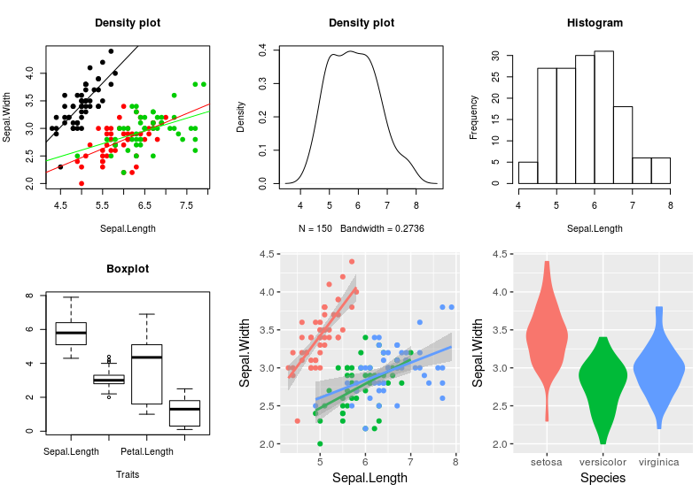

```{r setup, echo = F}
knitr::opts_chunk$set(
  comment = "#",
  collapse = TRUE,
  warning = FALSE,
  message = FALSE,
  fig.width=5, fig.height=5,
  fig.align = 'center'
)
```

```{r, echo = F}
options(repos=structure(c(CRAN="http://cran.r-project.org")))
```

```{r, include = FALSE}
if(!require(ggplot2)) install.packages("ggplot2")
library(ggplot2)
if(!require(knitr)) install.packages("knitr")
library(knitr)
if(!require(tidyr)) install.packages("tidyr")
library(tidyr)
if(!require(dplyr)) install.packages("dplyr")
library(dplyr)
if(!require(magrittr)) install.packages("magrittr")
library(magrittr)
if(!require(grid)) install.packages("grid")
require(grid)
if(!require(gridExtra)) install.packages("gridExtra")
require(gridExtra)
if(!require(RColorBrewer)) install.packages("RColorBrewer")
library(RColorBrewer)
if(!require(kableExtra)) install.packages("kableExtra")
library(kableExtra)
if(!require(gridBase)) install.packages("gridBase")
library(gridBase)
if(!require(grid)) install.packages("grid")
library(grid)
source(file="./scripts/multiplot.R")
```

## Introduction

- To follow along:

Code and .HTML available at http://qcbs.ca/wiki/r/workshop3

- Recommendation:
      * create your own new script
      * refer to provided code only if needed
      * avoid copy pasting or running the code directly from script

- ggplot2 is also hosted on Github: https://github.com/hadley/ggplot2
---
## Outline
1. Introduction
2. ggplot mechanics
3. Importance of data structure
4. Basic plot
5. Aesthetic
6. Geom
  * point, line, Histogram, box plot
  * Error bar, sgnificant value & linear regression
7. Fine tunning
  * Color
  * Theme
---
## Introduction

Why use R for plotting?

<div style="text-align:center">

</div>
---
## Introduction

Why use R for plotting?

<div style="text-align:center">

</div>

---
## Introduction

Why use R for plotting?

Beautiful and flexible graphics!

<div style="text-align:center">

</div>

---
## Introduction

- Have you created plots?
      * What kind of plot?
      * Which software?

- Have you plotted in R?
      * `base` R, `lattice`?
      * `ggplot2`?

---

## ggplot2

The `ggplot2` package lets you make beautiful and customizable plots of your data. It implements the grammar of graphics, an easy to use system for building plots.

<div style="text-align:center">

</div>

---

## Introduction

Required packages
```{r, eval = FALSE}
install.packages("ggplot2")
library(ggplot2)
```

---
## Grammar of Graphics (GG)

A graphic is made of different layers:
  * aesthetics (`aes`)
  * transformation
  * geometries (`geoms`)
  * axis (coordinate system)
  * scales


--- 
## Grammar of graphics (gg)
A graphic is made of elements (layers)

- Data
- Aesthetics (aes), to make data visible
    * x,y : position along the x and y axis
    * colour: the colour of the point
    * group: what group a point belongs to
    * shape: the figure used to plot a point
    * linetype: the type of line used (solid, dashed, etc)
    * size: the size of the point or line
    * alpha: the transparency of the point

---
## Example of use
```{r}
ggplot(data = iris,             # Data
       aes(x = Sepal.Length,    # Your X-value
           y = Sepal.Width,     # Your Y-value
           col = Species)) +    # Aesthtics
  geom_point() +                # Geometry
  geom_smooth(method = "lm") +  # Linear regression
  ggtitle("My fabulous graph")+  # Title
  theme(plot.title=
    element_text(color="red",
                 size=14,
                 face="bold.italic")) # Theme
```

---
## Importance in data structure for ggplot2
use example and data base from previous slide
```{r}
head(iris)
```

---
## A simple Example with Ibis database

```{r}
ggplot(data = iris,             # Data
       aes(x = Sepal.Length,    # Your X-value
           y = Sepal.Width)) +  # Your Y-value
       geom_point()             # Geometry       
```

---
## What's happen ?
* base layer
```{r}
ggplot() + 
coord_cartesian() +
scale_x_continuous() +
scale_y_continuous() 
```

---
* Data layer
```{r}
ggplot(data = iris, aes(x = Sepal.Length, y = Sepal.Width)) +
  xlab("x = Sepal Lenght") +
  ylab("y = Sepal Width")
```
---
* Gemoetric Layer
```{r}
ggplot(data = iris, aes(x = Sepal.Length, y = Sepal.Width)) +
  xlab("x = Sepal Lenght") +
  ylab("y = Sepal Width") + 
  geom_point()
```
---

## Challenge #1 (5min)

Draw your 1rst (gg)plot:
  * geom : geom_point
  * data : Petal length & Petal width

---

## Solution Challenge 1#
```{r}
ggplot(data = iris, aes(x = Petal.Length, y = Petal.Width)) +
  geom_point()
```

---

## Aesthetic
Different aesthetic are available to help you distinguish different class, group & structure within your data: 
  * color
  * group
  * shape
  * alpha
.alert[maybe draw a 4x-multiplot for each of the Aethetic introduced above]
---

## Example of aesthetic: color

```{r}
ggplot(data = iris, aes(x = Sepal.Length, y = Sepal.Width, 
                        color = Species)) +
  geom_point()
```

---
## Challenge #2

Produce a colourful plot from built in data such as the , Iris, CO2 or the msleep dataset

```{r, eval=FALSE}
?iris
data("iris")
?CO2
data(CO2)
?msleep
data(msleep)
```

---
## Solution to challenge #2

Example using iris database

```{r, echo=F, fig.height=4, fig.width=6, fig.align='center'}
data("iris")
iris.plot <- ggplot(data = iris, aes(x = Petal.Length, y = Petal.Width, color = Species)) + geom_point()
iris.plot
```
---
## Solution to challenge #2

Example using CO2 database

```{r, echo=F, fig.height=4, fig.width=6, fig.align='center'}
data(CO2)
CO2.plot <- ggplot(data = CO2, aes(x = conc, y = uptake, colour = Treatment)) +
    geom_point()
CO2.plot
```
---
## Solution to challenge #2

Example using msleep database

```{r, echo=F, fig.height=4, fig.width=6, fig.align='center'}
data("msleep")
msleep.plot <- ggplot(data = msleep, aes(x = log10(bodywt), y = awake, colour = vore, shape= conservation)) +
    geom_point()
msleep.plot
```

---
# Facet : Iris
```{r}
ggplot(data = iris, aes(x = Sepal.Length, y = Sepal.Width, 
                        color = Species)) +
  geom_point() + 
  facet_grid(~Species, scales = "free") +
  geom_smooth(method = "lm")
```
---

---
# Facet : CO2
```{r, echo=F, fig.align="center", fig.width=6, fig.height=4}
CO2.plot <- ggplot(data = CO2, aes(x = conc, y = uptake, colour = Treatment)) +
    geom_point() +
    xlab("CO2 Concentration (mL/L)") +
    ylab("CO2 Uptake (umol/m^2 sec)") +    
    ggtitle("CO2 uptake in grass plants")
CO2.plot.facet <- CO2.plot + facet_grid(~ Type)
multiplot(CO2.plot, CO2.plot.facet)
```
---

#Geom
.alert[put all geom graph here]

---
## Geom_point & Geom_line
  * .alert[put ggplot vs base plot]
  
```{r}
CO2.plot.facet.baline <- CO2.plot.facet + geom_line()
CO2.plot.facet.line <- CO2.plot.facet + geom_line(aes(group=Plant))
multiplot(CO2.plot.facet.baline, CO2.plot.facet.line)
```
---
## Histogram & boxplot
  * .alert[put ggplot vs base plot]

---
## linear regression
  * .alert[put ggplot vs base plot]

---
## Error bar & Significant value
  * .alert[put ggplot vs base plot]

---
## Fine Tunning
  * Colour

---
## Fine Tunning
  * Theme

---
## Final Challenge


---
## Solution of the final Challenge

---
## Miscellaneous
  * .alert[Put other Crazy R visualisation]
  * .alert[A time for a tour on r-graph-gallery.com]
  * .alert[Itroduce Dynamics representative]
  * .alert[May be let the choice to the current speaker to show its own tricks and/or own data visu]

---


### OLD SLIDES START HERE


---

## Solution to challenge #2 (old slide)

Example using CO2 database

```{r, echo=F, fig.height=4, fig.width=6, fig.align='center'}
data(CO2)
CO2.plot <- ggplot(data = CO2, aes(x = conc, y = uptake, colour = Treatment)) +
    geom_point() +
    xlab("CO2 Concentration (mL/L)") +
    ylab("CO2 Uptake (umol/m^2 sec)") +    
    ggtitle("CO2 uptake in grass plants") +
    geom_smooth(method = "loess")
CO2.plot
```
---
## Grammar of graphics (gg)
A graphic is made of elements (layers)

- Data
- Aesthetics (aes)
- Geometric objects (geoms)
    * `geom_point()`: scatterplot
    * `geom_line()`: lines connecting points by increasing value of x
    * `geom_path()`: lines connecting points in sequence of appearance
    * `geom_boxplot()`: box and whiskers plot for categorical variables
    * `geom_bar()`: bar charts for categorical x axis
    * `geom_histogram()`: histogram for continuous x axis

---
## Grammar of graphics (gg)
Edit any single element to produce a new graph
e.g., by changing the coordinate system

```{r, echo=FALSE, message=FALSE, warning=FALSE, fig.width=8.5, fig.align='center', fig.height=5}
plot1 <- ggplot(data = diamonds) +
  geom_bar(mapping = aes(x = cut, fill = cut))

plot2 <- ggplot(data = diamonds) +
  geom_bar(mapping = aes(x = cut, fill = cut)) +
  coord_polar()

grid.arrange(plot1, plot2, ncol=2)
```

---
## How it works

Create a simple plot object:

  * `plot.object <- ggplot()` OR `qplot()`

Add graphical layers:

  * `plot.object <- plot.object + layer()`

Repeat step 2 until statisfied, then print:

  * `print(plot.object)`

---
## `qplot()` vs `ggplot()`

```{r, eval = FALSE, message=FALSE, warning=FALSE}
qplot(data = iris,
      x = Sepal.Length,
      xlab = "Sepal Length (mm)",
      y = Sepal.Width,
      ylab = "Sepal Width (mm)",
      main = "Sepal dimensions")

ggplot(data = iris, aes(x = Sepal.Length, y = Sepal.Width)) +
  geom_point() +
  xlab("Sepal Length (mm)") +
  ylab("Sepal Width (mm)") +
  ggtitle("Sepal dimensions")
```

---
## Assign plot to an R object

```{r, fig.height=3.8, fig.width=3.8, fig.align='center'}
basic.plot <- ggplot(data=iris, aes(x=Sepal.Length, y=Sepal.Width)) +
    geom_point()+
    xlab("Sepal Length (mm)") + ylab("Sepal Width (mm)") +
    ggtitle("Sepal dimensions")
basic.plot
```

---

## Adding colours and shapes

Add aesthetics using `aes()`

```{r, fig.height=4, fig.width=6, fig.align='center'}
basic.plot <- basic.plot + aes(colour = Species, shape = Species)
basic.plot
```

---
## Adding geometric objects

Add linear regressions with geom_smooth()

```{r, fig.height=4, fig.width=6, fig.align='center'}
linear.smooth.plot <- basic.plot + geom_smooth(method = "lm", se = F)
linear.smooth.plot
```

---
## Adding multiple facets and groups

Data becomes difficult to visualize when there are multiple factors, e.g., the CO2 data set contains data on CO2 uptake for chilled vs non-chilled treatments from two different regions. Let's build a basic plot using this data set:

```{r, eval=F}
CO2.plot <- ggplot(data = CO2, aes(x = conc, y = uptake, colour = Treatment)) +
    geom_point() +
    xlab("CO2 Concentration (mL/L)") +
    ylab("CO2 Uptake (umol/m^2 sec)") +    
    ggtitle("CO2 uptake in grass plants")
CO2.plot
```

---
## Adding multiple facets and groups

```{r, echo=F, fig.align="center", fig.width=6, fig.height=4}
CO2.plot <- ggplot(data = CO2, aes(x = conc, y = uptake, colour = Treatment)) +
    geom_point() +
    xlab("CO2 Concentration (mL/L)") +
    ylab("CO2 Uptake (umol/m^2 sec)") +    
    ggtitle("CO2 uptake in grass plants")
CO2.plot
```

---
## Adding multiple facets and groups

If we want to compare regions, it is useful to make two panels.
Synthax: `plot.object + facet_grid(rows ~ columns)`

```{r, fig.align="center", fig.width=5.5, fig.height=3.5}
CO2.plot <- CO2.plot + facet_grid(. ~ Type)
CO2.plot
```

---
## Adding multiple facets and groups

Now that we have 2 facets, let's observe how the CO2 uptake evolves as CO2 concentrations rise, by adding connecting lines to the points using `geom_line()`:

```{r, fig.align="center", fig.width=5.5, fig.height=3.5}
CO2.plot + geom_line()
```
Not good, because each treatment in each region has 3 replicates

---
## Adding multiple facets and groups

Specify groups

```{r, fig.align="center", fig.width=5.5, fig.height=3.5}
CO2.plot <- CO2.plot + geom_line(aes(group = Plant))
CO2.plot
```

---
## Available elements

[Data Visualization with ggplot2 Cheat Sheet](https://www.rstudio.com/wp-content/uploads/2015/03/ggplot2-cheatsheet.pdf)

<div style="text-align:center">

</div>

---
## Additional resources

`help(package = ggplot)`

http://ggplot2.tidyverse.org/reference/

<div>
  
  
</div>

---
## Challenge #3

Explore a new geom and other plot elements with your own data or built in data.

```{r, eval = FALSE}
data(msleep)
data(OrchardSprays)
```

---
## Solution to challenge #3

```{r, fig.align='center', fig.width=4, fig.height=4}
data(OrchardSprays)
box.plot <- ggplot(data = OrchardSprays, aes(x=treatment, y=decrease)) +
  geom_boxplot()
box.plot
```

---
## Saving plots in RStudio

<div style="text-align:center">

</div>


---
## Saving plots in code

ggsave() will write directly to your working directory all in one line of code and you can specify the name of the file and the dimensions of the plot:

```{r, eval=FALSE}
ggsave("CO2_plot.pdf",
       CO2.plot,
       height = 8.5,
       width = 11,
       units = "in")
```
Note that vector format (e.g., pdf, svg) are often preferable choice compared to raster format (jpeg, png, ...)


---
Other methods to save image
`?pdf`
`?jpeg`

---
## Fine tuning - colours

```{r, fig.align="center", fig.width=6, fig.height=4}
CO2.plot +
  scale_colour_manual(values = c("nonchilled" = "red", "chilled" = "blue"))
```

---
## Fine tuning - colours

```{r, eval=FALSE}
install.packages("RColorBrewer")
require(RColorBrewer)
```

```{r, fig.align="center", fig.width=6, fig.height=6}
display.brewer.all()
```

---
## Fine tuning - colours
```{r, fig.align="center"}
CO2.plot + scale_color_brewer(palette = "Dark2")
```