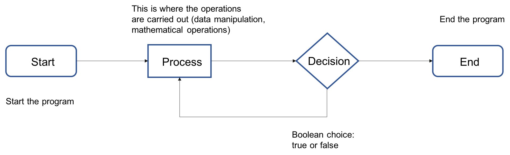
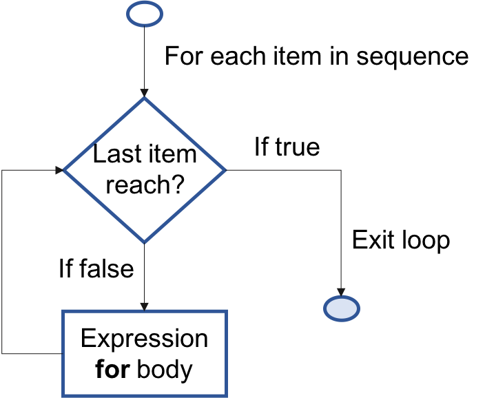
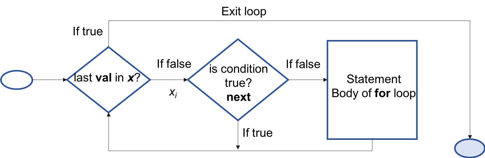
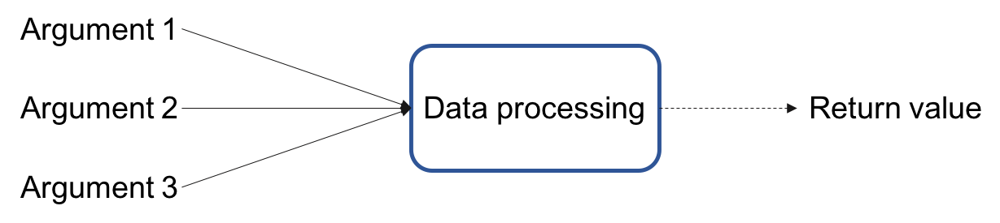

```{r setup, echo = F}
knitr::opts_chunk$set(
  comment = "#",
  collapse = TRUE,
  warning = FALSE,
  message = FALSE, 
  fig.width=6, fig.height=6,
  fig.align = 'center'
)
```

## Outline

1. Learning what is **control flow**;
2. Writing your first functions in R
3. Speeding up your code
4. Useful R packages for biologists

---
class: inverse, center, middle

# Control flow

---

## Control flow

Program flow control can be simply defined as the order in which a program is executed.

#### Why is it advantageous to have structured programs?

- It **decreases the complexity** and time of the task at hand;
- This logical structure also means that the code has **increased clarity**;
- It also means that **many programmers can work on one program**.

.large[.center[**This means increased productivity.**]]

---
## Control flow

Flowcharts can be used to plan programs and represent their structure

<br>

```{r}
library(DiagrammeR)
mermaid("
graph LR
A(Start)-->B[Process]
B-->C{Decision}
C-->|TRUE|E(End)
C-->|FALSE|D[Process]
D --> E
")
```





---
## Representing structure

The two basic building blocks of codes are the following:

.pull-left[

#### Selection

Program's execution determined by statements

```r
if
if else
```

]

.pull-right[

#### Iteration

Repetition, where the statement will **loop** until a criteria is met

```r
for
while
repeat
```
]

---
## Decision making

.pull-left[

**`if` statement**

```R
if(condition) {
  expression
}
```
.center[

]
]

.pull-right[

**`if` `else` statement**

```r
if(condition) {
  expression 1
} else {
  expression 2
}
```
.center[

]
]

---
#### What if you want to test more than one condition?

- `if` and `if` `else` test a single condition
- You can also use `ifelse` function to:
    - test a vector of conditions;
    - apply a function only under certain conditions.

```r
a <- 1:10
ifelse(a > 5, "yes", "no")

a <- (-4):5
sqrt(ifelse(a >= 0, a, NA))
```

---
## Nested `if` `else` statement

```r
if (test_expression1) {
statement1
} else if (test_expression2) {
statement2
} else if (test_expression3) {
statement3
} else {
statement4
}
```
.center[
]

---
## Challenge 1 

```R
Paws <- "cat"
Scruffy <- "dog"
Sassy <- "cat"
animals <- c(Paws, Scruffy, Sassy)
```

1. Use an `if` statement to print “meow” if `Paws` is a “cat”.
2. Use an `if`  `else` statement to print “woof” if you supply an object that is a `“dog”` and `“meow”` if it is not. Try it out with `Paws` and `Scruffy`.
3. Use the `ifelse` function to display `“woof”` for `animals` that are dogs and `“meow”` for `animals` that are cats.

---
## Beware of R’s expression parsing!

Use curly brackets `{}` so that R knows to expect more input. Try:

```r
if (2+2) == 4 print("Arithmetic works.")
else print("Houston, we have a problem.")
```

.center[.alert[This doesn't work because R evaluates the first line and doesn't know that you are going to use an `else` statement]]

Instead use:

```{r}
if (2+2 == 4) { #<<
  print("Arithmetic works.")
} else { #<<
  print("Houston, we have a problem.")
} #<<
```
---
## Remember the logical operators

| Command | Meaning |
| :-------------: | :-------------: |
| `==`  | equal to  |
| `!=`  | not x  |
| `<`   | less than  |
| `<=`  | less than or equal to  |
| `>`   | greater than  |
| `>=`  | greater than or equal to  |
| `x&y` | x AND y |
| `x`&#124;`y`  | x OR y  |
| `isTRUE(x)`  | test if X is true |


---
## Iteration

Every time some operations have to be repeated, a loop may come in handy

Loops are good for:
- doing something for every element of an object
- doing something until the processed data runs out
- doing something for every file in a folder
- doing something that can fail, until it succeeds
- iterating a calculation until it converges

---
## `for` loop

A `for` loop works in the following way: 

```R
for(val in sequence) {
  statement
  }
```

.center[

]

---
## `for` loop
The letter `i` can be replaced with any variable name and the sequence can be almost anything, even a list of vectors.

```r
# Try the commands below and see what happens:

for (a in c("Hello", "R", "Programmers")) {
  print(a)
}

for (z in 1:30) {
  a <- rnorm(n = 1, mean = 5, sd = 2)
  print(a)
}

elements <- list(1:3, 4:10)
for (element in elements) {
  print(element)
}
```

---
## `for` loop

In the example below, R would evaluate the expression 5 times:

```r
for(i in 1:5) {
  expression
}
```

In the example, every instance of `m` is being replaced by each number between `1:10`, until it reaches the last element of the sequence.

.pull-left[
```r
for(m in 1:10) {
  print(m*2)
}
```
]
.small[
.pull-right[.pull-left[
```{r echo=FALSE}
for(m in 1:5) {
  print(m*2)
}
```
]
.pull-right[
```{r echo=FALSE}
for(m in 6:10) {
  print(m*2)
}
```
]
]
]
---
## `for` loop


```r
x <- c(2,5,3,9,6)
count <- 0
for (val in x) {
  if(val %% 2 == 0) {
    count = count+1 
  }
}
print(count)
```

.center[

]


---
## `for` loop

For loops are often used to loop over a dataset. We will use loops to perform functions on the `CO2` dataset which is built in R.

```R
data(CO2) # This loads the built in dataset

for (i in 1:length(CO2[,1])) { # for each row in the CO2 dataset
  print(CO2$conc[i]) # print the CO2 concentration
}

for (i in 1:length(CO2[,1])) { # for each row in the CO2 dataset
  if(CO2$Type[i] == "Quebec") { # if the type is "Quebec"
    print(CO2$conc[i]) # print the CO2 concentration 
    }
}
```

---
## `for` loop

.alert[Tip 1]. To loop over the number of rows of a data frame, we can use the function `nrow()`

```r
for (i in 1:nrow(CO2)) { # for each row in the CO2 dataset
  print(CO2$conc[i]) # print the CO2 concentration
}
```

.alert[Tip 2]. If we want to perform operations on the elements of one column, we can directly iterate over it

```r
for (p in 1:CO2$conc) { # for each row of the column "conc"of the CO2 df
  print(p) # print the p-th element
}
```

---
## `for` loop

The expression within the loop can be almost anything and is usually a compound statement containing many commands.

```r
for (i in 4:5) { # for i in 4 to 5
  print(colnames(CO2)[i])  
  print(mean(CO2[,i])) # print the mean of that column from the CO2 dataset
}
```

Output:
```{r echo = FALSE}
for (i in 4:5) { # for i in 4 to 5
  print(colnames(CO2)[i])  
  print(mean(CO2[,i])) # print the mean of that column from the CO2 dataset
}
```
---
## `for` loops within `for` loops

In some cases, you may want to use nested loops to accomplish a task. When using nested loops, it is important to use different variables as counters for each of your loops. Here we used `i` and `n`:
.pull-left[
```r
for (i in 1:3) {
  for (n in 1:3) {
    print (i*n)
  }
}
```
]
.pull-right[
```{r echo = -c(2:5)}
# Output

for (i in 1:3) {
  for (n in 1:3) {
    print (i*n)
  }
}
```
]

---
## Getting good: using the `apply()` family

R disposes of the `apply()` function family, which consists of vectorized functions that aim at **minimizing your need to explicitly create loops**. 

`apply()` can be used to apply functions to a matrix.
.pull-left[
```{r}
(height <- matrix(c(1:10, 21:30), 
                 nrow = 5, 
                 ncol = 4))

```
]
.pull-right[
```{r}
apply(X = height, 
      MARGIN = 1, 
      FUN = mean)

```

```r
?apply
```
]

---
## `lapply()`

`lapply()` applies a function to every element of a `list`.

It may be used for other objects like **dataframes**, **lists** or **vectors**.

The output returned is a `list` (explaining the “`l`” in `lapply`) and has the same number of elements as the object passed to it.

.pull-left[
```{r eval = FALSE}
SimulatedData <- list(
  SimpleSequence = 1:4, 
  Norm10 = rnorm(10),
  Norm20 = rnorm(20, 1),
  Norm100 = rnorm(100, 5))

# Apply mean to each element 
## of the list 
lapply(SimulatedData, mean)
```
]
.small[
.pull-right[
```{r echo=FALSE}
SimulatedData <- list(SimpleSequence = 1:4, 
             Norm10 = rnorm(10), 
             Norm20 = rnorm(20, 1), 
             Norm100 = rnorm(100, 5))

# Apply mean to each element of the list 
lapply(SimulatedData, mean)
```
]
]

---
## `sapply()`

`sapply()` sapply() is a ‘wrapper’ function for `lapply()`, but returns a simplified output as a `vector`, instead of a `list`.


The output returned is a `list` (explaining the “`l`” in `lapply`) and has the same number of elements as the object passed to it.

.small[
```{r eval = FALSE}
SimulatedData <- list(SimpleSequence = 1:4, 
             Norm10 = rnorm(10), 
             Norm20 = rnorm(20, 1), 
             Norm100 = rnorm(100, 5))

# Apply mean to each element of the list 
sapply(SimulatedData, mean)
```
]

.small[
```{r echo = c(5)}
SimulatedData <- list(SimpleSequence = 1:4, 
             Norm10 = rnorm(10), 
             Norm20 = rnorm(20, 1), 
             Norm100 = rnorm(100, 5))

# Output
sapply(SimulatedData, mean)

```
]
---
## `mapply()`

`mapply()` works as a multivariate version of `sapply()`. 

It will apply a given function to the first element of each argument first, followed by the second element, and so on. For example:


```{r eval = FALSE}
lilySeeds <- c(80, 65, 89, 23, 21)
poppySeeds <- c(20, 35, 11, 77, 79)
  
# Output
mapply(sum, lilySeeds, poppySeeds)
```


```{r echo = c(3)}
lilySeeds <- c(80, 65, 89, 23, 21)
poppySeeds <- c(20, 35, 11, 77, 79)
  
# Output
mapply(sum, lilySeeds, poppySeeds)
```

---
## `tapply()`

`tapply()` is used to apply a function over subsets of a vector. 

It is primarily used when the dataset contains  dataset contains different groups (*i*.*e*. levels/factors) and we want to apply a function to each of these groups.
.small[
```{r}
head(mtcars)

# get the mean hp by cylinder groups
tapply(mtcars$hp, mtcars$cyl, FUN = mean)
```
]
---
## Challenge 2 

You have realized that your tool for measuring uptake was not calibrated properly at Quebec sites and all measurements are 2 units higher than they should be. 

1. Use a loop to correct these measurements for all Quebec sites.

2. Use a vectorisation-based method to calculate the mean CO2-uptake in both areas.

---

## Challenge 2: Solution 


1. Using `for` and `if` to correct the measurements:
```{r echo=TRUE}
for (i in 1:length(CO2[,1])) {
  if(CO2$Type[i] == "Quebec") {
    CO2$uptake[i] <- CO2$uptake[i] - 2
  }
}
```

2. Using `tapply()` to calculate the mean for each group:
```{r echo=TRUE}
tapply(CO2$uptake, CO2$Type, mean)
```
---

# Modifying iterations

Normally, loops iterate over and over until they finish

To change this behavior break out of the loop entirely using `break` or stop executing the current iterationand jump to the next using `next`

---
## Modifying iterations: `break`

```r
for(val in x) {
  if(condition) { break }
  statement
}
```


---
## Modifying iterations: `next`

```r
for(val in x) {
  if(condition) { next }
  statement
}
```



---
## Modifying iterations: example

Print the CO2 concentrations for "chilled" treatments and keep count of how many replications there were.

```r
count <- 0 # count is being set at zero so that we can edit this object in the loop to keep track of how many iterations were performed
 
for (i in 1:nrow(CO2)) {
  if (CO2$Treatment[i] == "nonchilled") next 
  # Skip to next iteration if treatment is nonchilled
  count <- count + 1
  print(CO2$conc[i])
}
print(count) # The count and print command were performed 42 times.
 
```

---
## Modifying iterations: example

This could be equivalently written using a repeat loop: 

```r
count <- 0
i <- 0
repeat {
      i <- i + 1
      if (CO2$Treatment[i] == "nonchilled") next  # skip this loop
      count <- count + 1
      print(CO2$conc[i])
      if (i == nrow(CO2)) break     # stop looping
    }  
 
print(count) 
```

---
## Modifying iterations: example

This could also be written using a while loop: 

```r 
i <- 0
count <- 0
while (i < nrow(CO2))
{
  i <- i + 1
  if (CO2$Treatment[i] == "nonchilled") next  # skip this loop
  count <- count + 1
  print(CO2$conc[i])
}
print(count) 
```

---
## Challenge 3 

You have realized that your tool for measuring concentration didn't work properly. At Mississippi sites, concentrations less than 300 were measured correctly but concentrations >= 300 were overestimated by 20 units. 

Use a loop to correct these measurements for all Mississippi sites.
<br>

Make sure you reload the data so that we are working with the raw data for the rest of the exercise:

```r
data(CO2)
```

---
## Challenge 3: Solution 

```r
for (i in 1:nrow(CO2)) {
  if(CO2$Type[i] == "Mississippi") {
    if(CO2$conc[i] < 300) next 
    CO2$conc[i] <- CO2$conc[i] - 20 
  }
}
``` 
.comment[Note : We could also have written it that way, which is more concise and clear]

```r
for (i in 1:nrow(CO2)) {
  if(CO2$Type[i] == "Mississippi" && CO2$conc[i] >= 300) {
    CO2$conc[i] <- CO2$conc[i] - 20 
  }
}
```

---
## Create a plot using `for` loop and `if` 

Let's plot uptake vs concentration with points of different colors according to their type (Quebec or Mississippi) and treatment (chilled or nonchilled).

.small[

```{r, eval=F}
plot(x = CO2$conc, y = CO2$uptake, type = "n", cex.lab=1.4, 
     xlab = "CO2 concentration", ylab = "CO2 uptake") 
# Type "n" tells R to not actually plot the points.
for (i in 1:length(CO2[,1])) {
  if (CO2$Type[i] == "Quebec" & CO2$Treatment[i] == "nonchilled") {
    points(CO2$conc[i], CO2$uptake[i], col = "red")
  }
  if (CO2$Type[i] == "Quebec" & CO2$Treatment[i] == "chilled") {
    points(CO2$conc[i], CO2$uptake[i], col = "blue")
  }
  if (CO2$Type[i] == "Mississippi" & CO2$Treatment[i] == "nonchilled") {
    points(CO2$conc[i], CO2$uptake[i], col = "orange")
  }
  if (CO2$Type[i] == "Mississippi" & CO2$Treatment[i] == "chilled") {
    points(CO2$conc[i], CO2$uptake[i], col = "green")
  }
}
```
] 
 
---
## Create a plot using `for` loop and `if` 

```{r, eval=T, echo = F, fig.height=5.5, fig.width=6}
plot(x=CO2$conc, y=CO2$uptake, type="n", cex.lab=1.4, xlab="CO2 concentration", ylab="CO2 uptake") # Type "n" tells R to not actually plot the points.
 
for (i in 1:length(CO2[,1])) {
  if (CO2$Type[i] == "Quebec" & CO2$Treatment[i] == "nonchilled") {
    points(CO2$conc[i], CO2$uptake[i], col = "red")
  }
  if (CO2$Type[i] == "Quebec" & CO2$Treatment[i] == "chilled") {
    points(CO2$conc[i], CO2$uptake[i], col = "blue")
  }
  if (CO2$Type[i] == "Mississippi" & CO2$Treatment[i] == "nonchilled") {
    points(CO2$conc[i], CO2$uptake[i], col = "orange")
  }
  if (CO2$Type[i] == "Mississippi" & CO2$Treatment[i] == "chilled") {
    points(CO2$conc[i], CO2$uptake[i], col = "green")
  }
}
``` 

---
## Challenge 4 

Generate a plot of showing concentration versus uptake where each plant is shown using a different colour point. Bonus points for doing it with nested loops!

---
## Challenge 4: Solution 

```{r, eval = F}
plot(x = CO2$conc, y = CO2$uptake, type = "n", cex.lab=1.4, 
     xlab = "CO2 concentration", ylab = "CO2 uptake") 
# Type "n" tells R to not actually plot the points.
 
plants <- unique(CO2$Plant)
 
for (i in 1:nrow(CO2)){
  for (p in 1:length(plants)) { 
    if (CO2$Plant[i] == plants[p]) {
      points(CO2$conc[i], CO2$uptake[i], col = p)
    }
  }
}

```

---
## Challenge 4: Solution 

```{r, eval = T, echo=F}
plot(x = CO2$conc, y = CO2$uptake, type = "n", cex.lab = 1.4, 
     xlab = "CO2 concentration", ylab = "CO2 uptake") 

plants <- unique(CO2$Plant)
 
for (i in 1:nrow(CO2)){
  for (p in 1:length(plants)) { 
    if (CO2$Plant[i] == plants[p]) {
      points(CO2$conc[i], CO2$uptake[i], col = p)
    }
  }
}

```

---
class: inverse, center, middle

# Writing functions

---
## Why write functions?

Much of the heavy lifting in R is done by functions. They are useful for:

- performing a task repeatedly, but configurably
- making your code more readable
- make your code easier to modify and maintain
- sharing code between different analyses
- sharing code with other people
- modifying R’s built-in functionality

---
## What is a function?

<br>
<br>
.center[

]


---
## Syntax of a function

```r
function_name <- function(argument1, argument2, ...) {
  expression...  # What we want the function to do
  return(value)  # Optional
}
```

---
## Arguments of a function

```r
function_name <- function(argument1, argument2, ...) {
  expression...  
  return(value) 
}
```

Arguments are the entry values of your function. They are the information your function needs to be able to perform correctly. A function can have between 0 and an infinity of arguments.

---
## Example of arguments

```{r}
operations <- function(number1, number2, number3) {
  result <- (number1 + number2) * number3
  print(result)
}
 
operations(1, 2, 3)
```

---
## Challenge 5 

Using what you learned previously on flow control, create a function print_animal that takes an animal as argument and gives the following results :

```{r, echo=F}
print_animal <- function(animal) {
  if (animal == "dog") {
    print("woof")
  } else if (animal == "cat") {
    print("meow")
  }
}
```

```{r}
Scruffy <- "dog"
Paws <- "cat"
 
print_animal(Scruffy)
 
print_animal(Paws)
```


---
## Challenge 5: Solution 

```r
print_animal <- function(animal) {
  if (animal == "dog") {
    print("woof")
  } else if (animal == "cat") {
    print("meow")
  }
}
```

---
## Default values in a function

Arguments can also be optional and be provided with a default value. This is useful when using a function often with the same settings as you can omit always repeating the same argument but it still provides the flexibility to change it if needed.

```{r}
operations <- function(number1, number2, number3 = 3) {
  result <- (number1 + number2) * number3
  print(result)
}
 
operations(1, 2, 3) # is equivalent to
operations(1, 2)
operations(1, 2, 2) # we can still change the value of number3 if needed
```

---
## Argument `...`

The special argument `...` allows you to pass on arguments to another function used inside your function. Here we use `...` to pass on arguments to `plot()` and `points()`

```{r, eval=F}
plot.CO2 <- function(CO2, ...) {
  plot(x=CO2$conc, y=CO2$uptake, type="n", ...) 
  for (i in 1:length(CO2[,1])){
     if (CO2$Type[i] == "Quebec") {
       points(CO2$conc[i], CO2$uptake[i], col = "red", type = "p", ...) 
     } else if (CO2$Type[i] == "Mississippi") {
       points(CO2$conc[i], CO2$uptake[i], col = "blue", type = "p", ...) 
     }
  }
}
plot.CO2(CO2, cex.lab=1.2, xlab="CO2 concentration", ylab="CO2 uptake")
plot.CO2(CO2, cex.lab=1.2, xlab="CO2 concentration", ylab="CO2 uptake", 
         pch=20)
```


---
## Argument `...`

The special argument `...` allows you to pass on arguments to another function used inside your function. Here we use `...` to pass on arguments to `plot()` and `points()`

```{r, echo=F, fig.height=3.5, fig.width=8}
plot.CO2 <- function(CO2, ...) {
  plot(x = CO2$conc, y = CO2$uptake, type = "n", ...) 
 
  for (i in 1:length(CO2[,1])){
     if (CO2$Type[i] == "Quebec") {
       points(CO2$conc[i], CO2$uptake[i], col="red", type="p", ...) 
     } else if (CO2$Type[i] == "Mississippi") {
       points(CO2$conc[i], CO2$uptake[i], col="blue", type="p", ...) 
     }
  }
}
par(mfrow=c(1,2), mar = c(4,4,1,1)) 
plot.CO2(CO2, cex.lab=1.2, xlab="CO2 concentration", ylab="CO2 uptake")
plot.CO2(CO2, cex.lab=1.2, xlab="CO2 concentration", ylab="CO2 uptake", pch=20)
```

---
## Argument `...`

The special argument `...` allows you to input an indefinite number of arguments.

```{r}
sum2 <- function(...){
  args <- list(...)
  result <- 0
  for (i in args)  {
    result <- result + i
  }
  return (result)
}
 
sum2(2, 3)
sum2(2, 4, 5, 7688, 1)
```

---
## Return values

The last expression evaluated in a `function` becomes the return value.

```{r}
myfun <- function(x) {
  if (x < 10) {
    0
  } else {
    10
  }
}

myfun(5)
myfun(15)
```

Functions can return only a single object. But this is not a limitation because you can return a list containing any number of objects.

---
## Return values

`function()` itself returns the last evaluated value even without including `return()` function.
It can be useful to include an explicit `return()` if the routine should end early, jump out of the function and return a value.

```r
myfun <- function(x) {
  if (x<0) return(x)
  
  complicated processing here
}

```

---
## Challenge 6 

Using what you learned so far on functions and control flow, create a function `bigsum` that takes two arguments a and b and :

- returns 0 if the sum of a and b is strictly less than 50
- returns the sum of a and b otherwise

---
## Challenge 6: Solution 

<br>

.pull-left[
**Answer 1**
```r
bigsum <- function(a, b) {
  result <- a + b
  if (result < 50) {
    return(0)
  } else {
    return (result)
  }
}
```
]

.pull-right[
**Answer 2**
```r
bigsum <- function(a, b) {
  result <- a + b
  if (result < 50) {
  0
  } else {
  result
  }
}
```
]


---
## Accessibility of variables

It is essential to always keep in mind where your variables are and whether they are defined and accessible:

 Variables defined .alert[inside] a function are not accessible outside

 Variables defined .alert[outside] a function are accessible inside. But it is NEVER a good idea, as your function won't function if the outside variable is erased.

---
## Accessibility of variables

```{r, error=T}
var1 <- 3     # var1 is defined outside our function
vartest <- function() {
  a <- 4      # 'a' is defined inside
  print(a)    # print 'a'
  print(var1) # print var1
}

a             # we cannot print 'a' as it exists only inside the function

vartest()     # calling vartest() will print a and var1 

rm(var1)      # remove var1
vartest()     # calling the function again doesn't work anymore
```

---
## Accessibility of variables

Instead, use arguments!! Inside a function, arguments names will take over other variable names.

```{r}
var1 <- 3     # var1 is defined outside our function
vartest <- function(var1) {
  print(var1) # print var1
}

vartest(8)    # Inside our function var1 is now our argument and takes its value

var1          # var1 still has the same value
```

---

## Accessibility of variables

Be very careful when creating variables inside a conditionnal statement as the variable may never have been created and cause errors

```r
a <- 3
if (a > 5) { 
  b <- 2
} 
a + b
# Error in eval(expr, envir, enclos): object 'b' not found
```

---

## Accessibility of variables

It is good practice to define variables outside the conditions and then modify their value to avoid any problem

```{r}
a <- 3
b <- 0
if (a > 5) {  
  b <- 2
} 
a + b
```

---

class: inverse, center, middle

# Good programming practices

---

## Why?

- To make your life easier 
- To achieve greater readability and makes sharing and reusing your code a lot less painful
- To reduce the time you'll spend to understand your code.

---

## Keep a clean and nice code

Proper indentation and spacing is the first step to get an easy to read code:

- Use spaces between and after you operators
- Use consistentely the same assignation operator. `<-` is often preferred, `=` is ok but don't switch all the time between the two
- Use brackets when using flow control statements
  - Inside brackets, indent by at least two spaces. 
  - Put closing brackets on a separate line, except when preceding an `else` statement. 
- Define each variable on its own line


---

## Keep a clean and nice code

Here is some hard to read code

```r
a<-4;b=3
if(a<b){
if(a==0)print("a zero") } else {
if(b==0){print("b zero")} else print(b)}
```

---

## Keep a clean and nice code

Here is a little easier-to-read version. It takes more space but it is easier to see the flow of the code.

```r
a <- 4
b <- 3
if(a < b){
  if(a == 0) {
    print("a zero")
  }
} else {
  if(b == 0){
    print("b zero")
  } else {
    print(b)
  }
}
```

---

## Use functions to simplify your code

Write your own function:
  - when some portion of code is repeated more than twice in your script;
  - if only a part of the code change and include options for different arguments.

This would reduce the number of errors done by copying/pasting and the time needed to correct them.

---

## Use functions to simplify your code

Let's modify the example from **Challenge 3** and suppose that all CO2 uptake from Mississipi were overestimated by 20 and Quebec underestimated by 50. We could write this:

```r
for (i in 1:length(CO2[,1])) {
  if(CO2$Type[i] == "Mississippi") {
    CO2$conc[i] <- CO2$conc[i] - 20 
  }
}
for (i in 1:length(CO2[,1])) {
  if(CO2$Type[i] == "Quebec") {
    CO2$conc[i] <- CO2$conc[i] + 50 
  }
}
```

---
## Use functions to simplify your code

Or this:

```r
recalibrate <- function(CO2, type, bias) {
  for (i in 1:nrow(CO2)) {
    if(CO2$Type[i] == type) {
      CO2$conc[i] <- CO2$conc[i] + bias 
    }
  }
  # we have to return our new dataset because the original is not modified
  return (CO2)
}

# Now we can use the function:
newCO2 <- recalibrate(CO2, "Mississipi", -20)
# Note that we recalibrate our newCO2 dataset here because the original CO2 is not modified
newCO2 <- recalibrate(newCO2, "Quebec", +50)
```

---
## Use meaningful variable and function names

Same function but vague names

```r
rc <- function(c, t, b) {
  for (i in 1:nrow(c)) {
    if(c$Type[i] == t) {
      c$uptake[i] <- c$uptake[i] + b 
    }
  }
  return (c)
}
```

.comment[Where possible, avoid using names of existing R functions and variables.]

---
## Use comments

Add comment to describe what your code does, how to use its arguments or a detailed step by step of the function.

.small[
```r
# recalibrates the CO2 dataset by modifying the CO2 uptake concentration
# by a fixed amount depending on the region of sampling

# Arguments
# CO2: the CO2 dataset
# type: the type ("Mississippi" or "Quebec") that need to be recalibrated. 
# bias: the amount to add or remove to the concentration uptake

recalibrate <- function(CO2, type, bias) {
  for (i in 1:nrow(CO2)) {
    if(CO2$Type[i] == type) {
      CO2$uptake[i] <- CO2$uptake[i] + bias 
    }
  }
  return(CO2)
}
```
]

---
class: inverse, center, bottom

# Thank you for attending!


---
class: inverse, center, middle

# Speeding up your code

---
class: inverse, center, middle

# Other packages of interest


