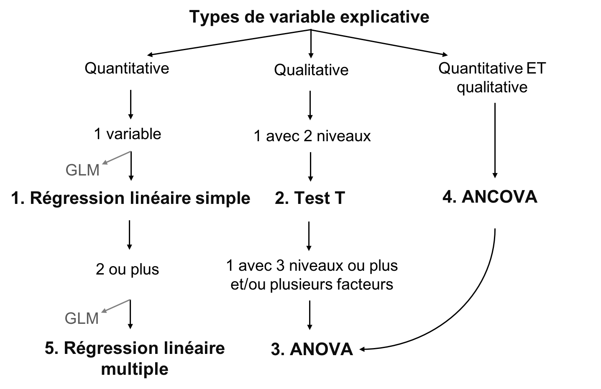
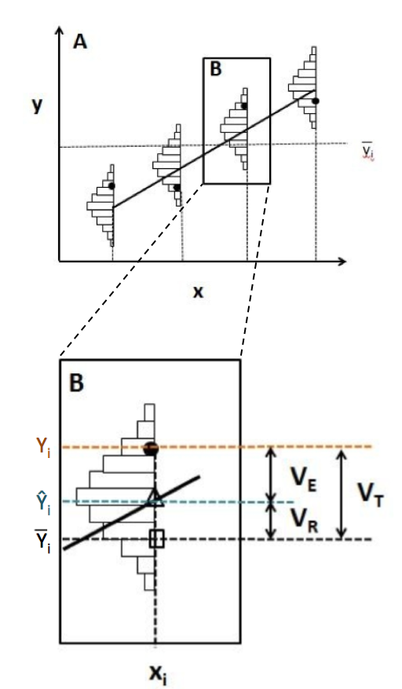

```{r setup, echo = F}
knitr::opts_chunk$set(
  comment = "#",
  collapse = TRUE,
  cache = TRUE,
  warning = FALSE,
  message = FALSE,
  fig.width=6, fig.height=6,
  fig.align = 'center'
)
```

```{r, echo =F}
options(repos=structure(c(CRAN="http://cran.r-project.org")))
```

```{r, include = FALSE}
if (!require(dplyr)) install.packages("dplyr")
library(dplyr)

if (!require(kableExtra)) install.packages("kableExtra")
library(kableExtra)

if (!require(vegan)) install.packages("vegan")
library(vegan)

if (!require(e1071)) install.packages("e1071")
library(e1071)

if (!require(MASS)) install.packages("MASS")
library(MASS)

if (!require(car)) install.packages("car")
library(car)
```

---
class: inverse, center, middle

# Concepts importants

## Définir la moyenne et la variation

---

## Moyenne

La moyenne est une mesure de la valeur moyenne d'une population (*x*):

$$\bar{x} = \frac{1}{N} \sum_{i=1}^{n} x_{i}$$

---
## Variation

- La variation est la dispersion des observations autour de la moyenne
  - Écart moyen
  - Variance
  - Écart type
  - Coefficient de variation

**Mais qu'est-ce que ce l'écart ?**

$$D_{i} = |x_{i} - \bar{x}|$$

---
## Variation

**l'écart**:

$$D_{i} = |x_{i} - \bar{x}|$$
--
**Écart moyen**:

$$D = \frac{1}{N} \sum_{i=1}^{n} |x_{i} - \bar{x}|$$
--

Au lieu de valeurs absolues, nous pouvons également mettre la valeur au carré, donnant la **variation**:

$$V = \frac{1}{N} \sum_{i=1}^{n} {(x_{i} - \bar{x})}^2$$

---
## Variation

Mais en mettant chaque valeur au carré, ces variables ne sont plus en unités significatives

On fait donc la racine carrée de la **variation** ( $V$ ), donnant l'**écart type**:

$$\sigma = \sqrt{V}$$
--

L'écart type relatif, en pourcentage, est le **coefficient de variation**:

$$cv = \frac{\sigma}{\bar{x}}$$

---
class: inverse, center, middle

# Les modèles linéaires

---
## Les modèles linéaires

Relation linéaire entre variable réponse ( $Y$ ) et explicatif ( $X$ ), en utilisant les concepts de **moyenne** et **variation**

- $Y$ : variable que vous voulez expliquer (une seule variable réponse)
- $X$ : expliquez votre variable réponse (une ou plusieurs variables explicatives)
- $Y$ : doit être quantitative
- $X$ : quantitative ou qualitative
- $\epsilon$ : ce qui n'est pas expliqué par la ou les variables explicatives  résidus ou erreur

---
## Définir des modèles linéaires

Mettre tout ensemble:

$$Y_{i} = \beta_{0} + \beta_{1} x_{i1} + \cdots + \beta_{p} x_{ip} + \epsilon_{i}$$

- $Y_i$ est la variable réponse
- $β_0$ est l'ordonnée à l'origine de la droite de régression
- $β_1$est le coefficient de variation de la $1^{ère}$ variable explicative
- $β_p$ est le coefficient de variation de la $p^{ème}$ variable explicative
- $x_i1$ est la variable explicative quantitative pour la $1^{ère}$ observation
- $x_ip$ est la variable explicative quantitative pour la $p^{ème}$ observation
- $ε_i$ sont les résidus du modèle (i.e. la variance inexpliquée)

---
## Le but des modèles linéaires

- Le but d'un modèle linéaire est de trouver la meilleure estimation des paramètres (les variables $\beta$), puis d'évaluer la qualité de l'ajustement du modèle

- Plusieurs méthodes ont été développées pour calculer l'intercept et les coefficient de modèles linéaires
  -  Le choix approprié dépend du type de variables explicatives considérées et leur nombre

.center[.large[Le concept général de ces méthodes consiste de minimiser les résidus]]

---
## Learning objectives

.center[

]

---
## Conditions de base du modèle linéaire

1. Les résidus sont indépendants
2. Les résidus suivent une distribution normale
3. Les résidus ont une moyenne de 0
4. es résidus sont homoscédastiques (i.e. leur variance est constante)

.alert[Ces 4 conditions concernent les résidus, et non les variables réponses ou explicatives]

.small[.comment[Dans les section suivantes, nous ne répétons pas les conditions ci-dessus pour chaque modèle parce que ces conditions de base s'appliquent à tous les modèles linéaires]]

---
## Flux de travail

.center[

]

- Visualiser les données
- Créer un modèle
- Tester les 4 conditions de base du modèle
- Ajuster le modèle si les conditions de base ne sont pas respectées
- Interpréter les résultats du modèle

---
class: inverse, center, middle

# Régression linéaire simple

---
## Régression linéaire simple

- Type de modèle linéaire qui contient seulement une variable explicative continue

$$Y_i = \beta_0 + \beta_1 x_i + \epsilon_i$$

- Estimation de l'**ordonnée à l'origine** ( $\beta_0$ ) et un **coefficient de corrélation** ( $\beta_1$ )

- Méthode des moindres carrés
  - méthode la plus couramment utilisée, et est employée par défaut sur R

---
## Méthode des moindres carrés

.pull-left[
.center[]
]

.pull-right[
**Suppositions**

- $Y_i$ : valeur observé (mesurée) à $X_i$
- $\widehat{Y}_i$ : valeur prédite à $X_i$
- $\bar{Y}$ : moyenne de tout les $Y_i$
- $V_E$ : résidus (erreur)
- $V_R$ : variance expliqué par la régression
- $V_T$ : variance totale
- $R^2 = \frac{V_R}{V_T}$
]

---
## Effectuer un modèle linéaire

.small[
**Étape 1**. Exécuter votre modèle linéaire

**Étape 2**. Vérifier les suppositions
]

.pull-left[.center[]] .pull-right[.center[]]

.pull-left[.center[*Suppositions sont satisfaites ?*]

.small[**Étape 3**. Estimer les paramètres de régression, test de signification, tracer votre modèle
]]

.pull-right[.center[*Suppositions pas satisfaites ?*]

.small[*Pouvez-vous transformer vos variables (est-ce justifié) ?*]

.pull-left[.center[]] .pull-right[.center[]]

.small[
.pull-left[
Oui: retourner à l'étape 1 avec des variables transformées
]

.pull-right[
Non: essayer GLM qui pourraient mieux convenir aux données
]]]

---
## Exécution du modèle linéaire dans R

**Étape 1**. créer votre modèle linéaire

Dans R, la fonction `lm()` est utilisée pour ajuster un modèle linéaire

```{r, eval = FALSE}
lm1 <- lm(Y~X)
```

- `lm1` : Nouvel objet contenant le modèle linéaire
- `Y` : Variable réponse
- `X` : Variable indépendante

---
## Exécution du modèle linéaire dans R

Télécharger les donées <span style="color:blue"> *birdsdiet* </span>:

```{r, eval=TRUE, echo=FALSE}
bird <- read.csv("Scripts_and_data/birdsdiet.csv")
```

```{r, eval = FALSE}
bird <- read.csv("birdsdiet.csv")
```

Visualisez le tableau de la structure des données en utilisant la fonction `str()` :

```{r}
str(bird)
```

---
## Exécution du modèle linéaire dans R

Variable réponse : **abondance d'oiseaux**   num : quantitative

Variable explicative : **masse**     num : quantitative

```{r}
str(bird)
```

Nous voulons d'abord vérifier si l'abondance maximale des oiseaux (`maxAbund`) est un fonction de la masse des oiseaux (`Mass`)

```{r eval=TRUE}
lm1 <- lm(MaxAbund ~ Mass, data = bird)
```

---
## Exécution du modèle linéaire dans R

**Étape 2**. Vérifier les suppositions avec les graphiques diagnostics

```{r, eval=FALSE}
opar <- par(mfrow=c(2,2))
plot(lm1)
```

- `par( )`: définit les paramètres du graphique, par exemple, l'argument `mfrow` spécifie le nombre de rangées et colonnes
- `plot( )`: est la fonction pour faire le graphique

La sortie comprend les quatre graphiques diagnostics de la fonction `lm()`

