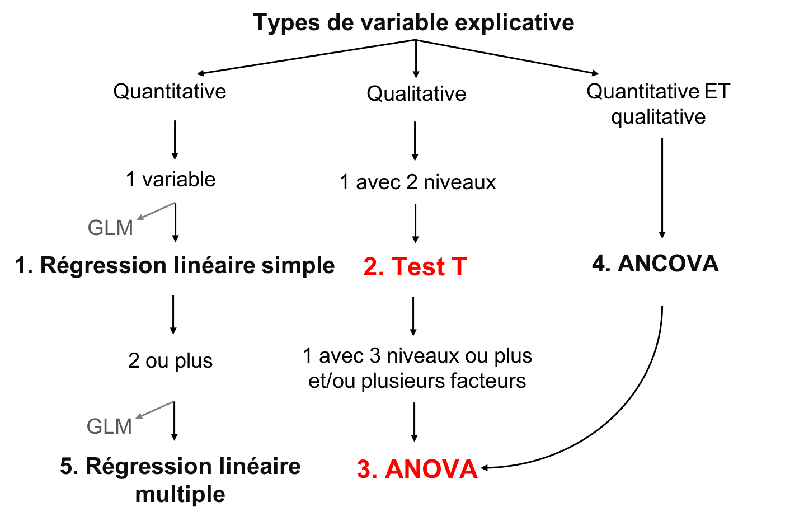
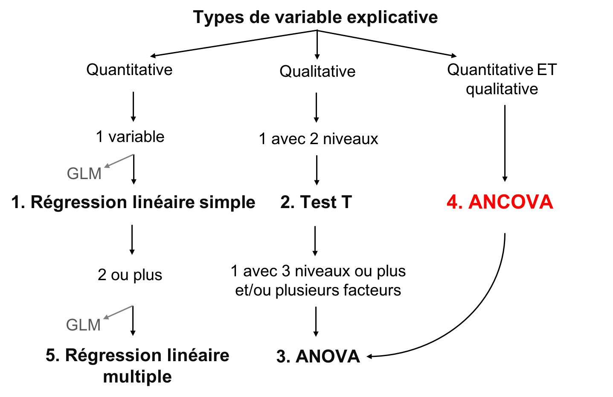

```{r setup, echo = F}
knitr::opts_chunk$set(
  comment = "#",
  collapse = TRUE,
  cache = TRUE,
  warning = FALSE,
  message = FALSE,
  fig.width=6, fig.height=6,
  fig.align = 'center'
)
```

```{r, echo =F}
options(repos=structure(c(CRAN="http://cran.r-project.org")))
```

```{r, include = FALSE}
if (!require(dplyr)) install.packages("dplyr")
library(dplyr)

if (!require(kableExtra)) install.packages("kableExtra")
library(kableExtra)

if (!require(vegan)) install.packages("vegan")
library(vegan)

if (!require(e1071)) install.packages("e1071")
library(e1071)

if (!require(MASS)) install.packages("MASS")
library(MASS)

if (!require(car)) install.packages("car")
library(car)
```

---
class: inverse, center, middle

# Concepts importants

## Définir la moyenne et la variation

---

## Moyenne

La moyenne est une mesure de la valeur moyenne d'une population (*x*):

$$\bar{x} = \frac{1}{N} \sum_{i=1}^{n} x_{i}$$

---
## Variation

- La variation est la dispersion des observations autour de la moyenne
  - Écart moyen
  - Variance
  - Écart type
  - Coefficient de variation

**Mais qu'est-ce que ce l'écart ?**

$$D_{i} = |x_{i} - \bar{x}|$$

---
## Variation

**l'écart**:

$$D_{i} = |x_{i} - \bar{x}|$$
--
**Écart moyen**:

$$D = \frac{1}{N} \sum_{i=1}^{n} |x_{i} - \bar{x}|$$
--

Au lieu de valeurs absolues, nous pouvons également mettre la valeur au carré, donnant la **variation**:

$$V = \frac{1}{N} \sum_{i=1}^{n} {(x_{i} - \bar{x})}^2$$

---
## Variation

Mais en mettant chaque valeur au carré, ces variables ne sont plus en unités significatives

On fait donc la racine carrée de la **variation** ( $V$ ), donnant l'**écart type**:

$$\sigma = \sqrt{V}$$
--

L'écart type relatif, en pourcentage, est le **coefficient de variation**:

$$cv = \frac{\sigma}{\bar{x}}$$

---
class: inverse, center, middle

# Les modèles linéaires

---
## Les modèles linéaires

Relation linéaire entre variable réponse ( $Y$ ) et explicatif ( $X$ ), en utilisant les concepts de **moyenne** et **variation**

- $Y$ : variable que vous voulez expliquer (une seule variable réponse)
- $X$ : expliquez votre variable réponse (une ou plusieurs variables explicatives)
- $Y$ : doit être quantitative
- $X$ : quantitative ou qualitative
- $\epsilon$ : ce qui n'est pas expliqué par la ou les variables explicatives  résidus ou erreur

---
## Définir des modèles linéaires

Mettre tout ensemble:

$$Y_{i} = \beta_{0} + \beta_{1} x_{i1} + \cdots + \beta_{p} x_{ip} + \epsilon_{i}$$

- $Y_i$ est la variable réponse
- $β_0$ est l'ordonnée à l'origine de la droite de régression
- $β_1$est le coefficient de variation de la $1^{ère}$ variable explicative
- $β_p$ est le coefficient de variation de la $p^{ème}$ variable explicative
- $x_i1$ est la variable explicative quantitative pour la $1^{ère}$ observation
- $x_ip$ est la variable explicative quantitative pour la $p^{ème}$ observation
- $ε_i$ sont les résidus du modèle (i.e. la variance inexpliquée)

---
## Le but des modèles linéaires

- Le but d'un modèle linéaire est de trouver la meilleure estimation des paramètres (les variables $\beta$), puis d'évaluer la qualité de l'ajustement du modèle

- Plusieurs méthodes ont été développées pour calculer l'intercept et les coefficient de modèles linéaires
  -  Le choix approprié dépend du type de variables explicatives considérées et leur nombre

.center[.large[Le concept général de ces méthodes consiste de minimiser les résidus]]

---
## Objectif d'enseignement

.center[

]

---
## Conditions de base du modèle linéaire

1. Les résidus sont indépendants
2. Les résidus suivent une distribution normale
3. Les résidus ont une moyenne de 0
4. es résidus sont homoscédastiques (i.e. leur variance est constante)

.alert[Ces 4 conditions concernent les résidus, et non les variables réponses ou explicatives]

.small[.comment[Dans les section suivantes, nous ne répétons pas les conditions ci-dessus pour chaque modèle parce que ces conditions de base s'appliquent à tous les modèles linéaires]]

---
## Flux de travail

.center[

]

- Visualiser les données
- Créer un modèle
- Tester les 4 conditions de base du modèle
- Ajuster le modèle si les conditions de base ne sont pas respectées
- Interpréter les résultats du modèle

---
class: inverse, center, middle

# Régression linéaire simple

---
## Régression linéaire simple

- Type de modèle linéaire qui contient seulement une variable explicative continue

$$Y_i = \beta_0 + \beta_1 x_i + \epsilon_i$$

- Estimation de l'**ordonnée à l'origine** ( $\beta_0$ ) et un **coefficient de corrélation** ( $\beta_1$ )

- Méthode des moindres carrés
  - méthode la plus couramment utilisée, et est employée par défaut sur R

---
## Méthode des moindres carrés

.pull-left[
.center[]
]

.pull-right[
**Suppositions**

- $Y_i$ : valeur observé (mesurée) à $X_i$
- $\widehat{Y}_i$ : valeur prédite à $X_i$
- $\bar{Y}$ : moyenne de tout les $Y_i$
- $V_E$ : résidus (erreur)
- $V_R$ : variance expliqué par la régression
- $V_T$ : variance totale
- $R^2 = \frac{V_R}{V_T}$
]

---
## Effectuer un modèle linéaire

.small[
**Étape 1**. Exécuter votre modèle linéaire

**Étape 2**. Vérifier les suppositions
]

.pull-left[.center[]] .pull-right[.center[]]

.pull-left[.center[*Suppositions sont satisfaites ?*]

.small[**Étape 3**. Estimer les paramètres de régression, test de signification, tracer votre modèle
]]

.pull-right[.center[*Suppositions pas satisfaites ?*]

.small[*Pouvez-vous transformer vos variables (est-ce justifié) ?*]

.pull-left[.center[]] .pull-right[.center[]]

.small[
.pull-left[
Oui: retourner à l'étape 1 avec des variables transformées
]

.pull-right[
Non: essayer GLM qui pourraient mieux convenir aux données
]]]

---
## Exécution du modèle linéaire dans R

**Étape 1**. créer votre modèle linéaire

Dans R, la fonction `lm()` est utilisée pour ajuster un modèle linéaire

```{r, eval = FALSE}
lm1 <- lm(Y~X)
```

- `lm1` : Nouvel objet contenant le modèle linéaire
- `Y` : Variable réponse
- `X` : Variable indépendante

---
## Exécution du modèle linéaire dans R

Télécharger les donées <span style="color:blue"> *birdsdiet* </span>:

```{r, eval=TRUE, echo=FALSE}
bird <- read.csv("Scripts_and_data/birdsdiet.csv")
```

```{r, eval = FALSE}
bird <- read.csv("birdsdiet.csv")
```

Visualisez le tableau de la structure des données en utilisant la fonction `str()` :

```{r}
str(bird)
```

---
## Exécution du modèle linéaire dans R

Variable réponse : **abondance d'oiseaux**   num : quantitative

Variable explicative : **masse**     num : quantitative

```{r}
str(bird)
```

Nous voulons d'abord vérifier si l'abondance maximale des oiseaux (`maxAbund`) est un fonction de la masse des oiseaux (`Mass`)

```{r eval=TRUE}
lm1 <- lm(MaxAbund ~ Mass, data = bird)
```

---
## Exécution du modèle linéaire dans R

**Étape 2**. Vérifier les suppositions avec les graphiques diagnostics

```{r, eval=FALSE}
opar <- par(mfrow=c(2,2))
plot(lm1)
```

- `par( )`: définit les paramètres du graphique, par exemple, l'argument `mfrow` spécifie le nombre de rangées et colonnes
- `plot( )`: est la fonction pour faire le graphique

La sortie comprend les quatre graphiques diagnostics de la fonction `lm()`

---
## Graph. #1 - Résidus vs valeurs prédites

Example d'indépendance .comment[(ce que nous recherchons !)]

- Devrait montrer une dispersion de points sans patron

```{r, echo = FALSE, fig.height=4.2, fig.width=5.5}
  set.seed(1234564)
  x <- rnorm(100,10,10)
  y <- 2*x+0 + rnorm(100)
  lm <- lm(y~x)
  plot(lm, which = 1)
```

---
## Graph. #1 - Résidus vs valeurs prédites

Example de non-indépendance .comment[(ce que nous ne voulons pas !)]
```{r, echo=FALSE, fig.height=4, fig.width=8.5, warning=FALSE}
par(mfrow=c(1,2))
set.seed(1234564)
x = rnorm(100,10,10)
y = (x)^2 + rnorm(length(x),0,30)
lm=lm(y~scale(x))
plot(lm,which = 1, main = "Non-linéaire", col.main="red")

x = rnorm(100,10,10)
y = (x) + 0 + rnorm(length(x), 0, x)
lm=lm(y~scale(x))
plot(lm,which = 1, main = "Hétéroscédastique", col.main="red")
```

- Solution: Transformer vos données ou essayer une distribution autre que linéaire (gaussienne); modèle linéaire généralisé (GLM) (ex: Poisson, binomial, binomial négatif, etc.)

Transform your data or try another distribution than linear (Gaussian) (i.e., a generalized linear model (GLM): Poisson, binomial, negative binomial, etc.)

---
## Graph. #2 - échelle localité

Devrait montrer une dispersion de points sans patron

```{r, echo=FALSE, fig.height=3.8, fig.width=8, warning=FALSE}
par(mfrow=c(1,2))
set.seed(1234564)
x <- 1:100
y <- x + rnorm(100,sd=5)
lm=lm(y~x)
plot(lm,which = 3)

set.seed(2)
x = rnorm(100,10,10)
y = (x) + 0 + rnorm(length(x), 0, x)
lm=lm(y~scale(x))
plot(lm,which = 3)
```
.pull-left[.center[]] .pull-right[.center[]]

.pull-left[.center[Aucun patron dans les résidus]] .pull-right[.center[Forte tendance dans les résidus]]

---
## Graph. # 3 - Normal QQ

- Compare la distribution (quantiles) des résidus aux quantiles d'une distribution normale
- Si les points se situent de façon linéaire sur la ligne 1: 1, les résidus suivent une distribution normale

```{r, echo=FALSE, fig.height=3, fig.width=8, warning=FALSE}
par(mfrow=c(1,2), mar = c(4, 4, 1.5, 3))
set.seed(1234564)
x <- 1:100
y <- x + rnorm(100,sd=5)
lm=lm(y~x)
plot(lm, which = 2)

set.seed(2)
x = rnorm(100,10,10)
y = (x) + 0 + rnorm(length(x), 0, x)
lm=lm(y~scale(x))
plot(lm, which = 2)
```

.pull-left[.center[]] .pull-right[.center[]]

.pull-left[.center[C'est bien !]] .pull-right[.center[Pas très bien...]]

---
## Graph. # 4 - Résidus vs effet de levier

- Recherche les valeurs influentes
- **Points de levier** : observations extrêmes ou périphériques de la variable explicative. Parce qu'ils n'ont pas d'observations voisines, la ligne de régression passe près de ces points. **Ils peuvent (ou pas) avoir une grande influence sur la régression**
- Les points de levier avec une forte influence peuvent être identifiés avec une **distance de Cook supérieure à 0,5**

---
## Effet levier vs influence

```{r, echo=FALSE, fig.height=6, fig.width=5, warning=FALSE}
par(mfrow=c(3, 1), mar = c(4, 15, 1, 3), cex = 0.75)
set.seed(1234564)
x <- 1:20
y <- rnorm(x, x, 2)
lm0 <- lm(y ~ x)
# plot 1
plot(x, y, ylim = c(-4, 22)); abline(lm0, col = 2); points(11, -3, pch = 15)
# add 20, 10 point to the new lm
xx <- c(x, 11); yy <- c(y, -3)
abline(lm(yy ~ xx), col = 2, lty = 3)
text(-20, 10, srt=0, adj = 0, labels = "* Pas d'effet de levier \n* Faible influence
", xpd = TRUE, cex = 1.5)
# plot 2
plot(x, y, ylim = c(-4, 32), xlim = c(0, 31)); abline(lm0, col = 2); points(30, 30, pch = 15)
# add 20, 10 point to the new lm
xx <- c(x, 30); yy <- c(y, 30)
abline(lm(yy ~ xx), col = 2, lty = 3)
text(-33, 15, srt=0, adj = 0, labels = "* Effet de levier \n* Pas d'influence", xpd = TRUE, cex = 1.5)

# plot 3
plot(x, y, ylim = c(-4, 32), xlim = c(0, 31)); abline(lm0, col = 2); points(30, 15, pch = 15)
# add 20, 10 point to the new lm
xx <- c(x, 30); yy <- c(y, 15)
abline(lm(yy ~ xx), col = 2, lty = 3)
text(-33, 15, srt=0, adj = 0, labels = '* Effet de levier \n* Influence élevée', xpd = TRUE, cex = 1.5)
```

---
## Effet levier vs influence

```{r, echo=FALSE, fig.height=3.5, fig.width=9, warning=FALSE}
par(mfrow=c(1,2), mar = c(4, 4, 1.5, 3))
set.seed(1234564)
x <- 1:100
y <- x + rnorm(100,sd=5)
lm=lm(y~x)
plot(lm, which = 5)

set.seed(1234564)
x = rnorm(100,10,10)
y = (x) + 0 + rnorm(length(x), 0, x)
lm=lm(y~scale(x))
plot(lm, which = 5)
```

.pull-left[.center[]] .pull-right[.center[]]

.pull-left[.center[Aucune valeur influente]]
.pull-right[.center[Effet de levier élevé et influence raisonnable]]

<br />
<br />
<br />

.comment[Ici, le point 32 a un effet de levier élevé, mais son influence est acceptable (à l'intérieur des limites de la distance Cook de 0,5)]

---
## Effet levier vs influence

Effet de levier et influence élevée

<br />

.pull-left[
```{r, echo=FALSE, fig.height=3.5, fig.width=4, warning=FALSE}
par(mar = c(4, 4, 1, 0))
set.seed(1234564)
x = rnorm(100,10,10)
y = (x) + 0 + rnorm(length(x), 0, x)
y[29] <- 100
lm=lm(y~scale(x))
plot(lm, which = 5)
```
]
.pull-right[
- Points en dehors de la limite de 0,5 de la distance Cook
- Ces points ont trop d'influence sur la régression
]

.alert[Vous ne devriez jamais supprimer les valeurs aberrantes si vous n'avez pas de bonnes raisons de le faire (ex: erreur de mesure)]

---
## **Étape 2**. Vérifier les suppositions de `lm1`

```{r, fig.height=4.9, fig.width=5.5}
par(mfrow=c(2,2), mar = c(4,4,2,1.1), oma =c(0,0,0,0))
plot(lm1)
```

---
## Suppositions non-respectées - quelle est la cause?

Traçons le graphique Y ~ X avec la droite de régression et les histogrammes de Y et X pour explorer leurs distributions

.small[
```{r, fig.height=2.7, fig.width=9, echo = -1}
par(mfrow=c(1,3), mar = c(4,4,3,1), cex = 0.8)
plot(bird$MaxAbund ~ bird$Mass)
abline(lm1) # adds the best-fit line
hist(bird$MaxAbund) # hist() produces a histogram of the variable
hist(bird$Mass)
```
]

---
## Suppositions non-respectées - quelle est la cause?

Vérifions la normalité des données à l'aide d'un test de `Shapiro-Wilk` et d'un test d'asymétrie (**`skewness`**) :

```{r}
shapiro.test(bird$MaxAbund)
shapiro.test(bird$Mass)
```
.comment[Dans les deux cas, les distributions ne sont pas normales
]

---
## Suppositions non-respectées - quelle est la cause?

Vérifions la normalité des données à l'aide d'un test de `Shapiro-Wilk` et d'un test d'asymétrie (**`skewness`**) :

```{r}
skewness(bird$MaxAbund)
skewness(bird$Mass)
```
.comment[La valeur positive indique que la distribution des données est décalée vers la gauche Beaucoup mieux!]

---
## Transformer les données

- Normalisons les données en appliquant une transformation `log10()`
- Ajoutons ces variables transformées à notre base de données

```{r}
bird$logMaxAbund <- log10(bird$MaxAbund)
bird$logMass <- log10(bird$Mass)
```

**Étape 1**: Exécuter une régression linéaire sur les données transformées

```{r}
lm2 <- lm(logMaxAbund ~ logMass, data = bird)
```

---
## **Étape 2**: Vérifier les suppositions de `lm2`

```{r, fig.height=4.4, fig.width=5.9}
par(mfrow=c(2,2), mar=c(3,4,1.15,1.2))
plot(lm2)
```

.comment[.center[Beaucoup mieux !]]

---
## **Étape 2**: Vérifier les suppositions de `lm2`

```{r, echo=-1, fig.height=3.4, fig.width=9}
par(mfrow=c(1,3), mar=c(4,4,1.15,1.2))
plot(logMaxAbund ~ logMass, data=bird)
abline(lm2)
hist(log10(bird$MaxAbund))
hist(log10(bird$Mass))
```

---
## **Étape 3**: Estimer les paramètres et leur seuil de signification

La fonction `summary()` est utilisée pour obtenir les paramètres, leur importance, etc

.small[
```{r}
summary(lm2)
```
]

---
## **Étape 3**: Estimer les paramètres et leur seuil de signification

Nous pouvons aussi extraire les paramètres du modèle, par exemple :

```{r}
lm2$coef
summary(lm2)$coefficients
summary(lm2)$r.squared
```

---
## Discussion de groupe

- Pouvez-vous écrire l'équation de la droite de régression pour votre modèle `lm2`
- Les paramètres sont-ils importants ?
- Quelle proportion de la variance est expliquée par le modèle `lm2` ?

.small[
```{r}
summary(lm2)
```
]

---
## Discussion de groupe

Pouvons-nous améliorer le modèle si nous analysons que les oiseaux terrestres?

.comment[Vous pouvez exclure des objets en utilisant `=!`]

```{r}
lm3 <- lm(logMaxAbund~logMass, data=bird, subset=!bird$Aquatic)
# removes aquatic birds (= TRUE)
# or equivalently
lm3 <- lm(logMaxAbund~logMass, data=bird, subset=bird$Aquatic == 0)
```

```{r eval=FALSE}
# Examine the diagnostic plots
par(mfrow=c(2,2))
plot(lm3)
summary(lm3)

# Compare both models
par(mfrow=c(1,2))
plot(logMaxAbund~logMass, data=bird)
plot(logMaxAbund~logMass, data=bird, subset=!bird$Aquatic)
```

---
## Plot

`R2-adj` a changé de 0,05 à 0,25 quand nous avons exclu les oiseaux aquatiques :

```{r, fig.height=3.5, fig.width=7}
par(mfrow=c(1,2), mar = c(4, 4, 3, 1))
plot(logMaxAbund~logMass, data=bird, main = 'Tous les oiseaux')
abline(lm2, col = 'red')
plot(logMaxAbund~logMass, data=bird, subset=!bird$Aquatic, main = 'Oiseaux terrestres')
abline(lm3, col = 'red')
```

---
## Défi 1 

- Examiner la relation entre `log(MaxAbund)` et `log(Mass)` chez les passereaux ("passerine birds")
- Sauvegarder l'objet du modèle sous `lm4`

.comment[INDICE: comme les espèces aquatiques, les passereaux sont codées 0/1, ce qui peut être vérifié à partir de la structure de la base de données]

- Comparer la variance expliquée par `lm2`, `lm3` and `lm4`

---
## Défi 1 - Solution 

<br>
```{r}
# Run the model
lm4 <- lm(logMaxAbund ~ logMass, data=bird, subset=bird$Passerine == 1)
summary(lm4)
```

---
## Défi 1 - Solution 

```{r, echo=-3,fig.height=4.8, fig.width=6.5}
# diagnostic plots
par(mfrow=c(2,2), mar = c(4,4,2,1.1), oma =c(0,0,0,0))
plot(lm4)
```

---
## Défi 1 - Solution 

Comparer la variance expliquée par `lm2`, `lm3` and `lm4`

```{r}
# Recall: we want adj.r.squared
summary(lm2)$adj.r.squared
summary(lm3)$adj.r.squared
summary(lm4)$adj.r.squared
```

.comment[TLe meilleur modèle parmi les trois est `lm3` *(seulement les oiseaux terrestres)*]

---
## Objectif d'enseignement

.center[

]

---
class: inverse, center, middle

# ANOVA

## Test-t, ANOVA à un critère de classification, ANOVA à deux critères de classification

---
## ANOVA

Variable réponse continue

**Variables explicatives catégoriques**

- Deux niveaux ou plus (groupes)

.large[.center[Compare la variation intra-groupe et inter-groupe afin de déterminer si les moyennes des groupes diffèrent]]

Somme des carrés : variance intra-traitement *vs* variance inter-traitement

Si variance entre traitements $>$ variance entre traitements:
  - la variable explicative a un effet plus important que l'erreur aléatoire
  - variable explicative est donc susceptible d'influencer significativement la variable réponse

---
## Types d'ANOVA

1. ANOVA à un critère de classification
  - Une variable explicative catégorique avec au moins 2 niveaux
  - If there are 2 levels a **t-test** can be used alternatively

2. ANOVA à deux critères de classification
  - Deux variables explicatives catégoriques ou plus
  - Chaque facteur peut avoir plusieurs niveaux
  - Les interactions entre chaque variable explicative catégorique doivent être testées

3. Mesures répétées ?
  - L'ANOVA peut être utilisée pour des mesures répétées, mais ce sujet n'est pas abordé dans cet atelier
  - Modèle linéaire mixte peut également être utilisé pour ce type de données (voir l'atelier 6)

---
class: inverse, center, middle

# Test T

---
## Test T

- **Variable réponse**  quantitative
- **Variable explicative**  qualitative avec **2 niveaux**

**Suppositions**
- Les données suivent une distribution normale
- Les variances des groupes sont homogènes

.comment[Le test est plus robuste lorsque la taille de l'échantillon est plus élevée et lorsque les groupes ont des tailles égales]

---
## Exécuter un test T dans R

Vous pouvez utiliser la fonction `t.test()`

```r
t.test(Y~X2, data= data, alternative = "two.sided")
```

  - `Y`: variable réponse
  - `X2`: facteur (2 niveaux)
  - `data`: nom du jeu de donées
  - `alternative` hypothèse alternative : `"two.sided"` (par défaut), `"less"`, ou `"greater"`

Le test de t est un modèle linéaire et un cas spécifique de l'ANOVA avec un facteur à 2 niveaux

Vous pouvez donc aussi utiliser la fonction `lm()`

```r
lm.t <-lm(Y~X2, data = data)
anova(lm.t)
```

---
## Exécuter un test T dans R

.large[Les oiseaux aquatiques sont-ils plus lourds que les oiseaux terrestres ?]

- Variable réponse : `Bird mass`  num: continue
- Variable explicative : `Aquatic`  2 niveaux : 1 ou 0 (oui ou non)

---
## Exécuter un test T dans R

Premièrement, visualisation les données à l'aide de la fonction `boxplot()`

```{r eval=TRUE,fig.height=4.8, fig.width=6.5}
boxplot(logMass ~ Aquatic,
        data = bird, names = c("Non aquatique", "Aquatique"))
```

---
## Exécuter un test T dans R

Testons l'homogénéité des variances avec la fonction `var.test()`

```{r}
var.test(logMass ~ Aquatic, data = bird)
```

.comment[Le rapport des variances n'est pas statistiquement différent de 1, celles-ci peuvent donc être considérées comme égales]

.comment[Nous pouvons maintenant procéder au test t !]

---
## Exécuter un test T dans R

```{r}
ttest1 <- t.test(logMass ~ Aquatic, var.equal = TRUE, data = bird)

# Or use lm()
ttest.lm1 <- lm(logMass ~ Aquatic, data=bird)
```

.comment[Spécifie que l'homogénéité des variances est respectée]

Vérifiez que `t.test()` et `lm()` donnent le même modèle :

```{r}
ttest1$statistic^2
anova(ttest.lm1)$F
# réponse : F=60.3845 dans les deux cas
```

.comment[Lorsque la supposition d'égalité de variance est confirmée, t^2 = F]

---
## Exécuter un test T dans R

Si $p<0,01$ (ou $0,05$ ), l'hypothèse de l'absence de différence entre les moyenne des 2 groupe (*H0*) peut être rejetée, avec un risque de $0,01$ (ou $0,05$ ) de se tromper

```{r}
ttest1
```

.small[.comment[Il existe une différence entre la masse des oiseaux aquatiques et terrestres - `p-value`]]

.small[.comment[Regardez les moyennes des 2 groupes]]

---
## Violation of Assumptions

- **Correction de Welch** : lorsque les écarts entre les groupes ne sont pas égaux (par défaut dans R !)
- **Test de Mann-Whitney** : l'équivalent **non paramétrique** du test de t lorsque les suppositions ne sont pas respectées
- **Test de t apparié** : lorsque les deux groupes ne sont **pas indépendants** (par exemple, des mesures sur la même personne récoltées lors de 2 années différentes)

---
## Discussion de groupe

.large[Les oiseaux aquatiques sont-ils plus lourds que les oiseaux terrestres ?]

```{r}
# Unilateral t-test
uni.ttest1 <- t.test(logMass ~ Aquatic,
                     var.equal = TRUE,
                     data = bird,
                     alternative = "less")
```

.comment[Qu'avez-vous conclu ?]

---
## Discussion de groupe

```{r}
uni.ttest1
```

.small[
Oui, les oiseaux aquatiques sont plus lourds que les oiseaux terrestres :

p-value = `r format(uni.ttest1$p.value, scientific=FALSE)`
]

---
class: inverse, center, middle

# ANOVA

---
## Analyse de Variance (ANOVA)

Généralisation du test t à $>2$ groupes, et/ou ≥ $2$ facteurs explicatifs

Décomposition de la variation observée de la variable réponse en effets additifs d'un ou de plusieurs facteurs et de leurs interactions

<br>
$$Y = \underbrace{\mu}_{\Large{\text{moyenne globale de la variable réponse}\atop\text{sur tous les individus}}} + \overbrace{\tau_{i}}^{\Large{\text{Le résultat moyen sur}\atop\text{tous les individus du groupe i}}} + \underbrace{\epsilon}_{\text{Résidus}}$$

---
## Rappel : ANOVA

Suppositions
- Normalité des résidus
- L'égalité de la variance inter-groupes

Test complémentaire
- Lorsque l'ANOVA détecte une différence significative entre les groupes, l'analyse n'indique pas quel(s) groupe(s) diffère(nt) de(s) l'autre(s)
- Un test couramment utilisé a posteriori pour répondre à cette question est le **Test de Tukey**

---
## Exécuter une ANOVA dans R

##### Est-ce que l'abondance maximale dépend du régime alimentaire ?
- Variable réponse : **MaxAbund**   num: quantitative
- Variable explicative : **Diet**  facteur avec 5 niveaux

```{r}
str(bird)
```

---
## Visualiser les données

Visualisons tout d'abord les données avec la fonction `boxplot()`

```{r, fig.height=4.2, fig.width=7,echo=-1}
par(mar = c(4, 4, 0.5, 1))
boxplot(logMaxAbund ~ Diet, data = bird,
  ylab = expression("log"[10]*"(Abondance maximale)"), xlab = 'Régime alimentaire')
```

---
## Visualiser les données

Nous pouvons changer l'ordre des niveaux afin qu'il suivent l'ordre croissant de leurs médianes respectives en utilisant les fonctions `tapply()` et `sort()`

```{r, fig.height=3.5, fig.width=7, echo=-1}
par(mar=c(4,4,.1,1))
med <- sort(tapply(bird$logMaxAbund, bird$Diet, median))
boxplot(logMaxAbund ~ factor(Diet, levels = names(med)), data = bird,
        ylab = expression("log"[10]*"(Abondance maximale)"), xlab = 'Régime alimentaire')
```

---
## Visualiser les données


Une autre façon de visualiser graphiquement les tailles d’effet est d’utiliser la fonction `plot.design()`

.small[
```{r, fig.height=3, fig.width=6, echo=-1}
par(mar=c(4,4,.4,1))
plot.design(logMaxAbund ~ Diet, data=bird,
  ylab = expression("log"[10]*"(Abondance maximale)"))
```
]

.comment[Levels of a particular factor along a vertical line, and the overall value of the response in a horizontal line]

---
## Ecécuter une ANOVA à un critère de classification dans R

Il est de nouveau possible d'utiliser la fonction `lm()`

```{r}
anov1 <- lm(logMaxAbund ~ Diet,
            data = bird)
```

Il y a aussi une fontion spécifique pour l'analyse de la variance dans R `aov()`

```{r}
aov1 <- aov(logMaxAbund ~ Diet,
            data = bird)
```

.comment[Essayez-les et comparez les sorties !]

---
## Ecécuter une ANOVA à un critère de classification dans R

Comparer les sorties

.small[
```{r}
anova(anov1)
```
```{r}
summary(aov1)
```
]

---
## Vérifier les asuppositions

**Test de Bartlett**: égalité de la variance entre les groupes

.small[
```{r}
bartlett.test(logMaxAbund ~ Diet,
              data = bird)
```
]

**Test de Shapiro-Wilk**:  normalité des résidus

.small[
```{r}
shapiro.test(resid(anov1))
```
]

.comment[Les deux tests sont non-significatifs; les résidus du modèle peuvent être considérés normaux et les variances homogènes]

---
## Et si les suppositons ne sont pas respectées...

**Transformer vos données** : pourrait égaliser les variances et normaliser les résidus, et peut convertir un effet multiplicatif en un effet additif

```{r eval=FALSE}
data$logY <- log10(data$Y)
```
* avoir le wiki de l'atelier 1 pour les règles de transformation de données
* ré-exécuter votre modèle avec la variable transformée et vérifier à nouveau les hypothèses

**Test de Kruskal-Wallis**: équivalent non paramétrique de l'ANOVA si vous ne pouvez pas
(*ou ne voulez pas*)

```{r eval=FALSE}
kruskal.test(Y~X, data)
```

---
## Sorties de notre modèle ANOVA

Triage en ordre alphabétique des niveaux et comparaison au niveau de référence (`Insect`)

.small[
```{r}
summary(anov1)
```
]

---
## Sorties de notre modèle ANOVA

D'autre part, si nous utilisons `lm()`

.pull-left2[
.small[
```{r}
summary.lm(aov1)
```
]]

.pull-right2[
<br><br>
.comment[Différence significative entre les groupes, mais nous ne savons pas lesquels !]]

---
## Test a posteriori

Lorsque l'ANOVA détecte un effet significatif de la variable explicative, un test post-hoc avec la fonction `TkeyHSD()`, doit être effectué pour déterminer quel(s) tratement(s) diffère(nt)

.pull-left2[
.small[
```{r}
TukeyHSD(aov(anov1), ordered = TRUE)
```
]]

.pull-right2[
<br><br>
.comment[Seuls "Vertebrate" et "PlantInsect diffèrent"]
]

---
## Représentation graphique

Représentation graphique de l'ANOVA à l'aide de la fonction `barplot()`

.small[
```{r, fig.height=3, fig.width=7,echo=-1}
par(mar=c(3,3,0.5,0.5))
sd <- tapply(bird$logMaxAbund, list(bird$Diet), sd)
means <- tapply(bird$logMaxAbund, list(bird$Diet), mean)
n <- length(bird$logMaxAbund)
se <- 1.96*sd/sqrt(n)
bp <- barplot(means, ylim = c(0, max(bird$logMaxAbund) - 0.5))
epsilon = 0.1
segments(bp, means - se, bp, means + se, lwd=2) # barres verticales
segments(bp - epsilon, means - se, bp + epsilon, means - se, lwd = 2) # barres horizontales
segments(bp - epsilon, means + se, bp + epsilon, means + se, lwd = 2) # barres horizontales
```
]

---
class: inverse, center, middle

# ANOVA à deux critères de classification

---
## ANOVA à deux critères de classification

Plus d'un facteur

- ANOVA avec un facteur:

 `aov <- lm(Y ~ X, data)`

- ANOVA avec deux ou plus facteurs:

 `aov <- lm(Y ~ X * Z * ..., data)`

.comment[lorsque vous utilisez le symbole "*" avec `lm()``, le modèle inclut les effets de chaque facteur séparément, ainsi que leur interaction]

.comment[lorsque vous utilisez le symbole "+" avec `lm()``, le modèle inclut les effets de
chaque facteur séparément (pas d'interaction)]

`aov <- lm(Y ~ X + Z + ..., data)`

---
## ANOVA à deux critères de classification

Exemple d'interaction non significative

.small[
```r
aov <- lm(Y ~ X * Z, data)
summary(aov)
# Analysis of Variance Table
#
# Response: Y
# Df Sum Sq Mean Sq F value Pr(>F)
# X 4 5.1059 1.27647 3.0378 0.02669 *
# Z 1 0.3183 0.31834 0.7576 0.38870
# X:Z 3 2.8250 0.94167 2.2410 0.10689
# Residuals 45 18.9087 0.42019
# ---
# Signif. codes: 0 ‘***’ 0.001 ‘**’ 0.01 ‘*’ 0.05 ‘.’ 0.1 ‘ ’ 1
```
]

Selon le principe de **parcimonie**, vous voulez que votre modèle explique le plus possible de la variance observée dans les données, avec le moins de termes possible
- Enlever le terme d'interaction s'il n'est pas significatif, et ré-exécuter le modèle

```r
aov <- lm(Y ~ X + Z, data)
```

---
## Défi 2 

Testez si l'abondance maximale `log(MaxAbund)` varie à la fois en fonction du régime alimentaire (`Diet`) et de l'habitat (`Aquatic`)

- .comment[INDICE: Examinez les facteurs Diet, Aquatic et leur interaction avec une ANOVA à deux critères de classificatioN e.g. `lm(Y ~ A*B)`]

- .comment[où A est le premier facteur, B le deuxième et "*" décrit l'interaction]

---
## Défi 2 - Solution 

.small[
```{r}
anov2 <- lm(logMaxAbund ~ Diet*Aquatic, data = bird)
summary(anov2)
```
]

---
## Défi 2 - Solution 

.small[
```{r}
anov2 <- lm(logMaxAbund ~ Diet*Aquatic, data = bird)
anova(anov2)
```
]

.comment[Le seul terme significatif du modèle est le facteur régime alimentaire]

---
## Objectif d'enseignement

.center[

]

---
class: inverse, center, middle

# ANCOVA

